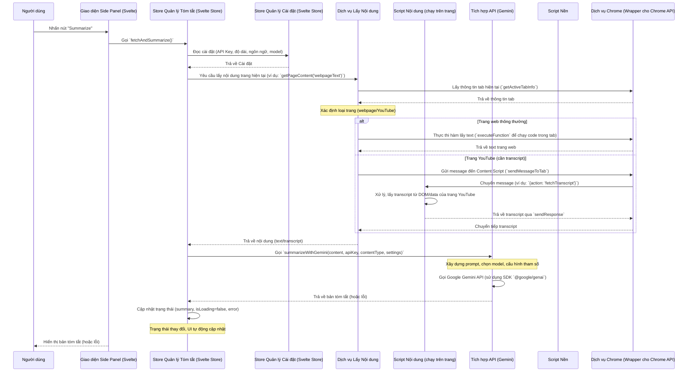

Đây là một tài liệu tổng quan về cấu trúc và cách hoạt động của tiện ích mở rộng Summarizerrrr, được thiết kế để cung cấp ngữ cảnh cho một AI agent hiểu rõ dự án và codebase.

---

## Tổng quan về Tiện ích Mở rộng Summarizerrrr

**Mục tiêu chính:** Summarizerrrr là một tiện ích mở rộng trình duyệt (Chrome Extension) cho phép người dùng nhanh chóng tạo bản tóm tắt cho nội dung trực tuyến như video YouTube, bài báo, hoặc đoạn văn bản được chọn. Tiện ích sử dụng AI Google Gemini để xử lý nội dung dựa trên các cài đặt của người dùng (độ dài, kiểu, ngôn ngữ) và hiển thị kết quả trực tiếp trong một side panel của trình duyệt.

**Công nghệ chính:** Svelte (cho UI), JavaScript, Chrome Extension APIs, Google Gemini API.

### Sơ đồ Luồng Hoạt động Chính (Khi người dùng yêu cầu tóm tắt):

### Các Thành phần Chính và Vai trò:

1.  **`Side Panel UI` (Giao diện Side Panel - `src/App.svelte`, `src/components/`)**

    - **Mô tả:** Là giao diện người dùng chính, được xây dựng bằng Svelte. Hiển thị thông tin (tiêu đề tab, trạng thái tải, bản tóm tắt, lỗi) và nhận tương tác từ người dùng (nhấn nút tóm tắt, thay đổi cài đặt).
    - **Hoạt động:**
      - Render các component Svelte (`SummarizeButton.svelte`, `SummaryDisplay.svelte`, `Setting.svelte`, v.v.).
      - Đọc dữ liệu từ các Svelte Store (ví dụ `$summaryStore.summary`, `$settingsStore.settings`) để hiển thị.
      - Khi người dùng tương tác (ví dụ: nhấn nút), nó gọi các "action" trên các Svelte Store (ví dụ `summaryStore.fetchAndSummarize()`, `settingsStore.updateSettings()`).
      - Lắng nghe tin nhắn từ `BackgroundScript` (qua `chrome.runtime.onMessage`) để cập nhật trạng thái (ví dụ: khi `BackgroundScript` gửi thông tin tab mới).

2.  **`State Management (Stores)` (Quản lý Trạng thái - `src/stores/`)**

    - **Mô tả:** Sử dụng Svelte Stores (`$state` trong Svelte 5) làm nguồn sự thật duy nhất cho dữ liệu của ứng dụng trong Side Panel. Giữ cho UI đồng bộ với dữ liệu.
    - **Các Store chính:**
      - `summaryStore.svelte.js`: Lưu trữ bản tóm tắt, trạng thái tải (loading), lỗi, loại nội dung đang tóm tắt. Chứa logic chính để điều phối quá trình lấy nội dung và gọi API tóm tắt.
      - `settingsStore.svelte.js`: Lưu trữ cài đặt của người dùng (API key, độ dài tóm tắt, ngôn ngữ, model AI, nhiệt độ, topP). Tự động tải và lưu cài đặt vào `chrome.storage.sync` (thông qua `ChromeService`).
      - `tabTitleStore.svelte.js`: Lưu trữ tiêu đề của tab hiện tại.
      - `themeStore.svelte.js`: Quản lý theme sáng/tối của UI.
    - **Hoạt động:**
      - Cung cấp các biến trạng thái phản ứng (reactive state).
      - Cung cấp các hàm (actions) để cập nhật trạng thái và thực hiện logic liên quan.
      - Khi trạng thái thay đổi, các component Svelte đăng ký (subscribe) vào store sẽ tự động cập nhật.

3.  **`Background Script` (Script Nền - `src/background.js`)**

    - **Mô tả:** Là một service worker chạy ngầm, không có giao diện. Đóng vai trò điều phối trung tâm, lắng nghe các sự kiện của trình duyệt và tin nhắn từ các phần khác của tiện ích.
    - **HoAT động:**
      - Lắng nghe sự kiện:
        - `chrome.action.onClicked`: Khi người dùng nhấn icon tiện ích (mở Side Panel, gửi thông tin tab).
        - `chrome.contextMenus.onClicked`: Khi người dùng chọn "Summarize selected text" từ menu chuột phải (lấy text được chọn, bắt đầu tóm tắt).
        - `chrome.tabs.onActivated`/`onUpdated`: Khi người dùng chuyển tab hoặc tab được cập nhật (gửi thông tin tab mới đến Side Panel).
        - `chrome.runtime.onInstalled`: Tạo context menu.
      - Giao tiếp qua tin nhắn (`chrome.runtime.sendMessage`, `chrome.runtime.onMessage`):
        - Nhận yêu cầu từ Side Panel (ví dụ: "lấy transcript").
        - Gửi cập nhật đến Side Panel (ví dụ: "thông tin tab mới", "kết quả tóm tắt cho selected text").
        - Giao tiếp với `ContentScript` (ví dụ: yêu cầu lấy transcript).
      - Có thể trực tiếp gọi các dịch vụ như `ContentService` hoặc `APIIntegration` nếu logic đó không phụ thuộc vào Svelte Stores của Side Panel (ví dụ: tóm tắt selected text có thể được điều phối hoàn toàn từ background).

4.  **`Content Service` (Dịch vụ Lấy Nội dung - `src/services/contentService.js`)**

    - **Mô tả:** Một module tiện ích chịu trách nhiệm lấy nội dung cần tóm tắt từ trang web hiện tại. Nó trừu tượng hóa sự khác biệt giữa các loại trang (ví dụ: trang web thông thường vs. YouTube).
    - **Hoạt động:**
      - Hàm chính: `getPageContent(contentType, preferredLang)`.
      - Lấy thông tin tab hiện tại (URL, ID) thông qua `ChromeService`.
      - Xác định loại trang dựa trên URL (ví dụ: có phải `youtube.com/watch` không).
      - Nếu là trang web thông thường: Sử dụng `ChromeService.executeFunction()` để chạy một hàm nhỏ trực tiếp trong context của trang web, lấy `document.body.innerText`.
      - Nếu là trang YouTube và yêu cầu transcript: Sử dụng `ChromeService.sendMessageToTab()` để gửi yêu cầu đến `ContentScript` (ví dụ: `youtubetranscript.js`) đang chạy trên trang YouTube đó.
      - Trả về một object `{ type, content, error }`.

5.  **`Content Scripts` (Script Nội dung - `src/youtubetranscript.js`, `src/selectionContentScript.js`)**

    - **Mô tả:** Các file JavaScript được tiêm vào (inject) và chạy trong context của các trang web cụ thể. Chúng có thể truy cập và tương tác với DOM của trang.
    - **Hoạt động:**
      - `youtubetranscript.js`:
        - Được inject tự động vào các trang `youtube.com/watch` (thông qua `manifest.json`).
        - Lắng nghe tin nhắn từ `ContentService` (thông qua `BackgroundScript`).
        - Khi nhận yêu cầu (`fetchTranscript`, `fetchTranscriptWithTimestamp`), nó sẽ truy cập DOM và các biến JavaScript của trang YouTube để lấy dữ liệu transcript.
        - Gửi transcript (hoặc lỗi) trở lại thông qua `sendResponse`.
      - `selectionContentScript.js`:
        - Có thể được inject khi cần (ví dụ, khi người dùng chọn menu "Summarize selected text").
        - Lắng nghe tin nhắn. Khi nhận yêu cầu `getSelectedText`, nó sử dụng `window.getSelection().toString()` để lấy văn bản người dùng đã chọn và gửi lại.
    - **Giao tiếp:** Chỉ có thể giao tiếp với các phần khác của tiện ích (chủ yếu là `BackgroundScript`) thông qua `chrome.runtime.onMessage` và `sendResponse`.

6.  **`Settings Management` (Quản lý Cài đặt - `src/stores/settingsStore.svelte.js`, `src/components/Setting.svelte`)**

    - **Mô tả:** Hệ thống lưu trữ, tải và quản lý các tùy chọn của người dùng.
    - **Hoạt động:**
      - `settingsStore.svelte.js` (Svelte Store):
        - Giữ trạng thái hiện tại của các cài đặt (API key, độ dài, ngôn ngữ, model, nhiệt độ, v.v.).
        - Sử dụng `ChromeService` (`getStorage`, `setStorage`) để đọc/ghi cài đặt vào `chrome.storage.sync`, giúp đồng bộ cài đặt giữa các thiết bị.
        - Tự động tải cài đặt khi khởi tạo và lưu khi có thay đổi.
        - Lắng nghe `onStorageChange` để cập nhật nếu cài đặt thay đổi từ một context khác.
      - `Setting.svelte` (UI Component):
        - Hiển thị các trường nhập liệu cho người dùng thay đổi cài đặt.
        - Đọc giá trị hiện tại từ `$settingsStore.settings`.
        - Khi người dùng thay đổi, gọi `settingsStore.updateSettings()` để cập nhật và lưu.

7.  **`API Integration` (Tích hợp API - `src/lib/api.js`)**

    - **Mô tả:** Module chịu trách nhiệm giao tiếp với AI service bên ngoài (Google Gemini).
    - **Hoạt động:**
      - Hàm chính: `summarizeWithGemini(content, apiKey, contentType, userSettings)`, `summarizeChaptersWithGemini(...)`.
      - Nhận đầu vào: nội dung cần tóm tắt, API key của người dùng, loại nội dung, và các cài đặt khác (model, độ dài, ngôn ngữ, nhiệt độ, topP) từ `SettingsStore` (thông qua `SummaryStore`).
      - Xây dựng "prompt": Định dạng nội dung và cài đặt thành một yêu cầu có cấu trúc cho AI. Sử dụng các template prompt từ `src/lib/prompts/` và cấu hình model từ `src/lib/geminiConfig.js` và `src/lib/models/`.
      - Chọn model AI (`gemini-2.0-flash`, `gemini-2.5-pro`, v.v.) dựa trên cài đặt người dùng.
      - Sử dụng SDK `@google/genai` để thực hiện cuộc gọi mạng đến API của Gemini.
      - Xử lý phản hồi: Lấy text tóm tắt từ kết quả, xử lý lỗi (API key không hợp lệ, lỗi mạng, lỗi từ AI service).
      - Trả về text tóm tắt (hoặc throw error).

8.  **`Chrome Service` (Dịch vụ Chrome - `src/services/chromeService.js`)**
    - **Mô tả:** Một lớp trừu tượng (wrapper) cho các API của `chrome.*`. Giúp đơn giản hóa việc gọi API, chuẩn hóa xử lý lỗi cơ bản, và làm cho code ở các module khác sạch sẽ hơn.
    - **Hoạt động:** Cung cấp các hàm tiện ích như:
      - `getActiveTabInfo()`: Wrapper cho `chrome.tabs.query`.
      - `sendMessageToTab(tabId, message)`: Wrapper cho `chrome.tabs.sendMessage` (có timeout, xử lý lỗi tốt hơn).
      - `onMessage(callback)`: Wrapper cho `chrome.runtime.onMessage.addListener`.
      - `getStorage(keys)`, `setStorage(data)`: Wrapper cho `chrome.storage.sync.get/set` (trả về Promise).
      - `onStorageChange(callback)`: Wrapper cho `chrome.storage.onChanged.addListener`.
      - `executeFunction(tabId, func, args)`: Wrapper cho `chrome.scripting.executeScript({ func: ... })`.
      - `injectScript(tabId, files)`: Wrapper cho `chrome.scripting.executeScript({ files: [...] })`.

### Luồng Dữ liệu và Tương tác Chính:

- **Người dùng -> UI -> Store -> Service/API -> Store -> UI.**
- `BackgroundScript` điều phối các sự kiện trình duyệt và giao tiếp giữa các context (Side Panel, Content Scripts).
- `ChromeService` là lớp tiện ích nền tảng cho mọi tương tác với API của trình duyệt.
- `ContentService` và `ContentScript` hợp tác để trích xuất dữ liệu từ trang web.
- `SettingsStore` cung cấp cấu hình cho `APIIntegration` và `SummaryStore`.
- `APIIntegration` thực hiện "phép màu" AI.
- `SummaryStore` là trung tâm điều phối chính cho quá trình tóm tắt trong Side Panel, cập nhật trạng thái để UI hiển thị.
