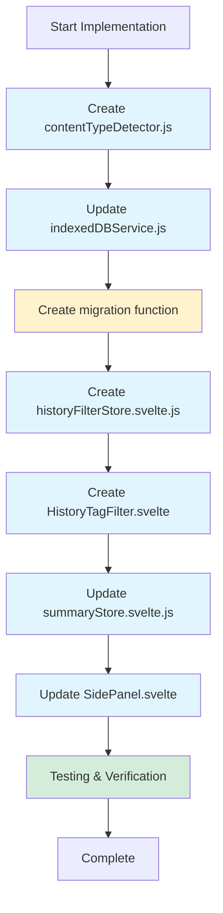

Tôi đã hoàn thành việc phân tích và tạo kế hoạch chi tiết cho tính năng auto tag cho history. Kế hoạch bao gồm:

## 📋 Tổng quan giải pháp

**10 bước implementation:**

1. ✅ **Phân tích kiến trúc** - Hoàn thành
2. **Tạo contentTypeDetector.js** - Utility function để detect loại content (youtube/course/website)
3. **Update database schema** - Thêm field `contentType` và index cho history store
4. **Migration function** - Auto-assign contentType cho history items cũ
5. **Create historyFilterStore** - Store riêng để quản lý filter state
6. **Create HistoryTagFilter component** - UI với 3 nút filter (YouTube/Website/Course)
7. **Update summaryStore** - Auto-assign contentType khi tạo history mới
8. **Update SidePanel** - Tích hợp filter UI và logic
9. **Update filtering logic** - Filter history items theo contentType
10. **Testing** - Verify tất cả hoạt động đúng

## 🎯 Kiến trúc chính:

- **Tách biệt concerns**: History filter riêng, không dùng chung với archive tags
- **Reuse patterns**: Dùng matched/unmatched items pattern giống archive
- **Auto-tagging**: Detect từ URL pattern (youtube.com/watch, udemy/coursera)
- **Migration**: Auto-gán tag cho history cũ khi upgrade DB version

Bạn có muốn tôi:

1. Làm rõ thêm chi tiết bất kỳ phần nào?
2. Sẵn sàng để tôi switch sang Code mode để implement?

## 📋 KẾ HOẠCH CHI TIẾT - AUTO TAG CHO HISTORY

### 🎯 Tổng quan giải pháp

Dựa trên phân tích code hiện tại, tôi đề xuất giải pháp sau:

#### **1. Kiến trúc tổng quan**

```
┌─────────────────────────────────────────────────────────────┐
│                    USER INTERACTION                          │
│  ┌──────────────┐  ┌──────────────┐  ┌──────────────┐      │
│  │   YouTube    │  │   Website    │  │    Course    │      │
│  │    Filter    │  │    Filter    │  │    Filter    │      │
│  └──────┬───────┘  └──────┬───────┘  └──────┬───────┘      │
│         │                 │                 │                │
│         └─────────────────┴─────────────────┘                │
│                           │                                   │
└───────────────────────────┼───────────────────────────────────┘
                            ▼
                  ┌──────────────────┐
                  │HistoryFilterStore│ (New)
                  │  - selectedType  │
                  └─────────┬────────┘
                            │
                            ▼
                  ┌──────────────────┐
                  │   SidePanel      │
                  │  - Filter UI     │
                  │  - Filtered List │
                  └─────────┬────────┘
                            │
        ┌───────────────────┴───────────────────┐
        ▼                                       ▼
┌───────────────┐                    ┌──────────────────┐
│  History DB   │                    │  summaryStore    │
│ + contentType │◄───────────────────┤ + auto-tagging   │
└───────────────┘                    └──────────────────┘
        ▲                                       │
        │                                       │
        └───────────Migration Function─────────┘
```

#### **2. Chi tiết các thành phần**

##### **A. Content Type Detector** (`src/lib/utils/contentTypeDetector.js`)

**Mục đích**: Centralize logic phát hiện loại content

**API**:

```javascript
// Phát hiện content type từ URL
export function detectContentType(url: string): 'youtube' | 'course' | 'website'

// Các pattern để detect
const PATTERNS = {
  youtube: /youtube\.com\/watch/i,
  course: /udemy\.com\/course\/.*\/learn\/|coursera\.org\/learn\//i
}
```

**Lý do tạo file riêng**:

- Tránh duplicate logic (hiện đang có ở nhiều nơi: `contentService.js`, `summaryStore.svelte.js`)
- Dễ maintain và test
- Single source of truth

---

##### **B. Database Schema Update** ([`indexedDBService.js`](src/lib/db/indexedDBService.js:1))

**Thay đổi**:

1. **Thêm index `contentType` cho history store**

   ```javascript
   historyStore.createIndex('contentType', 'contentType', { unique: false })
   ```

2. **Update [`addHistory`](src/lib/db/indexedDBService.js:183) function**

   ```javascript
   async function addHistory(historyData) {
     // Validate contentType
     if (!historyData.contentType) {
       historyData.contentType = 'website' // default fallback
     }

     // Existing logic...
   }
   ```

3. **Tạo migration function**
   ```javascript
   async function migrateHistoryContentTypes() {
     // Get all history items without contentType
     // Auto-assign contentType based on URL
     // Update each item
   }
   ```

---

##### **C. History Filter Store** (`src/stores/historyFilterStore.svelte.js`)

**Mục đích**: Quản lý filter state cho history tab (tách biệt với archive filter)

**State structure**:

```javascript
export const historyFilterStore = $state({
  selectedContentType: null, // null | 'youtube' | 'course' | 'website'
})

// Actions
export function setContentTypeFilter(type)
export function clearContentTypeFilter()
export function getSelectedContentType()
```

**Lý do tạo store riêng**:

- Tách biệt concerns: archive dùng tags, history dùng content types
- Có thể mở rộng sau này (thêm filters khác cho history)

---

##### **D. History Tag Filter Component** (`src/components/displays/history/HistoryTagFilter.svelte`)

**UI Design**:

```svelte
<div class="pt-2 pb-4 mb-2 border-b border-border/50">
  <h3 class="mb-2 px-2 text-xs font-semibold tracking-wider uppercase text-text-muted">
    Content Type
  </h3>

  <div class="flex flex-col gap-px">
    <!-- All button -->
    <button class={selectedContentType === null ? 'active' : ''}>
      <Icon icon="tabler:filter-off" />
      All History
    </button>

    <!-- YouTube filter -->
    <button class={selectedContentType === 'youtube' ? 'active' : ''}>
      <Icon icon="mdi:youtube" />
      YouTube
    </button>

    <!-- Website filter -->
    <button class={selectedContentType === 'website' ? 'active' : ''}>
      <Icon icon="mdi:web" />
      Website
    </button>

    <!-- Course filter -->
    <button class={selectedContentType === 'course' ? 'active' : ''}>
      <Icon icon="mdi:school" />
      Course
    </button>
  </div>
</div>
```

**Style**: Tương tự TagManagement component để consistency

---

##### **E. Update Summary Store** ([`summaryStore.svelte.js`](src/stores/summaryStore.svelte.js:1))

**Thay đổi trong [`logAllGeneratedSummariesToHistory`](src/stores/summaryStore.svelte.js:714)**:

```javascript
export async function logAllGeneratedSummariesToHistory() {
  // ... existing code ...

  try {
    // Import detector
    const { detectContentType } = await import('@/lib/utils/contentTypeDetector.js')

    const historyEntry = {
      id: generateUUID(),
      title: summaryState.pageTitle || 'Tiêu đề không xác định',
      url: summaryState.pageUrl || 'URL không xác định',
      date: new Date().toISOString(),
      summaries: summariesToLog,
      contentType: detectContentType(summaryState.pageUrl), // NEW: Auto-assign content type
    }

    await addHistory(historyEntry)
    // ... rest of code ...
  }
}
```

---

##### **F. Update SidePanel Component** ([`SidePanel.svelte`](src/entrypoints/archive/SidePanel.svelte:1))

**Thay đổi**:

1. **Import HistoryTagFilter component**

   ```svelte
   import HistoryTagFilter from '@/components/displays/history/HistoryTagFilter.svelte'
   import { historyFilterStore } from '@/stores/historyFilterStore.svelte.js'
   ```

2. **Thêm filter UI cho history tab**

   ```svelte
   {#if activeTab === 'history'}
     <HistoryTagFilter />
   {/if}
   ```

3. **Update filtering logic**

   ```svelte
   $effect(() => {
     if (activeTab !== 'history') {
       categorizedList = { matchedItems: list || [], unmatchedItems: [] }
       return
     }

     // Filter by content type
     if (historyFilterStore.selectedContentType === null) {
       categorizedList = { matchedItems: list || [], unmatchedItems: [] }
       return
     }

     const matched = []
     const unmatched = []

     ;(list || []).forEach((item) => {
       if (item.contentType === historyFilterStore.selectedContentType) {
         matched.push(item)
       } else {
         unmatched.push(item)
       }
     })

     categorizedList = { matchedItems: matched, unmatchedItems: unmatched }
   })
   ```

---

### 📝 Implementation Plan Diagram



---

### ⚠️ Lưu ý quan trọng

1. **Database Version**: Cần tăng `DB_VERSION` lên 5 để trigger migration
2. **Backward Compatibility**: Migration phải chạy an toàn cho history cũ
3. **Performance**: Index `contentType` giúp query nhanh hơn
4. **UX Consistency**: Filter UI phải giống với archive để user familiar
5. **Logic reuse**: Dùng chung pattern với archive filter (matched/unmatched items)

---

### 🎨 Visual Design (Filter UI)

```
┌────────────────────────┐
│ CONTENT TYPE          │
├────────────────────────┤
│ 📋 All History        │ ← Active (highlighted)
│ 🎥 YouTube            │
│ 🌐 Website            │
│ 🎓 Course             │
└────────────────────────┘
```

---

Bạn có muốn tôi làm rõ thêm phần nào không? Hoặc bạn đã sẵn sàng để tôi chuyển sang **Code mode** để implement giải pháp này?
