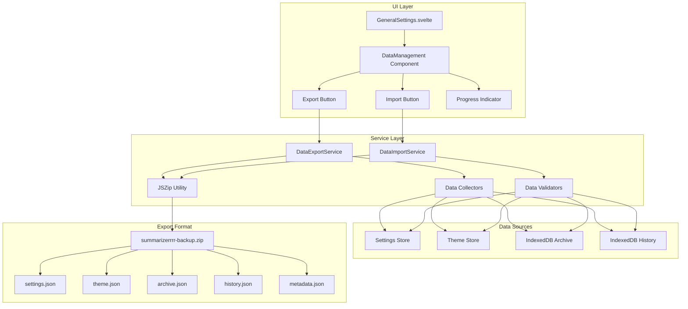
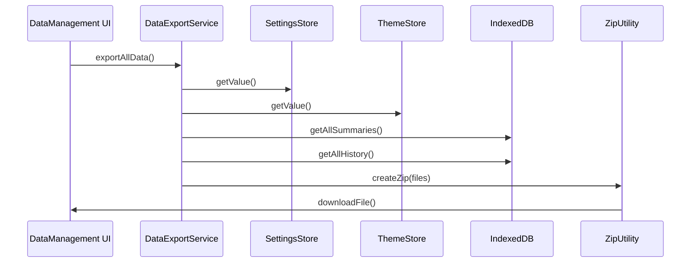
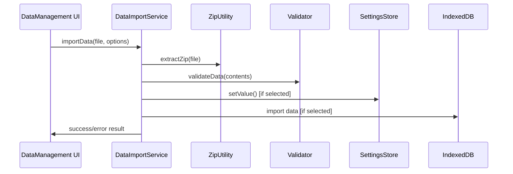

# 📋 Kế hoạch Implementation - Tính năng Export/Import Dữ liệu (Enhanced v2.0)

## 🎯 Mục tiêu

Tạo tính năng export và import dữ liệu người dùng (settings, theme, archive, và tags) cho extension Summarizerrrr, cho phép người dùng sao lưu và khôi phục dữ liệu của họ với **UUID-based merge**, **auto-backup trước import**, và **manual conflict resolution** để đảm bảo data integrity.

## 🆕 Major Improvements từ v1.0

### ✨ Key Enhancements:

1. **UUID-Based Merge Logic** - Smart merge dựa vào UUID thay vì simple replace
2. **Auto-Backup Before Import** - Tự động backup data hiện tại trước khi import
3. **Manual Conflict Resolution UI** - User control khi có conflicts
4. **Selective Import** - Chọn data types muốn import
5. **Version Migration Strategy** - Handle backups từ các versions khác nhau
6. **Enhanced Validation** - Multi-layer validation với checksum
7. **History Skipping** - Không sync history table (không quan trọng)
8. **Tag Reference Integrity** - Maintain tag relationships khi import

## 🏗️ Kiến trúc tổng quan

### 📊 Mermaid Diagram - Kiến trúc System



## 📁 Cấu trúc Files sẽ tạo

```
src/
├── services/
│   ├── dataExportService.js       # Export logic chính
│   ├── dataImportService.js       # Import logic chính
│   └── zipUtilityService.js       # JSZip wrapper utility
├── components/
│   └── settings/
│       └── DataManagement.svelte  # UI component cho export/import
└── lib/
    └── utils/
        └── dataValidation.js      # Validation helpers
```

## 🗃️ Cấu trúc dữ liệu Export

### ZIP File Structure

```
summarizerrrr-backup-YYYY-MM-DD-HH-mm-ss.zip
├── metadata.json          # Thông tin về backup
├── settings.json          # Toàn bộ settings từ settingsStorage
├── theme.json            # Theme settings từ themeStorage
├── archive.json          # Tất cả summaries từ IndexedDB
└── history.json          # Tất cả history từ IndexedDB
```

### metadata.json Format

```json
{
  "version": "1.0.0",
  "exportDate": "2025-01-08T15:30:00.000Z",
  "appVersion": "2.2.3",
  "browser": "chrome|firefox",
  "dataTypes": ["settings", "theme", "archive", "history"],
  "itemCounts": {
    "settings": 1,
    "theme": 1,
    "archive": 156,
    "history": 42
  },
  "checksum": "sha256-hash-of-all-files"
}
```

## 📋 Chi tiết Implementation Plan

### Phase 1: Core Services & Utilities

- [ ] **1.1** Thêm JSZip dependency vào package.json
- [ ] **1.2** Tạo zipUtilityService.js - wrapper cho JSZip
- [ ] **1.3** Tạo dataValidation.js - enhanced validation helpers
- [ ] **1.4** Tạo versionMigration.js - version migration logic
- [ ] **1.5** Tạo conflictDetection.js - duplicate detection utilities

### Phase 2: Export System

- [ ] **2.1** Tạo dataExportService.js
- [ ] **2.2** Implement data collection từ stores và IndexedDB
- [ ] **2.3** Implement metadata generation với backupFormatVersion
- [ ] **2.4** Implement ZIP file generation với checksum
- [ ] **2.5** Implement file download functionality
- [ ] **2.6** Add progress tracking cho large datasets

### Phase 3: Auto-Backup System

- [ ] **3.1** Tạo autoBackupService.js
- [ ] **3.2** Implement pre-import backup logic
- [ ] **3.3** Implement backup naming với timestamps
- [ ] **3.4** Add backup confirmation dialog

### Phase 4: Import System (Core)

- [ ] **4.1** Tạo dataImportService.js
- [ ] **4.2** Implement ZIP file reading và extraction
- [ ] **4.3** Implement multi-layer validation:
  - [ ] File format validation
  - [ ] Version compatibility check
  - [ ] Checksum verification
  - [ ] Schema validation
- [ ] **4.4** Implement version migration logic
- [ ] **4.5** Implement selective data restore

### Phase 5: Merge & Conflict Resolution

- [ ] **5.1** Implement UUID-based merge logic cho Archive
- [ ] **5.2** Implement tag merge với name-based matching
- [ ] **5.3** Implement duplicate detection by URL
- [ ] **5.4** Implement conflict detection và collection
- [ ] **5.5** Create conflict resolution state management

### Phase 6: UI Components

- [ ] **6.1** Tạo DataManagement.svelte component
- [ ] **6.2** Implement Export UI:
  - [ ] Export button với loading state
  - [ ] Progress indicator
  - [ ] Success/error feedback
- [ ] **6.3** Implement Import UI:
  - [ ] File input với drag & drop
  - [ ] Backup preview card
  - [ ] Data type selection checkboxes
  - [ ] Import mode selector (Merge/Replace)
  - [ ] Auto-backup option toggle
- [ ] **6.4** Implement ConflictResolution.svelte component:
  - [ ] Conflict list với details
  - [ ] Resolution options (Keep Both/Replace/Skip)
  - [ ] "Apply to All" checkbox
  - [ ] Preview existing vs imported data
- [ ] **6.5** Implement VersionWarning.svelte dialog
- [ ] **6.6** Implement AutoBackupConfirm.svelte dialog

### Phase 7: Integration

- [ ] **7.1** Integrate DataManagement vào GeneralSettings
- [ ] **7.2** Wire up all event handlers
- [ ] **7.3** Implement comprehensive error handling
- [ ] **7.4** Add progress indicators cho all async operations
- [ ] **7.5** Implement rollback mechanism nếu import fails

### Phase 8: Internationalization

- [ ] **8.1** Update English locale file với new keys:
  - [ ] Conflict resolution UI
  - [ ] Version warnings
  - [ ] Auto-backup messages
  - [ ] Validation errors
- [ ] **8.2** Update Vietnamese locale file
- [ ] **8.3** Update other locale files (de, es, fr, ja, ko, zh_CN)

### Phase 9: Testing & Validation

- [ ] **9.1** Unit Tests:
  - [ ] Version migration logic
  - [ ] UUID-based merge logic
  - [ ] Conflict detection
  - [ ] Tag merging
- [ ] **9.2** Integration Tests:
  - [ ] Full export-import cycle
  - [ ] Merge với conflicts
  - [ ] Replace mode
  - [ ] Auto-backup flow
- [ ] **9.3** UI Tests:
  - [ ] Conflict resolution workflow
  - [ ] Drag & drop functionality
  - [ ] Progress indicators
  - [ ] Error displays
- [ ] **9.4** Edge Case Tests:
  - [ ] Large datasets (1000+ summaries)
  - [ ] Version mismatches
  - [ ] Corrupted ZIP files
  - [ ] Network interruptions
  - [ ] Storage quota exceeded

### Phase 10: Documentation & Polish

- [ ] **10.1** Add inline code documentation
- [ ] **10.2** Create user guide cho export/import feature
- [ ] **10.3** Add tooltips trong UI
- [ ] **10.4** Performance optimization
- [ ] **10.5** Final testing & bug fixes

## 🔧 Technical Specifications

### 1. Dependencies cần thêm

```json
{
  "jszip": "^3.10.1"
}
```

### 2. Export Process Flow



### 3. Import Process Flow



### 4. Import Options Structure (Enhanced)

```javascript
const importOptions = {
  // Data type selection
  dataTypes: {
    settings: true, // Import settings.json
    theme: true, // Import theme.json
    archive: true, // Import archive.json (summaries)
    tags: true, // Import and merge tags
    history: false, // Skip history - not important
  },

  // Import modes
  mode: 'merge', // 'merge' | 'replace'

  // Conflict resolution (for merge mode)
  conflictResolution: {
    strategy: 'manual', // 'manual' | 'auto'
    autoRule: 'keep-newer', // 'keep-newer' | 'keep-both' | 'skip'
    applyToAll: false, // Apply same choice to all conflicts
  },

  // Auto-backup settings
  autoBackup: {
    enabled: true, // Auto backup before import
    includeInFilename: true, // Add timestamp to backup filename
  },

  // Validation options
  validation: {
    strictVersion: false, // Strict version matching
    verifyChecksum: true, // Verify file integrity
    validateSchema: true, // Validate data structure
  },
}
```

### 5. UUID-Based Merge Strategy

```javascript
// Archive (Summaries) Merge Logic
async function mergeArchiveData(importedSummaries, conflictResolution) {
  const existingSummaries = await getAllSummaries()
  const existingMap = new Map(existingSummaries.map((s) => [s.id, s]))
  const existingUrlMap = new Map(existingSummaries.map((s) => [s.url, s]))

  const results = {
    added: [],
    updated: [],
    skipped: [],
    conflicts: [],
  }

  for (const importedSummary of importedSummaries) {
    const existingByUUID = existingMap.get(importedSummary.id)

    if (existingByUUID) {
      // UUID match - potential update
      if (new Date(importedSummary.date) > new Date(existingByUUID.date)) {
        // Imported is newer - safe to update
        await updateSummary(importedSummary)
        results.updated.push(importedSummary.id)
      } else {
        // Existing is newer or same - skip or ask user
        if (conflictResolution.strategy === 'manual') {
          results.conflicts.push({
            type: 'uuid-older',
            existing: existingByUUID,
            imported: importedSummary,
          })
        } else if (conflictResolution.autoRule === 'keep-newer') {
          results.skipped.push(importedSummary.id)
        }
      }
    } else {
      // No UUID match - check for duplicate by URL
      const existingByUrl = existingUrlMap.get(importedSummary.url)

      if (existingByUrl) {
        // Same URL, different UUID - conflict!
        if (conflictResolution.strategy === 'manual') {
          results.conflicts.push({
            type: 'url-duplicate',
            existing: existingByUrl,
            imported: importedSummary,
          })
        } else if (conflictResolution.autoRule === 'keep-both') {
          // Create new entry with new UUID
          const newSummary = { ...importedSummary, id: generateUUID() }
          await addSummary(newSummary)
          results.added.push(newSummary.id)
        } else if (conflictResolution.autoRule === 'skip') {
          results.skipped.push(importedSummary.id)
        }
      } else {
        // Completely new - safe to add
        await addSummary(importedSummary)
        results.added.push(importedSummary.id)
      }
    }
  }

  return results
}

// Tags Merge Logic
async function mergeTagsData(importedTags) {
  const existingTags = await getAllTags()
  const existingTagsByName = new Map(existingTags.map((t) => [t.name, t]))

  const tagIdMap = new Map() // Old ID -> New ID mapping

  for (const importedTag of importedTags) {
    const existingTag = existingTagsByName.get(importedTag.name)

    if (existingTag) {
      // Tag name exists - reuse existing tag
      tagIdMap.set(importedTag.id, existingTag.id)
    } else {
      // New tag - create with same name but may need new ID
      const newTag = await addTag(importedTag.name)
      tagIdMap.set(importedTag.id, newTag.id)
    }
  }

  return tagIdMap // Return mapping for updating summary references
}

// Settings Merge Logic
async function mergeSettingsData(importedSettings, userChoice) {
  const currentSettings = await settingsStorage.getValue()

  if (userChoice === 'replace') {
    // Complete replace
    await settingsStorage.setValue(importedSettings)
  } else if (userChoice === 'merge') {
    // Merge - imported values override current
    const merged = { ...currentSettings, ...importedSettings }
    await settingsStorage.setValue(merged)
  } else if (userChoice === 'keep') {
    // Keep current - skip import
    return
  }
}
```

### 6. Version Migration Strategy (Hybrid Approach)

```javascript
// Semantic Versioning Validation
function validateBackupVersion(backupMetadata) {
  const backupFormat = backupMetadata.backupFormatVersion // e.g., "1.2.0"
  const currentFormat = '1.0.0' // Current backup format version

  const [backupMajor, backupMinor, backupPatch] = backupFormat
    .split('.')
    .map(Number)
  const [currentMajor, currentMinor, currentPatch] = currentFormat
    .split('.')
    .map(Number)

  // Rule 1: Major version must match
  if (backupMajor !== currentMajor) {
    return {
      compatible: false,
      error: 'MAJOR_VERSION_MISMATCH',
      message: `Backup format v${backupMajor}.x.x is not compatible with current v${currentMajor}.x.x`,
      canProceed: false,
    }
  }

  // Rule 2: Newer minor version - warning but can proceed
  if (backupMinor > currentMinor) {
    return {
      compatible: true,
      warning: 'NEWER_MINOR_VERSION',
      message: `Backup from newer version v${backupFormat}. Some features may not be imported.`,
      canProceed: true,
      requiresConfirmation: true,
    }
  }

  // Rule 3: Older minor version - need migration
  if (backupMinor < currentMinor) {
    return {
      compatible: true,
      info: 'OLDER_VERSION',
      message: `Backup from older version v${backupFormat}. Will auto-migrate.`,
      canProceed: true,
      needsMigration: true,
      migrationPath: `${backupMinor}.x.x -> ${currentMinor}.x.x`,
    }
  }

  // Rule 4: Same major.minor - always compatible
  return {
    compatible: true,
    canProceed: true,
    message: 'Backup version is compatible',
  }
}

// Migration Functions
const migrations = {
  // Migration from 1.0.x to 1.1.x
  '1.0-1.1': async (backupData) => {
    // Example: Add new field to summaries
    if (backupData.archive) {
      backupData.archive = backupData.archive.map((summary) => ({
        ...summary,
        newField: 'defaultValue', // Add missing field
      }))
    }
    return backupData
  },

  // Migration from 1.1.x to 1.2.x
  '1.1-1.2': async (backupData) => {
    // Example: Restructure data
    // ... migration logic
    return backupData
  },
}

async function migrateBackupData(backupData, fromVersion, toVersion) {
  const [fromMajor, fromMinor] = fromVersion.split('.').map(Number)
  const [toMajor, toMinor] = toVersion.split('.').map(Number)

  let currentData = backupData

  // Apply migrations sequentially
  for (let minor = fromMinor; minor < toMinor; minor++) {
    const migrationKey = `${fromMajor}.${minor}-${fromMajor}.${minor + 1}`
    const migration = migrations[migrationKey]

    if (migration) {
      console.log(`Applying migration: ${migrationKey}`)
      currentData = await migration(currentData)
    }
  }

  return currentData
}
```

## 🎨 UI Design Specifications

### Export Section

- **Icon**: 📤 Download/Export icon từ @iconify/svelte
- **Button**: "Export All Data" button với loading state
- **Progress**: Linear progress bar với percentage display
- **Success**: Toast notification với file size info

### Import Section

- **Icon**: 📥 Upload/Import icon từ @iconify/svelte
- **File Input**: Drag & drop zone cho ZIP files
- **Preview**: Hiển thị metadata từ backup file
- **Options**:
  - Checkboxes cho data types (Settings, Archive, History)
  - Radio buttons cho merge/replace mode
- **Import Button**: "Import Selected Data" với confirmation

### CSS Classes

- Sử dụng Tailwind CSS classes có sẵn trong project
- Theo design pattern của GeneralSettings hiện tại
- Responsive design cho mobile và desktop

## 🌐 Internationalization Keys

### English (en.json)

```json
{
  "settings": {
    "general": {
      "data_management": {
        "title": "Data Management",
        "description": "Export and import your settings and archive data",
        "export": {
          "title": "Export Data",
          "button": "Export All Data",
          "progress": "Preparing backup...",
          "success": "Data exported successfully ({size})",
          "error": "Failed to export data"
        },
        "import": {
          "title": "Import Data",
          "button": "Import Selected Data",
          "drag_drop": "Drag & drop backup file here or click to browse",
          "file_select": "Select backup file",
          "preview_title": "Backup Information",
          "options": {
            "settings": "Settings & Theme",
            "archive": "Archive Data ({count} items)",
            "history": "History Data ({count} items)",
            "mode_merge": "Merge with existing data",
            "mode_replace": "Replace existing data"
          },
          "success": "Data imported successfully",
          "error": "Failed to import data"
        }
      }
    }
  }
}
```

### Vietnamese (vi.json)

```json
{
  "settings": {
    "general": {
      "data_management": {
        "title": "Quản lý Dữ liệu",
        "description": "Xuất và nhập cài đặt cũng như dữ liệu lưu trữ của bạn",
        "export": {
          "title": "Xuất Dữ liệu",
          "button": "Xuất Tất cả Dữ liệu",
          "progress": "Đang chuẩn bị sao lưu...",
          "success": "Xuất dữ liệu thành công ({size})",
          "error": "Lỗi khi xuất dữ liệu"
        },
        "import": {
          "title": "Nhập Dữ liệu",
          "button": "Nhập Dữ liệu Đã chọn",
          "drag_drop": "Kéo thả file sao lưu vào đây hoặc nhấp để chọn",
          "file_select": "Chọn file sao lưu",
          "preview_title": "Thông tin Sao lưu",
          "options": {
            "settings": "Cài đặt & Giao diện",
            "archive": "Dữ liệu Lưu trữ ({count} mục)",
            "history": "Dữ liệu Lịch sử ({count} mục)",
            "mode_merge": "Ghép với dữ liệu hiện có",
            "mode_replace": "Thay thế dữ liệu hiện có"
          },
          "success": "Nhập dữ liệu thành công",
          "error": "Lỗi khi nhập dữ liệu"
        }
      }
    }
  }
}
```

## ✅ Enhanced Validation & Error Handling

### Multi-Layer Validation

**Layer 1: File Format Validation**

```javascript
async function validateFileFormat(file) {
  // Check file extension
  if (!file.name.endsWith('.zip')) {
    throw new ValidationError('INVALID_FILE_TYPE', 'File must be a .zip file')
  }

  // Check file size (max 100MB)
  const MAX_SIZE = 100 * 1024 * 1024
  if (file.size > MAX_SIZE) {
    throw new ValidationError(
      'FILE_TOO_LARGE',
      `File size exceeds ${MAX_SIZE / 1024 / 1024}MB`
    )
  }

  // Verify ZIP integrity
  try {
    const zip = await JSZip.loadAsync(file)
    return zip
  } catch (error) {
    throw new ValidationError(
      'CORRUPTED_ZIP',
      'ZIP file is corrupted or invalid'
    )
  }
}
```

**Layer 2: Content Validation**

```javascript
async function validateZipContents(zip) {
  const errors = []

  // Required files check
  const requiredFiles = ['metadata.json']
  for (const filename of requiredFiles) {
    if (!zip.files[filename]) {
      errors.push(`Missing required file: ${filename}`)
    }
  }

  // Optional files check
  const optionalFiles = [
    'settings.json',
    'theme.json',
    'archive.json',
    'tags.json',
  ]
  const foundFiles = optionalFiles.filter((f) => zip.files[f])

  if (foundFiles.length === 0) {
    errors.push('No data files found in backup')
  }

  if (errors.length > 0) {
    throw new ValidationError('INVALID_ZIP_CONTENTS', errors.join('; '))
  }

  return foundFiles
}
```

**Layer 3: Metadata Validation**

```javascript
async function validateMetadata(metadata) {
  const requiredFields = [
    'backupFormatVersion',
    'exportDate',
    'appVersion',
    'dataTypes',
  ]
  const missingFields = requiredFields.filter((field) => !metadata[field])

  if (missingFields.length > 0) {
    throw new ValidationError(
      'INVALID_METADATA',
      `Missing fields: ${missingFields.join(', ')}`
    )
  }

  // Validate date
  const exportDate = new Date(metadata.exportDate)
  if (isNaN(exportDate.getTime())) {
    throw new ValidationError('INVALID_DATE', 'Export date is invalid')
  }

  // Version validation
  const versionCheck = validateBackupVersion(metadata)
  if (!versionCheck.compatible) {
    throw new ValidationError('VERSION_INCOMPATIBLE', versionCheck.message)
  }

  return versionCheck
}
```

**Layer 4: Data Schema Validation**

```javascript
async function validateArchiveSchema(archiveData) {
  if (!Array.isArray(archiveData)) {
    throw new ValidationError(
      'INVALID_ARCHIVE_SCHEMA',
      'Archive data must be an array'
    )
  }

  const requiredSummaryFields = ['id', 'title', 'url', 'date', 'content']

  for (let i = 0; i < archiveData.length; i++) {
    const summary = archiveData[i]
    const missing = requiredSummaryFields.filter((field) => !summary[field])

    if (missing.length > 0) {
      throw new ValidationError(
        'INVALID_SUMMARY_SCHEMA',
        `Summary at index ${i} missing fields: ${missing.join(', ')}`
      )
    }

    // Validate UUID format
    if (!isValidUUID(summary.id)) {
      throw new ValidationError(
        'INVALID_UUID',
        `Invalid UUID at index ${i}: ${summary.id}`
      )
    }
  }

  return true
}
```

**Layer 5: Checksum Verification**

```javascript
async function verifyChecksum(zipFiles, metadata) {
  if (!metadata.checksums) {
    console.warn('No checksums in metadata - skipping verification')
    return true
  }

  for (const [filename, expectedChecksum] of Object.entries(
    metadata.checksums
  )) {
    if (zipFiles[filename]) {
      const content = await zipFiles[filename].async('string')
      const actualChecksum = await calculateSHA256(content)

      if (actualChecksum !== expectedChecksum) {
        throw new ValidationError(
          'CHECKSUM_MISMATCH',
          `File ${filename} checksum mismatch - file may be corrupted`
        )
      }
    }
  }

  return true
}
```

### Comprehensive Error Scenarios

| Error Code                      | Scenario                  | User Message                                                   | Action                         |
| ------------------------------- | ------------------------- | -------------------------------------------------------------- | ------------------------------ |
| `INVALID_FILE_TYPE`             | File không phải .zip      | "Please select a valid backup file (.zip)"                     | Show file picker again         |
| `FILE_TOO_LARGE`                | File > 100MB              | "Backup file is too large (max 100MB)"                         | Ask user to export selectively |
| `CORRUPTED_ZIP`                 | ZIP file bị corrupt       | "Backup file is corrupted. Please try another backup."         | Reject import                  |
| `MISSING_METADATA`              | Không có metadata.json    | "Invalid backup file - missing metadata"                       | Reject import                  |
| `INVALID_METADATA`              | Metadata thiếu fields     | "Backup metadata is incomplete or invalid"                     | Reject import                  |
| `VERSION_INCOMPATIBLE`          | Major version mismatch    | "Backup from incompatible version (v{X}.x.x)"                  | Reject import                  |
| `NEWER_VERSION`                 | Backup từ version mới hơn | "Backup from newer version - some data may be lost. Continue?" | Ask confirmation               |
| `INVALID_SCHEMA`                | Data structure sai        | "Backup data structure is invalid"                             | Reject import                  |
| `CHECKSUM_MISMATCH`             | Checksum không khớp       | "Backup file integrity check failed"                           | Reject import                  |
| `STORAGE_QUOTA_EXCEEDED`        | Không đủ storage          | "Not enough storage space to import"                           | Ask user to free space         |
| `IMPORT_INTERRUPTED`            | Import bị gián đoạn       | "Import was interrupted. Data has been restored."              | Show rollback success          |
| `CONFLICT_RESOLUTION_CANCELLED` | User cancel conflicts     | "Import cancelled by user"                                     | No changes made                |

### User Feedback System

**Progress Tracking**

```javascript
const importProgress = {
  stage: 'validating', // 'validating' | 'backing-up' | 'importing' | 'resolving-conflicts' | 'finalizing'
  percentage: 0,
  currentItem: '',
  totalItems: 0,
  processedItems: 0,
  message: 'Validating backup file...',
}
```

**Toast Notifications**

- ✅ **Success**: "Data imported successfully! {count} items added, {count} updated"
- ⚠️ **Warning**: "Import completed with {count} conflicts resolved"
- ❌ **Error**: "{Error message} - Please try again or contact support"
- ℹ️ **Info**: "Auto-backup created: backup-{timestamp}.zip"

**Confirmation Dialogs**

1. **Replace Mode Warning**: "This will replace all existing data. Continue?"
2. **Version Mismatch Warning**: "Backup from different version. Some features may not work. Continue?"
3. **Auto-Backup Confirm**: "Create backup before import? (Recommended)"
4. **Conflict Resolution**: "Found {count} conflicts. Resolve now?"

### Error Recovery & Rollback

```javascript
class ImportTransaction {
  constructor() {
    this.backupData = null
    this.importedIds = []
    this.updatedIds = []
  }

  async begin() {
    // Create backup of current data
    this.backupData = await exportAllData()
  }

  async commit() {
    // Import successful - clear backup
    this.backupData = null
  }

  async rollback() {
    // Import failed - restore from backup
    if (this.backupData) {
      console.log('Rolling back import...')

      // Remove newly added items
      for (const id of this.importedIds) {
        await deleteSummary(id)
      }

      // Restore updated items
      // ... restore logic

      toast.success('Import cancelled. Data has been restored.')
    }
  }
}
```

## 🧪 Testing Strategy

### Unit Tests

- Test từng service function độc lập
- Mock dependencies (stores, IndexedDB)
- Test validation logic với various input

### Integration Tests

- Test end-to-end export/import flow
- Test với real data từ stores
- Test error handling và recovery

### User Experience Tests

- Test drag & drop functionality
- Test progress indicators
- Test responsive design
- Test với large datasets

## 🚀 Deployment Considerations

### Performance

- **Lazy Loading**: Components chỉ load khi cần
- **Chunked Processing**: Xử lý large datasets theo chunks
- **Memory Management**: Cleanup resources sau operations

### Browser Compatibility

- **Chrome**: Full support với Manifest V3
- **Firefox**: Ensure compatibility với Manifest V2
- **Mobile**: Responsive design cho mobile browsers

### File Size Optimization

- **Compression**: Use ZIP compression để giảm file size
- **Data Filtering**: Option để exclude large/unnecessary data
- **Progress Tracking**: Show progress cho large operations

## 📝 Implementation Notes

### Critical Considerations

1. **Storage Limits**:

   - Check available storage trước khi import
   - Handle `QuotaExceededError` gracefully
   - Suggest selective import nếu storage không đủ

2. **Performance**:

   - Process large datasets trong chunks (100 items/chunk)
   - Use Web Workers cho heavy operations
   - Implement cancellation support

3. **Data Privacy**:

   - API keys trong settings được encrypt
   - Option để exclude sensitive data khi export
   - Clear warning về data security

4. **Browser Compatibility**:

   - Test trên Chrome, Firefox, Edge
   - Handle browser-specific IndexedDB quirks
   - Polyfills cho File API nếu cần

5. **User Experience**:
   - Clear progress indication
   - Ability to cancel long operations
   - Detailed import summary
   - Undo/rollback capability

### Technical Assumptions

1. **UUID Format**: Using standard UUID v4
2. **Date Format**: ISO 8601 (YYYY-MM-DDTHH:mm:ss.sssZ)
3. **File Encoding**: UTF-8
4. **ZIP Compression**: Default (level 6)
5. **Checksum Algorithm**: SHA-256
6. **Max File Size**: 100MB
7. **Max Items**: 10,000 summaries per backup

## 🔄 Future Enhancements (Post v1.0)

### Phase 2 Enhancements:

1. **Cloud Backup Integration** (Separate feature)

   - Google Drive support
   - Dropbox integration
   - Auto-sync capabilities
   - Version history tracking

2. **Advanced Features**:

   - Scheduled auto-backups
   - Incremental backups (delta sync)
   - Backup encryption với password
   - Backup compression options
   - Multi-device sync

3. **Analytics & Insights**:

   - Backup statistics
   - Storage usage tracking
   - Import/export history
   - Conflict patterns analysis

4. **Collaboration** (Premium feature):
   - Share backups với team
   - Merge backups từ multiple users
   - Conflict resolution với voting
   - Backup comments/notes

## 🎯 Success Metrics

### MVP Success Criteria:

- ✅ User có thể export tất cả data thành ZIP file
- ✅ User có thể import ZIP file với selective options
- ✅ Conflicts được detect và resolve correctly
- ✅ Data integrity maintained sau import
- ✅ Auto-backup works trước mỗi import
- ✅ UI responsive và intuitive
- ✅ Comprehensive error handling
- ✅ Performance acceptable với 1000+ items

### Performance Targets:

- Export 1000 items: < 5 seconds
- Import 1000 items (no conflicts): < 10 seconds
- Import 1000 items (with conflicts): < 30 seconds (user time)
- File size: ~1KB per summary (compressed)
- Memory usage: < 200MB peak

### Quality Metrics:

- Zero data loss during import/export
- < 1% error rate in production
- 99% user satisfaction
- < 5 support tickets per month

---

**Tác giả**: Kilo Code  
**Ngày tạo**: 2025-01-08  
**Version**: 1.0.0  
**Status**: Ready for Implementation
