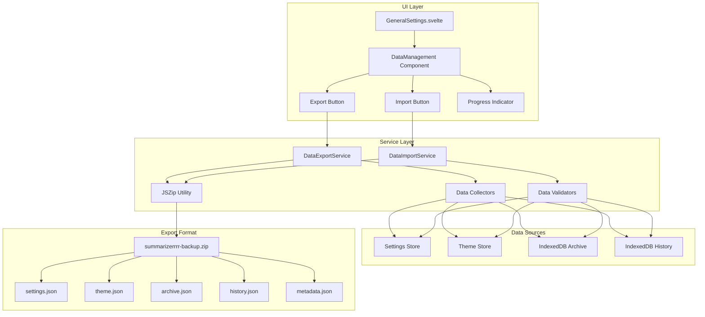
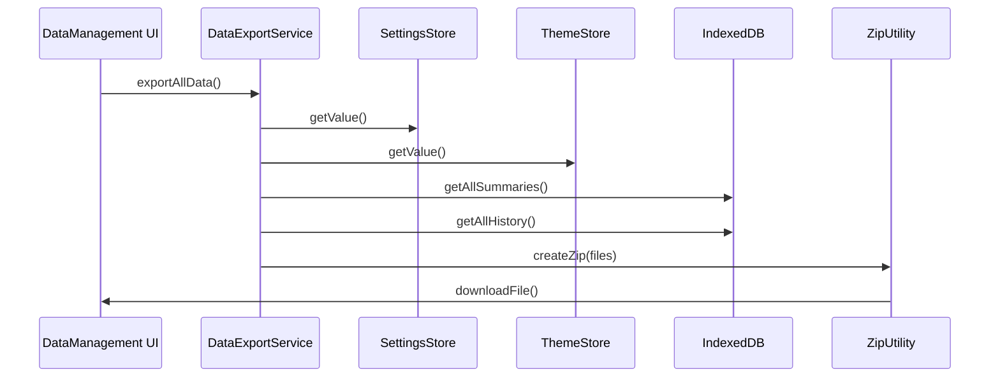
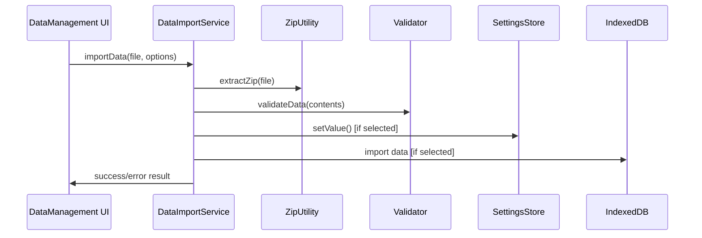

# 📋 Kế hoạch Implementation - Tính năng Export/Import Dữ liệu

## 🎯 Mục tiêu

Tạo tính năng export và import dữ liệu người dùng (settings và archive) cho extension Summarizerrrr, cho phép người dùng sao lưu và khôi phục dữ liệu của họ.

## 🏗️ Kiến trúc tổng quan

### 📊 Mermaid Diagram - Kiến trúc System



## 📁 Cấu trúc Files sẽ tạo

```
src/
├── services/
│   ├── dataExportService.js       # Export logic chính
│   ├── dataImportService.js       # Import logic chính
│   └── zipUtilityService.js       # JSZip wrapper utility
├── components/
│   └── settings/
│       └── DataManagement.svelte  # UI component cho export/import
└── lib/
    └── utils/
        └── dataValidation.js      # Validation helpers
```

## 🗃️ Cấu trúc dữ liệu Export

### ZIP File Structure

```
summarizerrrr-backup-YYYY-MM-DD-HH-mm-ss.zip
├── metadata.json          # Thông tin về backup
├── settings.json          # Toàn bộ settings từ settingsStorage
├── theme.json            # Theme settings từ themeStorage
├── archive.json          # Tất cả summaries từ IndexedDB
└── history.json          # Tất cả history từ IndexedDB
```

### metadata.json Format

```json
{
  "version": "1.0.0",
  "exportDate": "2025-01-08T15:30:00.000Z",
  "appVersion": "2.2.3",
  "browser": "chrome|firefox",
  "dataTypes": ["settings", "theme", "archive", "history"],
  "itemCounts": {
    "settings": 1,
    "theme": 1,
    "archive": 156,
    "history": 42
  },
  "checksum": "sha256-hash-of-all-files"
}
```

## 📋 Chi tiết Implementation Plan

### Phase 1: Dependencies và Utilities

- [ ] **1.1** Thêm JSZip dependency vào package.json
- [ ] **1.2** Tạo zipUtilityService.js - wrapper cho JSZip
- [ ] **1.3** Tạo dataValidation.js - validation helpers

### Phase 2: Export System

- [ ] **2.1** Tạo dataExportService.js
- [ ] **2.2** Implement data collection từ các stores
- [ ] **2.3** Implement ZIP file generation
- [ ] **2.4** Implement file download functionality

### Phase 3: Import System

- [ ] **3.1** Tạo dataImportService.js
- [ ] **3.2** Implement ZIP file reading và validation
- [ ] **3.3** Implement selective data restore
- [ ] **3.4** Implement merge vs replace logic

### Phase 4: UI Components

- [ ] **4.1** Tạo DataManagement.svelte component
- [ ] **4.2** Implement export UI với progress indicator
- [ ] **4.3** Implement import UI với drag & drop
- [ ] **4.4** Implement data type selection checkboxes

### Phase 5: Integration

- [ ] **5.1** Integrate DataManagement vào GeneralSettings
- [ ] **5.2** Add error handling và user feedback
- [ ] **5.3** Add progress indicators và loading states

### Phase 6: Internationalization

- [ ] **6.1** Update English locale file
- [ ] **6.2** Update Vietnamese locale file
- [ ] **6.3** Update other locale files if needed

### Phase 7: Testing

- [ ] **7.1** Test export functionality với các data types
- [ ] **7.2** Test import functionality với validation
- [ ] **7.3** Test error scenarios và edge cases
- [ ] **7.4** Test UI responsiveness và UX flow

## 🔧 Technical Specifications

### 1. Dependencies cần thêm

```json
{
  "jszip": "^3.10.1"
}
```

### 2. Export Process Flow



### 3. Import Process Flow



### 4. Import Options Structure

```javascript
const importOptions = {
  settings: true, // Import settings.json & theme.json
  archive: true, // Import archive.json
  history: false, // Skip history.json
  mode: 'merge', // 'merge' | 'replace'
}
```

## 🎨 UI Design Specifications

### Export Section

- **Icon**: 📤 Download/Export icon từ @iconify/svelte
- **Button**: "Export All Data" button với loading state
- **Progress**: Linear progress bar với percentage display
- **Success**: Toast notification với file size info

### Import Section

- **Icon**: 📥 Upload/Import icon từ @iconify/svelte
- **File Input**: Drag & drop zone cho ZIP files
- **Preview**: Hiển thị metadata từ backup file
- **Options**:
  - Checkboxes cho data types (Settings, Archive, History)
  - Radio buttons cho merge/replace mode
- **Import Button**: "Import Selected Data" với confirmation

### CSS Classes

- Sử dụng Tailwind CSS classes có sẵn trong project
- Theo design pattern của GeneralSettings hiện tại
- Responsive design cho mobile và desktop

## 🌐 Internationalization Keys

### English (en.json)

```json
{
  "settings": {
    "general": {
      "data_management": {
        "title": "Data Management",
        "description": "Export and import your settings and archive data",
        "export": {
          "title": "Export Data",
          "button": "Export All Data",
          "progress": "Preparing backup...",
          "success": "Data exported successfully ({size})",
          "error": "Failed to export data"
        },
        "import": {
          "title": "Import Data",
          "button": "Import Selected Data",
          "drag_drop": "Drag & drop backup file here or click to browse",
          "file_select": "Select backup file",
          "preview_title": "Backup Information",
          "options": {
            "settings": "Settings & Theme",
            "archive": "Archive Data ({count} items)",
            "history": "History Data ({count} items)",
            "mode_merge": "Merge with existing data",
            "mode_replace": "Replace existing data"
          },
          "success": "Data imported successfully",
          "error": "Failed to import data"
        }
      }
    }
  }
}
```

### Vietnamese (vi.json)

```json
{
  "settings": {
    "general": {
      "data_management": {
        "title": "Quản lý Dữ liệu",
        "description": "Xuất và nhập cài đặt cũng như dữ liệu lưu trữ của bạn",
        "export": {
          "title": "Xuất Dữ liệu",
          "button": "Xuất Tất cả Dữ liệu",
          "progress": "Đang chuẩn bị sao lưu...",
          "success": "Xuất dữ liệu thành công ({size})",
          "error": "Lỗi khi xuất dữ liệu"
        },
        "import": {
          "title": "Nhập Dữ liệu",
          "button": "Nhập Dữ liệu Đã chọn",
          "drag_drop": "Kéo thả file sao lưu vào đây hoặc nhấp để chọn",
          "file_select": "Chọn file sao lưu",
          "preview_title": "Thông tin Sao lưu",
          "options": {
            "settings": "Cài đặt & Giao diện",
            "archive": "Dữ liệu Lưu trữ ({count} mục)",
            "history": "Dữ liệu Lịch sử ({count} mục)",
            "mode_merge": "Ghép với dữ liệu hiện có",
            "mode_replace": "Thay thế dữ liệu hiện có"
          },
          "success": "Nhập dữ liệu thành công",
          "error": "Lỗi khi nhập dữ liệu"
        }
      }
    }
  }
}
```

## ✅ Validation & Error Handling

### File Validation

- **ZIP Format**: Kiểm tra file có phải ZIP hợp lệ
- **Required Files**: metadata.json phải có mặt
- **JSON Structure**: Validate cấu trúc JSON của từng file
- **Version Check**: Kiểm tra compatibility với app version hiện tại
- **Checksum**: Verify tính toàn vẹn dữ liệu

### Error Scenarios

- **Invalid ZIP**: File không phải ZIP hoặc bị corrupt
- **Missing Files**: Thiếu các file bắt buộc trong ZIP
- **Invalid JSON**: Cấu trúc JSON không hợp lệ
- **Version Mismatch**: Backup từ version không tương thích
- **Storage Quota**: Không đủ storage để import
- **Permission Errors**: Lỗi quyền truy cập file/storage

### User Feedback

- **Success Messages**: Toast notifications cho thành công
- **Error Messages**: Chi tiết lỗi và hướng dẫn khắc phục
- **Progress Indicators**: Loading states cho operations dài
- **Confirmation Dialogs**: Xác nhận trước khi replace data

## 🧪 Testing Strategy

### Unit Tests

- Test từng service function độc lập
- Mock dependencies (stores, IndexedDB)
- Test validation logic với various input

### Integration Tests

- Test end-to-end export/import flow
- Test với real data từ stores
- Test error handling và recovery

### User Experience Tests

- Test drag & drop functionality
- Test progress indicators
- Test responsive design
- Test với large datasets

## 🚀 Deployment Considerations

### Performance

- **Lazy Loading**: Components chỉ load khi cần
- **Chunked Processing**: Xử lý large datasets theo chunks
- **Memory Management**: Cleanup resources sau operations

### Browser Compatibility

- **Chrome**: Full support với Manifest V3
- **Firefox**: Ensure compatibility với Manifest V2
- **Mobile**: Responsive design cho mobile browsers

### File Size Optimization

- **Compression**: Use ZIP compression để giảm file size
- **Data Filtering**: Option để exclude large/unnecessary data
- **Progress Tracking**: Show progress cho large operations

## 📝 Notes và Assumptions

1. **Storage Limits**: Cần handle browser storage quotas
2. **File API**: Sử dụng modern File API cho drag & drop
3. **Async Operations**: Tất cả operations là async với proper error handling
4. **User Permissions**: Có thể cần additional permissions cho file access
5. **Data Privacy**: Ensure exported data không chứa sensitive information

## 🔄 Future Enhancements

1. **Cloud Sync**: Integration với cloud storage services
2. **Scheduled Backups**: Automatic backup scheduling
3. **Incremental Backups**: Only backup changed data
4. **Encryption**: Encrypt sensitive data trong backups
5. **Version History**: Keep multiple backup versions

---

**Tác giả**: Kilo Code  
**Ngày tạo**: 2025-01-08  
**Version**: 1.0.0  
**Status**: Ready for Implementation
