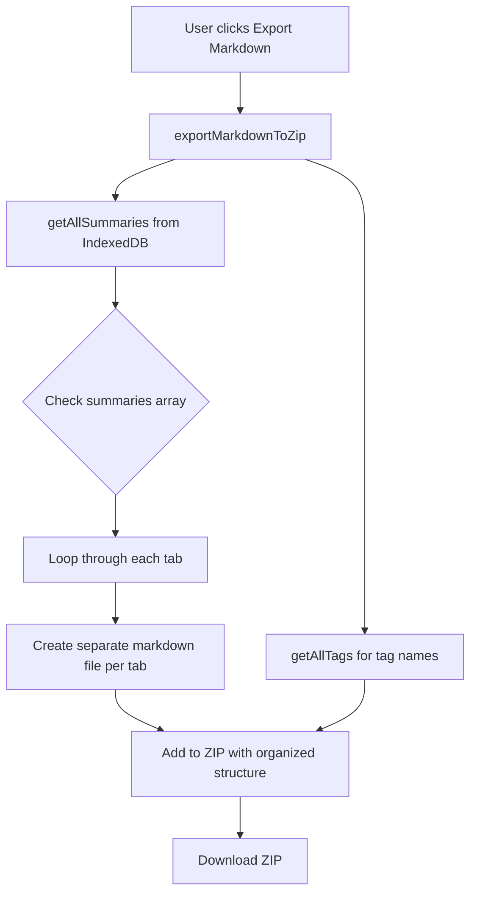

# Phân Tích Khả Thi: Export Archive ra Markdown Files (UPDATED)

## 📊 Kết Luận: HOÀN TOÀN KHẢ THI ✅

Sau khi phân tích kỹ lưỡng hệ thống export/import hiện tại **VÀ CẤU TRÚC MULTI-TAB**, tôi khẳng định tính năng này hoàn toàn khả thi và có thể thực hiện một cách hiệu quả.

---

## 🔍 Phân Tích Cấu Trúc Dữ Liệu (UPDATED)

### Cấu Trúc Archive Object

```javascript
{
  id: "uuid-123",
  title: "Video Title",
  url: "https://youtube.com/watch?v=...",
  date: "2025-01-29T10:00:00.000Z",
  contentType: "youtube", // hoặc "course", "website"
  tags: ["tag-id-1", "tag-id-2"],
  historySourceId: "history-uuid",

  // ⭐ KEY DISCOVERY: summaries là ARRAY chứa nhiều tabs
  summaries: [
    {
      title: "Summary",
      content: "## Summary content here..."
    },
    {
      title: "Chapters",
      content: "## Chapters content here..."
    },
    {
      title: "Concepts", // Chỉ có với course
      content: "## Course concepts here..."
    }
  ]
}
```

### Content Types và Tab Structure

| Content Type | Tabs Available              |
| ------------ | --------------------------- |
| **YouTube**  | Summary, Chapters           |
| **Course**   | Summary, Chapters, Concepts |
| **Website**  | Summary (single)            |

---

## 🎯 Thiết Kế Giải Pháp (UPDATED)

### Updated Architecture



### Updated File Structure trong ZIP

```
summarizerrrr-markdown-backup-YYYY-MM-DD.zip
├── README.md                           (Metadata và hướng dẫn)
├── youtube/
│   ├── video-title-1/
│   │   ├── summary.md                 (Tab 1)
│   │   └── chapters.md                (Tab 2)
│   ├── video-title-2/
│   │   ├── summary.md
│   │   └── chapters.md
│   └── ...
├── courses/
│   ├── course-title-1/
│   │   ├── summary.md                 (Tab 1)
│   │   ├── chapters.md                (Tab 2)
│   │   └── concepts.md                (Tab 3)
│   └── ...
├── websites/
│   ├── article-title-1.md             (Single file - no tabs)
│   ├── article-title-2.md
│   └── ...
└── _metadata.json                      (Optional: mapping info)
```

**Alternative Structure** (Simpler, flat):

```
summarizerrrr-markdown-backup-YYYY-MM-DD.zip
├── README.md
├── 001-video-title-1-summary.md
├── 001-video-title-1-chapters.md
├── 002-video-title-2-summary.md
├── 002-video-title-2-chapters.md
├── 003-course-title-summary.md
├── 003-course-title-chapters.md
├── 003-course-title-concepts.md
└── ...
```

---

## 🛠️ Implementation Plan (UPDATED)

### 1. Markdown Service (UPDATED)

**File mới**: `src/lib/exportImport/markdownService.js`

```javascript
// @ts-nocheck

/**
 * Convert a single tab content to markdown with frontmatter
 * @param {Object} summary - Archive summary object
 * @param {Object} tab - Tab object {title, content}
 * @param {Object} tagNames - Tag ID to name mapping
 * @returns {string} Markdown content
 */
export function convertTabToMarkdown(summary, tab, tagNames) {
  const tagsList = (summary.tags || [])
    .map((tagId) => tagNames[tagId])
    .filter(Boolean)

  const frontmatter = `---
title: "${summary.title}"
tab: "${tab.title}"
url: ${summary.url || 'N/A'}
date: ${summary.date}
type: ${summary.contentType || 'unknown'}
tags: [${tagsList.join(', ')}]
---

`

  const header = `# ${summary.title} - ${tab.title}

**URL**: ${summary.url || 'N/A'}  
**Date**: ${new Date(summary.date).toLocaleDateString('en-US', {
    year: 'numeric',
    month: 'long',
    day: 'numeric',
  })}  
**Type**: ${capitalizeFirst(summary.contentType || 'unknown')}  
**Tags**: ${tagsList.map((t) => `#${t}`).join(' ') || 'None'}

---

`

  const footer = `

---

*Exported from **${tab.title}** tab by Summarizerrrr v${
    chrome.runtime.getManifest().version
  } on ${new Date().toLocaleDateString()}*
`

  return frontmatter + header + tab.content + footer
}

/**
 * Generate safe filename for a tab
 * @param {Object} summary - Archive summary object
 * @param {string} tabTitle - Tab title (Summary, Chapters, etc.)
 * @param {number} index - Index in array for uniqueness
 * @returns {string} Safe filename
 */
export function generateTabFilename(summary, tabTitle, index) {
  const safeTitle = sanitizeFilename(summary.title, 60)
  const safeTab = tabTitle.toLowerCase().replace(/\s+/g, '-')
  const shortId = summary.id.substring(0, 6)

  // Format: 001-video-title-summary-abc123.md
  const paddedIndex = String(index + 1).padStart(3, '0')
  return `${paddedIndex}-${safeTitle}-${safeTab}-${shortId}.md`
}

/**
 * Generate organized folder structure filename
 * @param {Object} summary - Archive summary object
 * @param {string} tabTitle - Tab title
 * @param {number} index - Index in array
 * @returns {string} Path with folder structure
 */
export function generateOrganizedPath(summary, tabTitle, index) {
  const contentType = summary.contentType || 'unknown'
  const safeTitle = sanitizeFilename(summary.title, 60)
  const safeTab = tabTitle.toLowerCase().replace(/\s+/g, '-')
  const paddedIndex = String(index + 1).padStart(3, '0')

  // For website (single file), no folder
  if (contentType === 'website') {
    return `websites/${paddedIndex}-${safeTitle}.md`
  }

  // For youtube/course (multiple tabs), create folder
  const folderName = `${paddedIndex}-${safeTitle}`
  return `${contentType}s/${folderName}/${safeTab}.md`
}

/**
 * Sanitize filename to be filesystem-safe
 * @param {string} filename - Original filename
 * @param {number} maxLength - Max length
 * @returns {string} Safe filename
 */
function sanitizeFilename(filename, maxLength = 100) {
  return filename
    .replace(/[<>:"/\\|?*]/g, '-') // Replace unsafe chars
    .replace(/\s+/g, '-') // Replace spaces
    .replace(/-+/g, '-') // Remove duplicate dashes
    .replace(/^-+|-+$/g, '') // Remove leading/trailing dashes
    .substring(0, maxLength) // Limit length
}

/**
 * Create README.md content
 * @param {Object} metadata - Export metadata
 * @returns {string} README content
 */
export function createReadmeContent(metadata) {
  return `# Summarizerrrr Archive Export

**Export Date**: ${new Date(metadata.exportDate).toLocaleDateString('en-US', {
    year: 'numeric',
    month: 'long',
    day: 'numeric',
    hour: '2-digit',
    minute: '2-digit',
  })}  
**Total Archives**: ${metadata.totalSummaries}  
**Format**: Markdown  
**Version**: ${metadata.version}

## Structure

This archive contains your summaries exported as individual markdown files:

- **YouTube Videos**: \`youtube/video-folder/summary.md\`, \`chapters.md\`
- **Courses**: \`courses/course-folder/summary.md\`, \`chapters.md\`, \`concepts.md\`  
- **Websites**: \`websites/article-title.md\`

Each file includes:
- YAML frontmatter with metadata (title, url, date, tags)
- Content from the specific tab
- Export information footer

## Usage

These markdown files can be:
- Opened in any text editor
- Imported into note-taking apps (Obsidian, Notion, etc.)
- Committed to version control (Git)
- Searched with desktop search tools
- Read as-is (human-readable format)

---

*Exported by Summarizerrrr Browser Extension*  
*https://github.com/your-repo*
`
}

function capitalizeFirst(str) {
  return str.charAt(0).toUpperCase() + str.slice(1)
}
```

### 2. Export Service Integration (UPDATED)

**File cần sửa**: [`src/lib/exportImport/exportService.js`](src/lib/exportImport/exportService.js:1)

```javascript
import {
  convertTabToMarkdown,
  generateOrganizedPath,
  createReadmeContent,
} from './markdownService.js'

/**
 * Export all archives as markdown files in ZIP
 * @param {Function} onProgress - Progress callback
 * @returns {Promise<Blob>} ZIP blob
 */
export async function exportMarkdownToZip(onProgress) {
  try {
    // Step 1: Load data from IndexedDB
    if (onProgress) {
      onProgress({
        stage: 'loading_data',
        message: 'Loading archives from database...',
        progress: 10,
      })
    }

    const summaries = await getAllSummaries()
    const tags = await getAllTags()

    // Step 2: Create tag mapping
    const tagMap = Object.fromEntries(tags.map((t) => [t.id, t.name]))

    if (onProgress) {
      onProgress({
        stage: 'converting',
        message: 'Converting to markdown files...',
        progress: 30,
      })
    }

    // Step 3: Convert each summary to markdown files
    const markdownFiles = {}
    let fileCount = 0

    summaries.forEach((summary, index) => {
      // Check if summaries is array (multi-tab) or string (single)
      const tabs = Array.isArray(summary.summaries)
        ? summary.summaries
        : [{ title: 'Summary', content: summary.summary || summary.summaries }]

      // Create a file for each tab
      tabs.forEach((tab) => {
        const filepath = generateOrganizedPath(summary, tab.title, index)
        const markdown = convertTabToMarkdown(summary, tab, tagMap)
        markdownFiles[filepath] = markdown
        fileCount++
      })

      if (onProgress) {
        onProgress({
          stage: 'converting',
          message: `Converting ${index + 1}/${summaries.length}...`,
          progress: 30 + ((index + 1) / summaries.length) * 40,
        })
      }
    })

    // Step 4: Create README
    markdownFiles['README.md'] = createReadmeContent({
      totalSummaries: summaries.length,
      totalFiles: fileCount,
      exportDate: new Date().toISOString(),
      version: chrome.runtime.getManifest().version,
    })

    // Step 5: Create ZIP
    if (onProgress) {
      onProgress({
        stage: 'creating_zip',
        message: 'Creating ZIP archive...',
        progress: 70,
      })
    }

    const zipBlob = await createZipFromFiles(markdownFiles, (zipProgress) => {
      if (onProgress) {
        onProgress({
          stage: 'creating_zip',
          message: `Compressing... ${zipProgress.percent || 0}%`,
          progress: 70 + (zipProgress.percent || 0) * 0.3,
        })
      }
    })

    if (onProgress) {
      onProgress({
        stage: 'completed',
        message: 'Export completed!',
        progress: 100,
      })
    }

    return zipBlob
  } catch (error) {
    console.error('[exportMarkdownToZip] Error:', error)
    throw new Error(`Markdown export failed: ${error.message}`)
  }
}

/**
 * Generate filename for markdown export
 * @returns {string} Filename with timestamp
 */
export function generateMarkdownExportFilename() {
  const date = new Date().toISOString().split('T')[0]
  return `summarizerrrr-markdown-backup-${date}.zip`
}
```

### 3. UI Component Update (UPDATED)

**File cần sửa**: [`src/components/settings/ExportImport.svelte`](src/components/settings/ExportImport.svelte:112)

**Thêm state cho markdown export**:

```javascript
let state = $state({
  showImportModal: false,
  importData: null,
  errorMessage: '',
  successMessage: '',
  isExportingMarkdown: false, // 👈 NEW
})
```

**Thêm handler function** (sau line ~125):

```javascript
async function exportMarkdown() {
  try {
    state.isExportingMarkdown = true

    // Import markdown export function
    const { exportMarkdownToZip, generateMarkdownExportFilename } =
      await import('../../lib/exportImport/exportService.js')

    // Export with progress (optional - có thể bỏ nếu không cần)
    const zipBlob = await exportMarkdownToZip((progress) => {
      console.log(`[Export Markdown] ${progress.message}`)
    })

    // Download
    const filename = generateMarkdownExportFilename()
    downloadBlob(zipBlob, filename)

    setMessage('success', 'Markdown files exported successfully!')
  } catch (error) {
    console.error('[Export Markdown] Error:', error)
    setMessage('error', `Export failed: ${error.message}`)
  } finally {
    state.isExportingMarkdown = false
  }
}
```

**Update button layout** (line ~560):

```svelte
<div class="mt-2 flex gap-1">
  <!-- Existing Export button -->
  <button class="relative overflow-hidden group" onclick={exportData}>
    <div class="font-medium py-2 px-4 border transition-colors duration-200
                bg-blackwhite-5 text-text-secondary group-hover:border-border
                border-transparent hover:text-text-primary dark:hover:text-white">
      Export
    </div>
    <span class="size-4 absolute z-10 -left-2 -bottom-2 border bg-surface-1
                 rotate-45 transition-colors duration-200 border-transparent
                 group-hover:border-border"></span>
  </button>

  <!-- 👇 NEW: Export Markdown button -->
  <button
    class="relative overflow-hidden group"
    onclick={exportMarkdown}
    disabled={state.isExportingMarkdown}
  >
    <div class="font-medium py-2 px-4 border transition-colors duration-200
                {state.isExportingMarkdown
                  ? 'bg-blackwhite-5 text-text-tertiary cursor-not-allowed'
                  : 'bg-blackwhite-5 text-text-secondary group-hover:border-border hover:text-text-primary dark:hover:text-white'
                }
                border-transparent">
      {#if state.isExportingMarkdown}
        <Icon icon="svg-spinners:ring-resize" class="inline mr-1" width="14" />
        Exporting...
      {:else}
        Export as Markdown
      {/if}
    </div>
    <span class="size-4 absolute z-10 -left-2 -bottom-2 border bg-surface-1
                 rotate-45 transition-colors duration-200
                 {state.isExportingMarkdown ? 'border-border/20' : 'border-transparent group-hover:border-border'}"></span>
  </button>

  <!-- Existing Import button -->
  <button class="relative overflow-hidden group" onclick={openImportDialog}>
    <!-- ... existing code ... -->
  </button>

  <!-- Hidden file input -->
  <input bind:this={fileInputRef} type="file" class="hidden"
         accept=".zip" onchange={handleFileSelect} />
</div>
```

---

## ⚠️ Challenges & Solutions (UPDATED)

### Challenge 1: Multi-Tab Structure

**Vấn đề**: Archive có thể có 1-3 tabs tùy content type

**Giải pháp**:

```javascript
// Handle both array và string format
const tabs = Array.isArray(summary.summaries)
  ? summary.summaries
  : [{ title: 'Summary', content: summary.summary || summary.summaries }]

// Create file for each tab
tabs.forEach((tab) => {
  const filepath = generateOrganizedPath(summary, tab.title, index)
  const markdown = convertTabToMarkdown(summary, tab, tagMap)
  markdownFiles[filepath] = markdown
})
```

### Challenge 2: Filename Collisions với Multi-Tabs

**Vấn đề**: Cùng 1 video có nhiều files (summary.md, chapters.md)

**Giải pháp**: Sử dụng folder structure

```
youtube/
  001-video-title/
    summary.md
    chapters.md
```

Hoặc flat structure với prefix:

```
001-video-title-summary.md
001-video-title-chapters.md
```

### Challenge 3: Large Archive Sets

**Vấn đề**: User có 500+ archives = 1000+ markdown files

**Giải pháp**:

- Progress indicator trong UI
- Batch processing (convert 10 files at a time)
- Use JSZip streaming (đã support sẵn)
- File size estimate trước khi export

### Challenge 4: Empty or Missing Tabs

**Vấn đề**: Một số archive có thể thiếu chapters hoặc concepts

**Giải pháp**:

```javascript
// Skip empty tabs
tabs.forEach((tab) => {
  if (!tab.content || tab.content.trim() === '') {
    console.warn(`[Export] Empty tab "${tab.title}" in "${summary.title}"`)
    return // Skip this tab
  }
  // ... create file
})
```

---

## 📝 Implementation Checklist (UPDATED)

### Phase 1: Markdown Service (3-4 hours)

- [ ] Tạo [`markdownService.js`](src/lib/exportImport/markdownService.js:1)
- [ ] Implement [`convertTabToMarkdown()`](src/lib/exportImport/markdownService.js:1) với frontmatter
- [ ] Implement [`generateOrganizedPath()`](src/lib/exportImport/markdownService.js:1) cho folder structure
- [ ] Implement [`sanitizeFilename()`](src/lib/exportImport/markdownService.js:1) với edge cases
- [ ] Implement [`createReadmeContent()`](src/lib/exportImport/markdownService.js:1)
- [ ] Handle empty/missing tabs gracefully
- [ ] Add JSDoc comments

### Phase 2: Export Service Integration (2-3 hours)

- [ ] Add [`exportMarkdownToZip()`](src/lib/exportImport/exportService.js:26) to exportService
- [ ] Load summaries và tags từ IndexedDB
- [ ] Loop through each summary và tabs
- [ ] Convert và collect markdown files
- [ ] Create ZIP với progress tracking
- [ ] Handle errors và edge cases
- [ ] Test với different content types

### Phase 3: UI Integration (2 hours)

- [ ] Add `isExportingMarkdown` state to [`ExportImport.svelte`](src/components/settings/ExportImport.svelte:49)
- [ ] Implement [`exportMarkdown()`](src/components/settings/ExportImport.svelte:112) handler
- [ ] Add \"Export as Markdown\" button với loading state
- [ ] Style button consistent với existing design
- [ ] Add loading spinner icon
- [ ] Test success/error messages
- [ ] Ensure button disabled during export

### Phase 4: Testing & Polish (2-3 hours)

- [ ] Test với 1 summary (edge case)
- [ ] Test với 10 summaries (normal case)
- [ ] Test với 100+ summaries (stress test)
- [ ] Test với YouTube (2 tabs)
- [ ] Test với Course (3 tabs)
- [ ] Test với Website (1 tab)
- [ ] Test với special characters trong titles
- [ ] Test với very long titles
- [ ] Test với empty/missing tabs
- [ ] Test ZIP extraction và markdown rendering
- [ ] Test trong different browsers (Chrome, Firefox)
- [ ] Verify folder structure correctness
- [ ] Check file sizes và compression

---

## 📦 Markdown File Example

### Example: YouTube Video với 2 Tabs

**File 1**: `youtube/001-how-to-build-ai-agents/summary.md`

```markdown
---
title: 'How to Build AI Agents with LangChain'
tab: 'Summary'
url: https://youtube.com/watch?v=abc123
date: 2025-01-29T10:00:00.000Z
type: youtube
tags: [AI, LangChain, Tutorial]
---

# How to Build AI Agents with LangChain - Summary

**URL**: https://youtube.com/watch?v=abc123  
**Date**: January 29, 2025  
**Type**: Youtube  
**Tags**: #AI #LangChain #Tutorial

---

## What is LangChain?

LangChain is a framework for building applications with LLMs...

## Key Concepts

1. **Chains**: Sequential operations...
2. **Agents**: Autonomous decision-making...
3. **Memory**: Conversation history...

## Conclusion

LangChain simplifies AI agent development...

---

_Exported from **Summary** tab by Summarizerrrr v2.1.0 on January 29, 2025_
```

**File 2**: `youtube/001-how-to-build-ai-agents/chapters.md`

```markdown
---
title: 'How to Build AI Agents with LangChain'
tab: 'Chapters'
url: https://youtube.com/watch?v=abc123
date: 2025-01-29T10:00:00.000Z
type: youtube
tags: [AI, LangChain, Tutorial]
---

# How to Build AI Agents with LangChain - Chapters

**URL**: https://youtube.com/watch?v=abc123  
**Date**: January 29, 2025  
**Type**: Youtube  
**Tags**: #AI #LangChain #Tutorial

---

## 0:00 - Introduction

Introduction to LangChain framework...

## 2:30 - Setting Up Environment

Installing required dependencies...

## 5:45 - Building Your First Chain

Creating a simple LLM chain...

## 10:20 - Advanced Agent Patterns

Implementing autonomous agents...

---

_Exported from **Chapters** tab by Summarizerrrr v2.1.0 on January 29, 2025_
```

---

## 🎨 UI/UX Design

### Button Visual Design

```
┌─────────────────────────────────────────────────────────────┐
│                                                               │
│  ┏━━━━━━━━━┓  ┏━━━━━━━━━━━━━━━━━━━━━┓  ┏━━━━━━━━━┓        │
│  ┃ Export  ┃  ┃ Export as Markdown  ┃  ┃ Import  ┃        │
│  ┗━━━━━━━━━┛  ┗━━━━━━━━━━━━━━━━━━━━━┛  ┗━━━━━━━━━┛        │
│                                                               │
│  [Loading state when exporting]                              │
│  ┏━━━━━━━━━━━━━━━━━━━━━━━━━━━━━━━┓                         │
│  ┃ ⟳ Exporting... (30/100)      ┃  [Disabled]              │
│  ┗━━━━━━━━━━━━━━━━━━━━━━━━━━━━━━━┛                         │
│                                                               │
│  ✅ Markdown files exported successfully!                    │
│                                                               │
└─────────────────────────────────────────────────────────────┘
```

### Progress Messages

```javascript
const progressMessages = {
  loading_data: 'Loading archives from database...',
  converting: 'Converting to markdown files... (45/100)',
  creating_zip: 'Compressing files... 75%',
  completed: 'Export completed!',
}
```

---

## 🚀 Advantages của Giải Pháp (UPDATED)

1. **Organized Structure**: Mỗi content type có folder riêng, mỗi archive có subfolder
2. **Portable**: Markdown files mở được ở bất kỳ editor nào
3. **Human-readable**: Dễ đọc, search, và navigate
4. **Version control friendly**: Commit được vào Git
5. **Universal**: Compatible với Obsidian, Notion, Logseq, etc.
6. **No lock-in**: Không phụ thuộc vào extension format
7. **SEO/Indexing**: Desktop search tools có thể index
8. **Multi-tab support**: Giữ nguyên structure của archive (Summary/Chapters/Concepts riêng biệt)
9. **Metadata rich**: YAML frontmatter chứa đầy đủ thông tin

---

## 📦 Estimated Effort (UPDATED)

| Task                                  | Time      | Difficulty |
| ------------------------------------- | --------- | ---------- |
| Markdown Service + Multi-tab handling | 3-4h      | Medium     |
| Export Integration                    | 2-3h      | Medium     |
| UI Updates + Loading states           | 2h        | Easy       |
| Testing & Polish (all content types)  | 2-3h      | Medium     |
| **Total**                             | **9-12h** | **Medium** |

---

## 🎯 Final Recommendation

Tính năng này **HOÀN TOÀN KHẢ THI** với cấu trúc multi-tab:

✅ **Pros**:

- Leverage existing ZIP infrastructure
- Clean separation per tab (summary.md, chapters.md, concepts.md)
- Organized folder structure
- Maintain data integrity
- User-friendly format
- No breaking changes

⚠️ **Updated Considerations**:

- Multi-tab detection và handling (SOLVED)
- Folder structure vs flat structure (DESIGNED)
- Empty/missing tabs (HANDLED)
- Large file counts (OPTIMIZED)

**Recommendation**:

1. Implement theo architecture trên
2. Sử dụng **organized folder structure** (cleaner, more maintainable)
3. Add progress indicator cho better UX
4. Test thoroughly với all 3 content types
5. Consider adding file count warning nếu > 500 files

Architecture rõ ràng, scalable, và maintainable. Ready for implementation! 🚀
