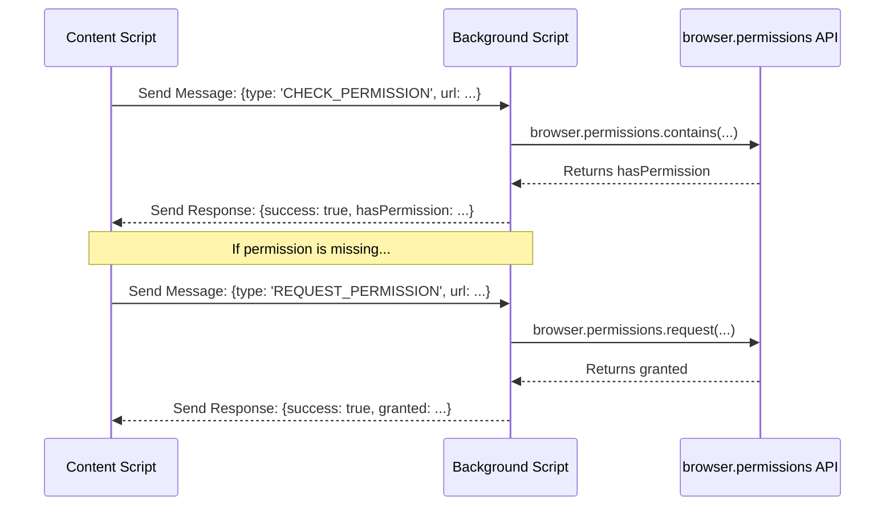
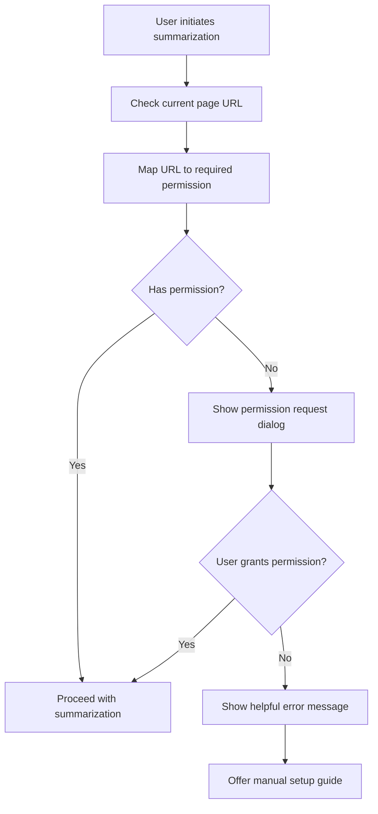

# Firefox Dynamic Permissions Implementation Plan

## 🎯 Objective

Implement automatic permission requests for Firefox when users try to summarize pages that require optional permissions, instead of requiring manual permission setup.

## 🐞 **UPDATE: Bug Fix & Refactoring Plan (Post-Implementation)**

### **Problem Analysis**

The initial implementation caused a runtime error: `TypeError: can't access property "contains", cn.permissions is undefined`.

**Root Cause:** The `browser.permissions` API was called directly from a **content script** (`ContentExtractorService`). This is a privileged API and is only accessible from the extension's background script or other extension pages, not from the sandboxed environment of a content script.

### **Architectural Solution: Message Passing**

To fix this, we must refactor the logic to use a message-passing architecture.

1.  **Content Script (`ContentExtractorService`)**: Will no longer call the `permissions` API directly. Instead, it will send a message to the background script to perform the action.
2.  **Background Script (`background.js`)**: Will listen for messages from content scripts, execute the `browser.permissions` API calls, and return the result to the caller.



### **Revised Implementation Steps**

#### **Phase 1 (Refactor): Background Script**

**File to modify:** `src/entrypoints/background.js`

1.  **Add Message Listeners**: Create listeners for `CHECK_PERMISSION` and `REQUEST_PERMISSION` message types.
2.  **Execute API Calls**: Within the listeners, call `PermissionService` functions (which will now correctly execute `browser.permissions` in the background context).
3.  **Return Results**: Use `sendResponse` to return the boolean result (`hasPermission` or `granted`) asynchronously.

#### **Phase 2 (Refactor): Permission Service**

**File to modify:** `src/services/permissionService.js`

1.  **Add Context Detection**: Use `isContentScriptContext()` to determine the execution environment.
2.  **Implement Message Passing**:
    - If in a content script, `checkPermissionForUrl` and `requestPermissionForUrl` will use `browser.runtime.sendMessage` to delegate the call to the background script.
    - If in the background script, the functions will execute the `browser.permissions` calls directly as before.
    - This makes the service a universal handler, abstracting away the complexity of message passing.

---

## _Original plan below for reference._

## 📋 Current Analysis

### Files Analyzed

- [`wxt.config.ts`](wxt.config.ts) - Manifest configuration with optional_permissions for Firefox
- [`src/components/settings/GeneralSettings.svelte`](src/components/settings/GeneralSettings.svelte) - Current permission UI management
- [`src/services/contentService.js`](src/services/contentService.js) - Content extraction and page type detection
- [`src/entrypoints/content/services/ContentExtractorService.js`](src/entrypoints/content/services/ContentExtractorService.js) - Content extraction service
- [`src/entrypoints/content/services/SummarizationService.js`](src/entrypoints/content/services/SummarizationService.js) - Main summarization logic
- [`src/entrypoints/background.js`](src/entrypoints/background.js) - Background script with message handling
- [`src/lib/utils/contextDetection.js`](src/lib/utils/contextDetection.js) - Context detection utilities
- [`src/services/fabPermissionService.js`](src/services/fabPermissionService.js) - FAB permission service (for reference)
- [`src/stores/summaryStore.svelte.js`](src/stores/summaryStore.svelte.js) - Summary state management
- [`src/entrypoints/content/composables/useSummarization.svelte.js`](src/entrypoints/content/composables/useSummarization.svelte.js) - Summarization composable
- [`src/entrypoints/content/composables/useOneClickSummarization.svelte.js`](src/entrypoints/content/composables/useOneClickSummarization.svelte.js) - One-click summarization

### Current State Analysis

#### Optional Permissions Configuration

In [`wxt.config.ts`](wxt.config.ts:94-100):

```javascript
optional_permissions: [
  'https://*/*',
  '*://*.youtube.com/*',
  '*://*.udemy.com/*',
  '*://*.coursera.org/*',
  '*://*.reddit.com/*',
]
```

#### Permission Management UI

In [`src/components/settings/GeneralSettings.svelte`](src/components/settings/GeneralSettings.svelte:24-61):

- Array `all_origins` defines required permissions
- Functions `checkAllPermissions()`, `togglePermission()` for manual management
- UI only shows for Firefox (line 256-278)

#### Content Detection System

- [`contentService.js`](src/services/contentService.js:5-7): YouTube, Course pattern detection
- [`ContentExtractorService.js`](src/entrypoints/content/services/ContentExtractorService.js:19-36): Content type classification
- [`contextDetection.js`](src/lib/utils/contextDetection.js:11-28): Environment detection

## 🏗️ Implementation Architecture

### Core Permission Service

**New File**: `src/services/permissionService.js`

```javascript
export class PermissionService {
  // Map URL patterns to permission origins
  static URL_TO_PERMISSION_MAP = {
    'youtube.com': '*://*.youtube.com/*',
    'udemy.com': '*://*.udemy.com/*',
    'coursera.org': '*://*.coursera.org/*',
    'reddit.com': '*://*.reddit.com/*',
    // General web pages
    'https://': 'https://*/*'
  }

  static async checkPermissionForUrl(url)
  static async requestPermissionForUrl(url)
  static getPermissionPattern(url)
  static async requestPermissionWithUserFeedback(url)
}
```

## 📋 Implementation Plan

### Phase 1: Core Permission Service

**Files to create/modify:**

1. **Create**: `src/services/permissionService.js`
   - URL to permission pattern mapping
   - Permission check functions using `browser.permissions`
   - Dynamic permission request handling
   - Error handling with user-friendly messages

### Phase 2: Integration Layer

**Files to modify:**

2. **Update**: [`src/services/contentService.js`](src/services/contentService.js)

   - Add permission validation in `getPageContent()` function
   - Create wrapper function `getPageContentWithPermission()`
   - Handle permission errors gracefully

3. **Update**: [`src/entrypoints/content/services/SummarizationService.js`](src/entrypoints/content/services/SummarizationService.js)

   - Add permission layer to `summarize()` method
   - Handle permission-related errors in streaming/non-streaming modes
   - Provide user feedback during permission requests

4. **Update**: [`src/entrypoints/background.js`](src/entrypoints/background.js)
   - Add permission checking for commands (line 425-444)
   - Handle permission requests in context menu (line 459-488)
   - Add new message type for permission requests

### Phase 3: UI/UX Enhancement

**Files to modify:**

5. **Update**: [`src/components/settings/GeneralSettings.svelte`](src/components/settings/GeneralSettings.svelte)

   - Show dynamic permission status
   - Add feedback for auto-permission requests
   - Integrate with existing permission UI (lines 256-278)

6. **Update**: [`src/entrypoints/content/composables/useSummarization.svelte.js`](src/entrypoints/content/composables/useSummarization.svelte.js)

   - Add permission error handling in `summarizePageContent()` function
   - Show loading states during permission requests
   - Implement retry mechanisms

7. **Update**: [`src/entrypoints/content/composables/useOneClickSummarization.svelte.js`](src/entrypoints/content/composables/useOneClickSummarization.svelte.js)
   - Add permission handling to one-click flow
   - Maintain UX consistency

### Phase 4: Error Handling & Edge Cases

**Files to modify:**

8. **Update**: [`src/lib/error/simpleErrorHandler.js`](src/lib/error/simpleErrorHandler.js)

   - Add permission-specific error types
   - User-friendly error messages for permission denial
   - Guidance for manual permission setup

9. **Update**: [`src/stores/summaryStore.svelte.js`](src/stores/summaryStore.svelte.js)
   - Handle permission errors in summary functions
   - Add permission status to store if needed

### Phase 5: Testing & Integration

10. **Testing Strategy**
    - Unit tests for PermissionService
    - Integration tests with different websites
    - Manual testing on Firefox with various scenarios
    - Edge case handling (denied permissions, revoked permissions)

## 🔧 Key Integration Points

### Entry Points for Permission Checks

1. **Keyboard Shortcuts**: [`background.js`](src/entrypoints/background.js:425) - `summarize-current-page` command
2. **Context Menu**: [`background.js`](src/entrypoints/background.js:459) - `summarizeSelectedText`
3. **Direct Summarization**: [`useSummarization.svelte.js`](src/entrypoints/content/composables/useSummarization.svelte.js:90) - `summarizePageContent()`
4. **One-Click FAB**: [`useOneClickSummarization.svelte.js`](src/entrypoints/content/composables/useOneClickSummarization.svelte.js:82)

### Content Type Detection Logic

Based on [`ContentExtractorService.js`](src/entrypoints/content/services/ContentExtractorService.js:19-36):

- YouTube: `/youtube\.com\/watch/i`
- Udemy: `/udemy\.com\/course\/.*\/learn\//i`
- Coursera: `/(coursera\.org\/learn\/.*\/lecture\/|coursera\.org\/learn\/.*\/supplement\/)/i`
- General: All other HTTPS sites

## 🎨 User Experience Flow



## 🚀 Expected Benefits

- **Seamless UX**: No manual permission setup required
- **Better Onboarding**: New users can immediately use all features
- **Reduced Support**: Fewer user questions about permission setup
- **Firefox-Optimized**: Leverages Firefox's optional permissions system
- **Backwards Compatible**: Existing manual permission UI still works

## 📝 Technical Notes

- Uses Firefox's `browser.permissions` API
- Maintains compatibility with existing codebase
- Handles cross-context communication between scripts
- Provides consistent error handling and user feedback
- Focuses only on Firefox implementation (Chrome uses required permissions)

## 🔄 Rollback Plan

If issues arise, the implementation can be disabled by:

1. Adding a feature flag in settings
2. Falling back to existing manual permission flow
3. No changes to manifest.json required
