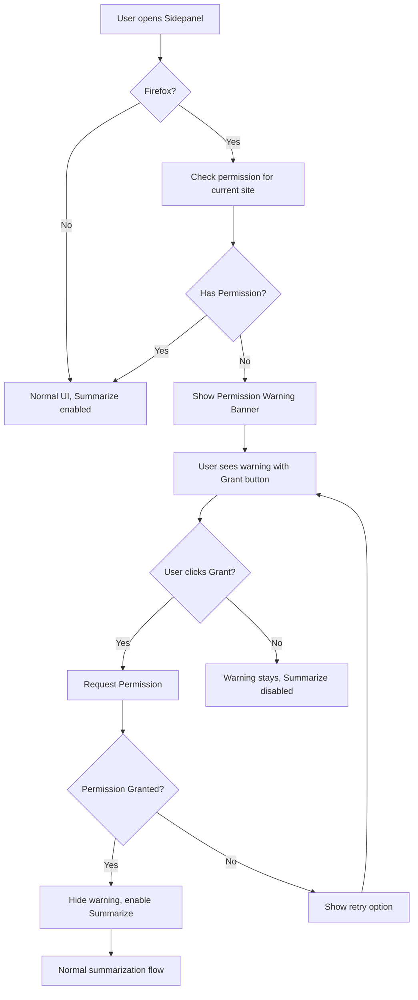

# Firefox Permissions Implementation - Proactive Approach

## Tổng Quan

Đã implement **Proactive Permission System** cho Firefox để cải thiện UX khi xử lý permissions. Thay vì báo lỗi sau khi user nhấn Summarize, hệ thống sẽ:

1. **Check permission ngay khi mở sidepanel**
2. **Hiển thị warning banner** nếu chưa có quyền
3. **Cung cấp nút "Grant Permission"** để user cấp quyền trước
4. **Disable nút Summarize** cho đến khi có đủ quyền

## Files Đã Thay Đổi

### 1. `src/components/ui/PermissionWarningPrompt.svelte` (NEW)

**Mục đích:** Component chính hiển thị warning và handle permission requests

**Features:**

- ✅ Auto-check permission khi mount/URL thay đổi
- ✅ Loading states rõ ràng
- ✅ Warning banner với Grant Permission button
- ✅ Success feedback khi grant thành công
- ✅ Error handling với retry capability
- ✅ Firefox-only (không hiển thị trên browsers khác)

**Props:**

- `currentUrl`: URL hiện tại để check permission
- `onPermissionGranted`: Callback khi permission status thay đổi

### 2. `src/services/firefoxPermissionService.js` (ENHANCED)

**Các functions mới:**

- `getCurrentTabInfo()`: Get active tab info
- `requestPermissionWithFeedback()`: Enhanced permission request với metadata
- `checkMultiplePermissions()`: Check nhiều URLs cùng lúc
- `analyzePermissionError()`: Phân tích lỗi và đề xuất action
- `PERMISSION_ERROR_TYPES`: Constants cho error types

**Cải tiến:**

- ✅ Better error analysis và categorization
- ✅ Enhanced feedback cho permission requests
- ✅ More utility functions cho complex scenarios

### 3. `src/entrypoints/sidepanel/App.svelte` (MODIFIED)

**Thay đổi:**

- ✅ Thêm state tracking cho permissions và current URL
- ✅ Import và integrate PermissionWarningPrompt component
- ✅ Pass currentUrl và permission callback
- ✅ Disable SummarizeButton khi chưa có permission
- ✅ Firefox-only conditional rendering

**New state variables:**

```javascript
let hasPermission = $state(true) // Default to true for non-Firefox
let currentTabUrl = $state('')
```

### 4. `src/components/buttons/SummarizeButton.svelte` (ENHANCED)

**Thay đổi:**

- ✅ Thêm `disabled` prop support
- ✅ Combined disable logic: `isLoading || isChapterLoading || disabled`

## User Flow



## Lợi Ích So Với Approach Cũ

### ❌ **Before (Reactive)**

```
User nhấn Summarize → Check permission → Error popup → User confused
```

### ✅ **After (Proactive)**

```
User mở sidepanel → Check permission → Show warning → User grants → Summarization ready
```

**Advantages:**

- 🎯 **No surprise errors**: User biết trước cần permission
- 🔄 **Proactive**: Handle permissions trước khi user action
- 📝 **Clear guidance**: Rõ ràng cần làm gì
- ⚡ **Better UX**: Smooth flow không bị interrupt
- 🛡️ **Transparent**: User hiểu tại sao cần permission

## Testing Scenarios

### Test Cases Cần Verify:

1. **🌐 Non-Firefox browsers**: Không hiển thị warning, hoạt động bình thường
2. **✅ Firefox với permission**: Hiển thị success state ngắn, Summarize enabled
3. **⚠️ Firefox chưa có permission**: Hiển thị warning banner, Summarize disabled
4. **👆 User grants permission**: Warning disappears, Summarize enabled, auto-retry không cần
5. **❌ User denies permission**: Warning remains, có thể retry
6. **🔄 URL changes**: Auto re-check permission cho site mới
7. **🐛 Permission check error**: Graceful fallback với error message

### Manual Testing Steps:

1. Build Firefox version: `npm run build:firefox`
2. Load extension vào Firefox Developer Edition
3. Test trên các sites khác nhau:
   - YouTube (cần permission)
   - Reddit (cần permission)
   - Sites chưa grant permission
4. Verify UI states và behaviors

## Browser Support

- ✅ **Firefox**: Full functionality với proactive permission checking
- ✅ **Chrome/Edge**: Unchanged behavior (không cần permission system này)
- ✅ **Other browsers**: Auto-fallback, không break existing functionality

## Configuration

Tất cả logic được wrap trong:

```javascript
if (import.meta.env.BROWSER === 'firefox') {
  // Permission logic here
}
```

Không cần configuration thêm, tự động detect và chỉ chạy trên Firefox.

## Future Enhancements (Optional)

1. **Settings integration**: Cho phép pre-manage permissions trong Settings
2. **Bulk permission requests**: Request permission cho multiple sites cùng lúc
3. **Permission status display**: Show current permissions trong Settings
4. **Advanced error recovery**: Handle edge cases như context invalidation

## Notes

- ⚠️ **Firefox only**: Component chỉ hiển thị trên Firefox
- 🔄 **Reactive**: Auto re-check khi URL thay đổi
- 🎨 **UI consistent**: Sử dụng design system hiện tại
- 🚀 **Performance**: Lazy load component để không impact initial load
- 🛡️ **Error handling**: Graceful fallbacks cho tất cả edge cases

---

## Implementation Complete ✅

Proactive Permission System đã được implement hoàn chỉnh và sẵn sàng để test trên Firefox!
