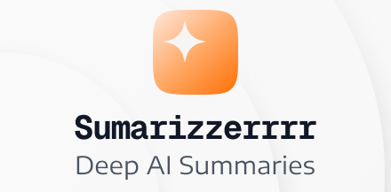

<div align="center">
  
  <h1>Summarizerrrr</h1>
  <p><strong>Summarize everything in 1 click. Save time. Learn faster.</strong></p>
  <p>The ultimate AI-powered browser extension for YouTube, Web Pages, Udemy, Coursera, and more. <br/> Built with privacy, customization, and a premium UI/UX in mind.</p>
  
  <p>
    <a href="https://chromewebstore.google.com/detail/summarizerrrr/ahfjndakflcegianjdojpldllodpkkpc">
      
    </a>
    <a href="https://addons.mozilla.org/en-CA/firefox/addon/summarizerrrr/">
      
    </a>
    <a href="https://microsoftedge.microsoft.com/addons/detail/summarizerrrr/kgoolaebmcbhbjokofmhdcjbljagaiif">
      
    </a>
  </p>
</div>

---

## ✨ Why Summarizerrrr?

Summarizerrrr isn't just another wrapper. It's a fully-featured productivity tool designed to help you consume content more efficiently. Whether you're researching, learning a new skill, or just trying to get the gist of a long video, Summarizerrrr has you covered.

### 🧠 Smart Summarization
- **YouTube Intelligence**: Get concise summaries of videos with **clickable timestamps** that take you directly to the key moments.
- **Comment Insights**: Don't just watch the video; understand the community sentiment by summarizing the top comments.
- **Universal Support**: Works on **Any Website**, plus specialized support for learning platforms like **Udemy** and **Coursera**.

### 🤖 AI Your Way
- **Multi-Model Support**: Choose your brain. We support **Google Gemini**, **OpenAI (ChatGPT)**, **DeepSeek**, and more.
- **Local Privacy**: Run **Ollama** locally to summarize content without your data ever leaving your machine. Your keys, your data.

### ⚡ Powerful Modes
- **Side Panel**: Supported on Firefox, Chrome, and Edge. Watch YouTube while keeping the summary side-by-side for easy reference.
- **Floating Panel**: An in-page panel that runs independently in each tab. Perfect for tablet users or browsers like Arc.
- **Mobile Sheet**: Optimized for mobile devices. Open the summary with a single tap.

### 🛠️ Interactive Tools
- **Deep Dive**: Not satisfied with the summary? Ask follow-up questions to the AI directly about the content.
- **Custom Actions**: One-click tools to **Analyze**, **Explain**, or **Debate** the content you're viewing.
- **Transcript**: Copy transcript of the video or download transcript as a .srt file.

### 🎨 Premium Experience
- **Beautiful UI**: Built with **Svelte 5** and **Tailwind CSS 4** for a smooth, modern, and responsive experience.
- **Dark/Light Mode**: Automatically syncs with your system or can be toggled manually.
- **Internationalization (i18n)**: Fully localized in **English, Vietnamese, Spanish, Chinese, German, French, Japanese, and Korean**.

---

## 🚀 Installation

### Official Stores
The easiest way to get started is to install from your browser's extension store:
- [**Chrome Web Store**](https://chromewebstore.google.com/detail/summarizerrrr/ahfjndakflcegianjdojpldllodpkkpc)
- [**Firefox Add-ons**](https://addons.mozilla.org/en-CA/firefox/addon/summarizerrrr/)
- [**Edge Add-ons**](https://microsoftedge.microsoft.com/addons/detail/summarizerrrr/kgoolaebmcbhbjokofmhdcjbljagaiif)

### Manual Installation (Developer Mode)
If you want to try the latest features before they are released:

1.  Clone the repository:
    ```bash
    git clone https://github.com/trongnguyen24/Summarizerrrr.git
    cd Summarizerrrr
    ```
2.  Install dependencies:
    ```bash
    npm install
    ```
3.  Build the project:
    ```bash
    npm run build
    ```
4.  Load the extension:
    - **Chrome/Edge**: Go to `chrome://extensions`, enable "Developer mode", click "Load unpacked", and select the `.output/chrome-mv3` folder.
    - **Firefox**: Go to `about:debugging#/runtime/this-firefox`, click "Load Temporary Add-on", and select the `manifest.json` file in `.output/firefox-mv2`.

---

## ⚙️ Configuration

1.  **Open Settings**: Click the gear icon in the extension popup or panel.
2.  **Choose Provider**: Select your preferred AI provider (Gemini is a great free starting point).
3.  **Enter API Key**: Get your key from the provider's dashboard and paste it in.
    - *Note: Keys are stored securely in your browser's local storage.*
4.  **Customize**: Adjust the prompt language, summary length, and other preferences to fit your workflow.

---

## 👨‍💻 Development

Summarizerrrr is built with the latest web technologies:
- **Framework**: [WXT](https://wxt.dev/) (Next-gen Web Extension Framework)
- **UI Library**: [Svelte 5](https://svelte.dev/) (Runes mode)
- **Styling**: [Tailwind CSS 4](https://tailwindcss.com/)
- **AI Integration**: [Vercel AI SDK](https://sdk.vercel.ai/)

### Commands
```bash
# Start Development Server (Chrome)
npm run dev

# Start Development Server (Firefox)
npm run dev:firefox

# Build for Production
npm run build

# Package for Distribution (.zip)
npm run zip
```

---

## 💬 Community & Support

- 🐛 **Found a bug?** [Open an Issue](https://github.com/trongnguyen24/Summarizerrrr/issues)
- 💡 **Have an idea?** [Start a Discussion](https://github.com/trongnguyen24/Summarizerrrr/discussions)
- ⭐ **Enjoying the app?** Please leave a review on the store and star the repo!

---

<div align="center">
  <p>Designed and Developed with ❤️ in Viet Nam 🇻🇳</p>
  <p>Licensed under <strong>MIT</strong></p>
</div>
