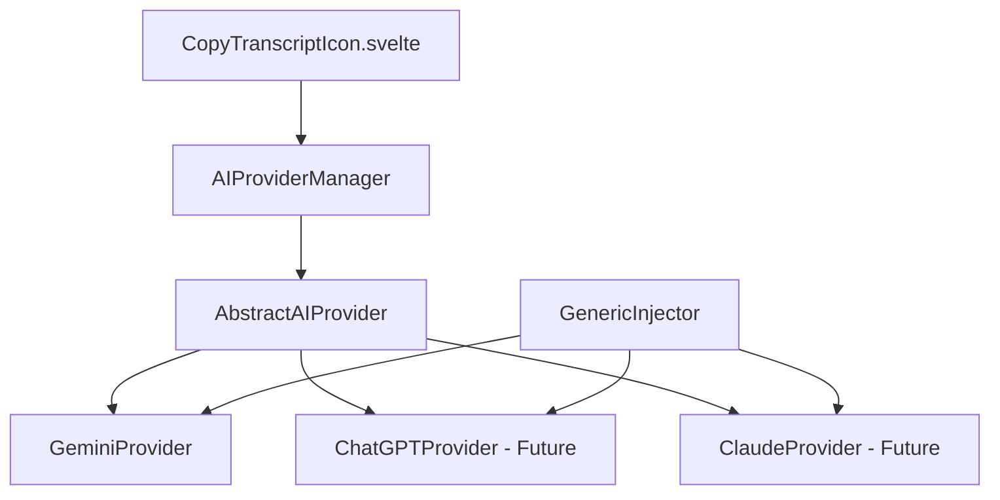
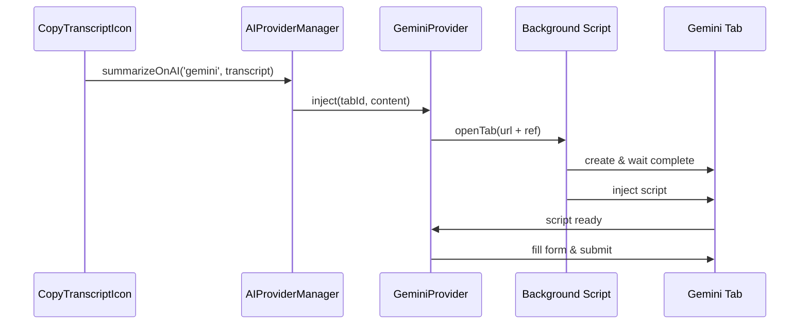

## Kiến trúc Scalable cho Multiple AI Providers

### **1. Abstract AI Provider Pattern**

```typescript
// src/services/ai-providers/AbstractAIProvider.js
interface AIProvider {
  name: string
  baseUrl: string
  inject(tabId: number, content: string): Promise<boolean>
  getUISelectors(): AIUISelectors
  formatPayload(transcript: string): string
}

interface AIUISelectors {
  textArea: string
  submitButton: string
  loadingIndicator?: string
}
```

### **2. Concrete Implementations**



### **3. Directory Structure Được Đề Xuất**

```
src/services/ai-providers/
├── AbstractAIProvider.js       # Base class/interface
├── GeminiProvider.js          # Gemini implementation
├── AIProviderManager.js       # Factory pattern
└── injectors/
    ├── GenericInjector.js     # Reusable injection logic
    └── gemini-injector.js     # Gemini-specific script
```

### **4. Kiến trúc Message Flow**



### **5. Configuration cho Future Expansion**

```javascript
// AI Provider Configurations
const AI_PROVIDERS = {
  gemini: {
    name: 'Gemini',
    baseUrl: 'https://gemini.google.com/app',
    ref: 'summarizerrrr',
    icon: 'gemini-icon',
    selectors: {
      textArea: '.ql-editor.textarea.new-input-ui[contenteditable="true"]',
      submitButton: 'button[aria-label*="Send"]',
    },
  },
  chatgpt: {
    name: 'ChatGPT',
    baseUrl: 'https://chat.openai.com',
    ref: 'summarizerrrr',
    icon: 'openai-icon',
    // Future implementation
  },
  claude: {
    name: 'Claude',
    baseUrl: 'https://claude.ai',
    ref: 'summarizerrrr',
    icon: 'claude-icon',
    // Future implementation
  },
}
```

## Phương pháp Implementation Từng Bước

### **Phase 1: Foundation (Injection First)**

1. Tạo `GenericInjector` với core injection logic
2. Test injection mechanism với Gemini page
3. Đảm bảo content script hoạt động stable

### **Phase 2: Gemini Provider**

1. Implement `GeminiProvider` cụ thể
2. Test UI interaction với Gemini
3. Hoàn thiện error handling

### **Phase 3: Integration**

1. Tạo `AIProviderManager`
2. Integrate với `CopyTranscriptIcon.svelte`
3. End-to-end testing

### **Benefits của Kiến trúc này:**

- ✅ **Scalable**: Dễ dàng thêm ChatGPT, Claude sau này
- ✅ **Maintainable**: Tách biệt logic cho từng provider
- ✅ **Reusable**: Injection mechanism có thể tái sử dụng
- ✅ **Testable**: Có thể test từng component riêng biệt
- ✅ **Extensible**: Dễ mở rộng features như custom prompts, settings

Bạn có hài lòng với kiến trúc này không? Tôi sẽ bắt đầu implement từ GenericInjector trước như bạn đề xuất.
