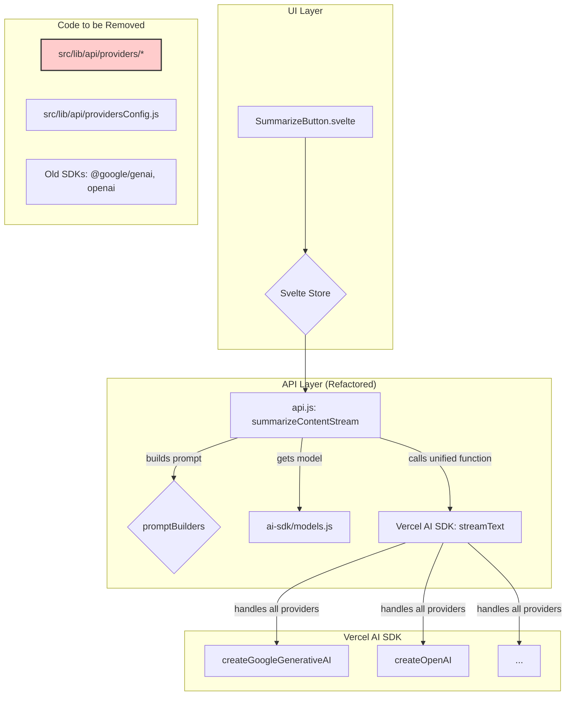

# Kế hoạch di chuyển sang Vercel AI SDK

Tài liệu này vạch ra kế hoạch chi tiết để thay thế hoàn toàn hệ thống provider AI hiện tại bằng Vercel AI SDK, nhằm mục đích đơn giản hóa mã nguồn, cải thiện hiệu suất và dễ dàng bảo trì trong tương lai.

## Mục tiêu

Thay thế hoàn toàn lớp trừu tượng provider hiện tại (`src/lib/api/providers`, `src/lib/api/providersConfig.js`) và các SDK riêng lẻ (`@google/genai`, `openai`) bằng một giao diện duy nhất do Vercel AI SDK cung cấp.

## Kiến trúc mục tiêu



## Kế hoạch thực thi

### Bước 1: Cài đặt & Chuẩn bị

1.  **Cài đặt dependencies cần thiết:**
    ```bash
    npm install ai @ai-sdk/openai @ai-sdk/google @ai-sdk/openrouter
    ```
2.  **Gỡ bỏ dependencies cũ:**
    ```bash
    npm uninstall @google/genai openai
    ```
3.  **Tạo cấu trúc thư mục mới:**
    - Tạo thư mục `src/lib/ai-sdk/`

### Bước 2: Tạo Module quản lý Model

1.  Tạo tệp `src/lib/ai-sdk/models.js`.
2.  Trong tệp này, định nghĩa và khởi tạo các model từ Vercel AI SDK (ví dụ: `createGoogleGenerativeAI`, `createOpenAI`).
3.  Tạo một hàm `getModel(providerId)` để trả về model object tương ứng dựa trên ID của provider được lưu trong cài đặt của người dùng.

### Bước 3: Tái cấu trúc `api.js`

1.  Xóa bỏ hàm `getProviderConfig` và `getProvider`.
2.  Import hàm `getModel` từ `src/lib/ai-sdk/models.js`.
3.  Trong các hàm `summarizeContentStream`, `summarizeContent`, `enhancePrompt`, và `summarizeChapters`:
    - Gọi `getModel(selectedProviderId)` để lấy model.
    - Thay thế toàn bộ logic gọi provider cũ bằng một lệnh gọi duy nhất đến `streamText` (hoặc `generateText` cho các hàm không streaming) từ Vercel AI SDK.
    - Định dạng lại `systemInstruction` và `userPrompt` cho phù hợp với yêu cầu của `streamText`.
    - Xử lý kết quả trả về từ `streamText` để yield từng chunk văn bản.

### Bước 4: Dọn dẹp mã nguồn cũ

1.  **Xóa toàn bộ thư mục `src/lib/api/providers`**.
2.  **Xóa tệp `src/lib/api/providersConfig.js`**.
3.  Kiểm tra và xóa các import không còn được sử dụng trong các tệp khác, đặc biệt là trong `api.js`.
4.  Cập nhật `package.json` để đảm bảo các dependencies cũ đã được gỡ bỏ hoàn toàn.

### Bước 5: Kiểm thử toàn diện

1.  Kiểm tra chức năng tóm tắt cho tất cả các loại nội dung (YouTube, web, text).
2.  Đảm bảo chức năng streaming hoạt động mượt mà.
3.  Kiểm tra tất cả các provider được hỗ trợ (Gemini, OpenAI, OpenRouter).
4.  Kiểm tra việc xử lý lỗi khi API key không hợp lệ hoặc có lỗi từ API.
5.  Kiểm tra các cài đặt nâng cao (temperature, topP) có được áp dụng đúng cách không.
