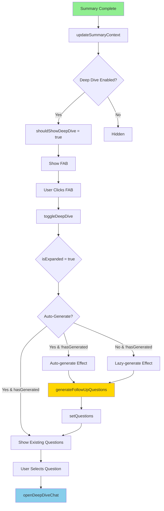

# Deep Dive FAB Implementation Plan

## 📋 Tổng quan

Chuyển đổi Deep Dive Section từ vị trí footer thành một FAB (Floating Action Button) với khả năng expand/collapse và lazy generation, sử dụng Svelte 5 và Tailwind CSS 4.

## 🎯 Yêu cầu

- **Vị trí hiển thị**: Side Panel (Floating Panel sẽ triển khai sau)
- **Điều kiện hiển thị**: Chỉ khi có summary thành công
- **Hành vi**: Expand/collapse + lazy generation nếu chưa auto-generate
- **Vị trí UI**: Góc dưới bên trái
- **Framework**: Svelte 5 với `$state`, `$derived`, `$effect`
- **Styling**: Tailwind CSS 4 (inline classes, không dùng `@apply`)

## 🏗️ Kiến trúc & Files

### 1. Component mới cần tạo

#### `src/components/tools/deepdive/DeepDiveFAB.svelte`

```svelte
<script>
  // @ts-nocheck
  import Icon from '@iconify/svelte'
  import { slideScaleFade } from '@/lib/ui/slideScaleFade.js'

  let { isExpanded = false, onToggle, hasQuestions = 0, isGenerating = false } = $props()
</script>

<button
  onclick={onToggle}
  class="fixed bottom-6 left-4 z-40 p-2 relative transition-colors overflow-hidden
         border border-primary/10 hover:border-primary/20
         dark:border-border/70 dark:hover:border-gray-700
         text-primary/90 hover:text-primary
         bg-gradient-to-br from-orange-100 dark:from-gray-950
         to-orange-50 dark:to-surface-2
         rounded-full group"
  title="Deep Dive with AI"
  transition:slideScaleFade={{
    duration: 400,
    delay: 200,
    slideFrom: 'bottom',
    slideDistance: '0.5rem',
    startScale: 0.75,
  }}
>
  <div class="chip__filter overflow-hidden"></div>

  {#if isGenerating}
    <Icon
      icon="svg-spinners:ring-resize"
      width="16"
      height="16"
      class="animate-spin"
    />
  {:else}
    <Icon
      icon="heroicons:light-bulb"
      width="16"
      height="16"
      class="group-hover:rotate-12 group-hover:scale-110 ease-in-out transition-transform duration-300"
      class:rotate-180={isExpanded}
    />
  {/if}

  {#if hasQuestions > 0}
    <span
      class="absolute -top-1 -right-1
             bg-primary text-white text-xs
             rounded-full w-5 h-5 flex items-center justify-center
             font-medium"
    >
      {hasQuestions}
    </span>
  {/if}
</button>

<style>
  .chip__filter {
    position: absolute;
    inset: 5px;
    z-index: 20;
    border-radius: 100px;
    filter: blur(4px);
  }

  .chip__filter::before {
    content: '';
    display: block;
    position: absolute;
    filter: blur(8px);
    border-radius: 100px;
    mix-blend-mode: color-dodge;
    width: 1.5rem;
    top: 0;
    aspect-ratio: 1;
    transform-origin: center;
    background: linear-gradient(-45deg, #3f312100 20%, #ffa856, #3f342100 80%) 200%;
    animation: shimmer-1 5s linear infinite;
  }

  .chip__filter::after {
    content: '';
    display: block;
    position: absolute;
    width: 1.5rem;
    aspect-ratio: 1;
    mix-blend-mode: color-dodge;
    transform-origin: center;
    background: linear-gradient(45deg, #3f312100 40%, #ffbb67, #3f342100 55%) 300%;
    filter: blur(4px);
    border-radius: 100px;
    animation: shimmer-2 4s linear infinite;
  }

  @keyframes shimmer-1 {
    0% { transform: translateX(-100%) translateY(-100%) scale(0.2); }
    50% { transform: translateX(0) translateY(0) scale(0.75); }
    100% { transform: translateX(100%) translateY(100%) scale(0.2); }
  }

  @keyframes shimmer-2 {
    0% { transform: translateX(-100%) translateY(100%) scale(0.1); }
    50% { transform: translateX(0) translateY(0) scale(0.8); }
    100% { transform: translateX(100%) translateY(-100%) scale(0.2); }
  }
</style>
```

**Đặc điểm:**

- Svelte 5 `$props()` runes
- Tailwind CSS 4 inline classes
- Transition với `slideScaleFade`
- Badge hiển thị số câu hỏi
- Shimmer effect giống Prompt Enhance

#### `src/stores/deepDiveStore.svelte.js`

```javascript
// @ts-nocheck
import { settings } from './settingsStore.svelte.js'

/**
 * Deep Dive UI state management
 */
export const deepDiveState = $state({
  isExpanded: false,
  isGenerating: false,
  questions: [],
  hasGenerated: false,
  error: null,

  // Context từ summary cuối cùng
  lastSummaryContent: '',
  lastPageTitle: '',
  lastPageUrl: '',
  lastSummaryLang: 'English',
})

/**
 * Toggle expand/collapse Deep Dive panel
 */
export function toggleDeepDive() {
  deepDiveState.isExpanded = !deepDiveState.isExpanded
  console.log('[deepDiveStore] Toggled:', deepDiveState.isExpanded)
}

/**
 * Set generated questions
 */
export function setQuestions(questions) {
  deepDiveState.questions = questions
  deepDiveState.hasGenerated = true
  console.log('[deepDiveStore] Questions set:', questions.length)
}

/**
 * Update summary context
 */
export function updateSummaryContext(content, title, url, lang) {
  deepDiveState.lastSummaryContent = content
  deepDiveState.lastPageTitle = title
  deepDiveState.lastPageUrl = url
  deepDiveState.lastSummaryLang = lang
}

/**
 * Reset Deep Dive state (khi start summarization mới)
 */
export function resetDeepDive() {
  deepDiveState.isExpanded = false
  deepDiveState.isGenerating = false
  deepDiveState.questions = []
  deepDiveState.hasGenerated = false
  deepDiveState.error = null
  deepDiveState.lastSummaryContent = ''
  deepDiveState.lastPageTitle = ''
  deepDiveState.lastPageUrl = ''
  deepDiveState.lastSummaryLang = 'English'
  console.log('[deepDiveStore] Reset')
}

/**
 * Set generating state
 */
export function setGenerating(isGenerating) {
  deepDiveState.isGenerating = isGenerating
}

/**
 * Set error
 */
export function setError(error) {
  deepDiveState.error = error
}

/**
 * Check if Deep Dive should be shown
 */
export function shouldShowDeepDive() {
  const toolEnabled = settings.tools?.deepDive?.enabled ?? false
  const hasContent = deepDiveState.lastSummaryContent.trim() !== ''
  return toolEnabled && hasContent
}
```

**Đặc điểm:**

- Pure Svelte 5 reactive state với `$state()`
- Không dùng stores legacy (writable, readable)
- Tách biệt UI state và business logic
- Context tracking cho lazy generation

### 2. Components cần sửa đổi

#### `src/components/displays/ui/FoooterDisplay.svelte`

**Thay đổi:**

```svelte
<script>
  // @ts-nocheck
  import SaveToArchiveButton from '@/components/buttons/SaveToArchiveButton.svelte'
  import CopyButton from '@/components/buttons/CopyButton.svelte'
  import DownloadButton from '@/components/buttons/DownloadButton.svelte'
  import { summaryState } from '@/stores/summaryStore.svelte'

  // ❌ XÓA imports Deep Dive
  // import { settings } from '@/stores/settingsStore.svelte.js'
  // import DeepDiveSection from '@/components/tools/deepdive/DeepDiveSection.svelte'

  let { summaryContent, summaryTitle, targetId } = $props()

  // ❌ XÓA Deep Dive logic
  // let isDeepDiveEnabled = $derived(settings.tools?.deepDive?.enabled ?? false)
</script>

<div class="w-fit mx-auto relative mt-12 flex justify-center items-center gap-2">
  <!-- ... existing footer content ... -->
</div>

<!-- ❌ XÓA Deep Dive Section -->
<!-- {#if isDeepDiveEnabled && summaryContent}
  <DeepDiveSection ... />
{/if} -->
```

#### `src/components/tools/deepdive/DeepDiveSection.svelte`

**Thay đổi:**

```svelte
<script>
  // @ts-nocheck
  import { t } from 'svelte-i18n'
  import Icon from '@iconify/svelte'
  import { settings } from '@/stores/settingsStore.svelte.js'
  import { summaryState } from '@/stores/summaryStore.svelte.js'
  import {
    deepDiveState,
    setQuestions,
    setGenerating,
    setError
  } from '@/stores/deepDiveStore.svelte.js'
  import {
    generateFollowUpQuestions,
    openDeepDiveChat,
    validateDeepDiveAvailability,
  } from '@/services/tools/deepDiveService.js'
  import { getChatProviderName } from '@/lib/prompts/tools/deepDivePrompts.js'
  import QuestionChip from './QuestionChip.svelte'
  import ChatProviderSelect from './ChatProviderSelect.svelte'
  import CustomQuestionInput from './CustomQuestionInput.svelte'
  import { slide } from 'svelte/transition'
  import { cubicOut } from 'svelte/easing'

  // ✅ Props từ parent (context)
  let { summaryContent, pageTitle, pageUrl, summaryLang = 'English' } = $props()

  // ✅ State từ store
  let questions = $derived(deepDiveState.questions)
  let isGenerating = $derived(deepDiveState.isGenerating)
  let error = $derived(deepDiveState.error)
  let hasGenerated = $derived(deepDiveState.hasGenerated)

  // Local state
  let selectedQuestion = $state(null)
  let customQuestion = $state('')
  let chatProvider = $state(
    settings.tools?.deepDive?.defaultChatProvider || 'gemini'
  )

  // Derived state
  let toolConfig = $derived(settings.tools?.deepDive ?? {})
  let isToolEnabled = $derived(toolConfig.enabled ?? false)
  let availability = $derived(validateDeepDiveAvailability())
  let canGenerate = $derived(
    isToolEnabled && availability.available && summaryContent && !isGenerating
  )
  let hasQuestions = $derived(questions.length > 0)
  let activeQuestion = $derived(selectedQuestion || customQuestion)
  let canStartChat = $derived(activeQuestion && activeQuestion.trim() !== '')

  /**
   * ✅ Effect cho lazy generation
   * Chỉ generate khi:
   * - Panel đã expanded
   * - Chưa generate trước đó
   * - Auto-generate OFF
   */
  $effect(() => {
    const shouldLazyGenerate =
      deepDiveState.isExpanded &&
      !hasGenerated &&
      !toolConfig.autoGenerate &&
      canGenerate

    if (shouldLazyGenerate) {
      console.log('[DeepDiveSection] Lazy generating questions...')
      handleGenerate()
    }
  })

  /**
   * Handles question generation
   */
  async function handleGenerate() {
    if (!canGenerate) return

    setGenerating(true)
    setError(null)

    try {
      console.log('[DeepDiveSection] Generating questions...')
      const generated = await generateFollowUpQuestions(
        summaryContent,
        pageTitle,
        pageUrl,
        summaryLang
      )

      setQuestions(generated)
      console.log('[DeepDiveSection] Generated questions:', generated)
    } catch (err) {
      console.error('[DeepDiveSection] Generation error:', err)
      setError(err.message || 'Failed to generate questions')
    } finally {
      setGenerating(false)
    }
  }

  // ... rest of existing handlers (handleQuestionSelect, handleStartChat, etc.)
</script>

{#if isToolEnabled}
  <!-- ✅ Wrap toàn bộ trong transition -->
  <div
    class="deep-dive-section fixed bottom-20 left-4 right-4
           max-w-2xl mx-auto bg-surface-1 border border-border
           rounded-lg shadow-xl p-4 z-30
           max-h-[70vh] overflow-y-auto"
    transition:slide={{ duration: 300, easing: cubicOut }}
  >
    <!-- Existing content -->
    <div class="flex items-center gap-2 mb-4">
      <Icon icon="heroicons:light-bulb" width="20" height="20" class="text-primary" />
      <h3 class="text-sm font-bold text-text-primary">Deep Dive with AI</h3>
    </div>

    <!-- Error Display -->
    {#if error}
      <div class="error-message mb-4 p-3 bg-red-500/10 border border-red-500/30 rounded-md">
        <p class="text-xs text-red-400">{error}</p>
      </div>
    {/if}

    <!-- ... rest of existing UI ... -->
  </div>
{/if}

<style>
  .deep-dive-section {
    /* Custom scrollbar */
  }
  .deep-dive-section::-webkit-scrollbar {
    width: 6px;
  }
  .deep-dive-section::-webkit-scrollbar-thumb {
    background-color: oklch(0.77 0.003 106.6 / 40%);
    border-radius: 10px;
  }
  .deep-dive-section::-webkit-scrollbar-thumb:hover {
    background-color: oklch(0.77 0.003 106.6 / 60%);
  }
</style>
```

#### `src/entrypoints/sidepanel/App.svelte`

**Thay đổi:**

```svelte
<script>
  // ... existing imports ...
  import DeepDiveFAB from '@/components/tools/deepdive/DeepDiveFAB.svelte'
  import DeepDiveSection from '@/components/tools/deepdive/DeepDiveSection.svelte'
  import {
    deepDiveState,
    toggleDeepDive,
    shouldShowDeepDive,
    updateSummaryContext
  } from '@/stores/deepDiveStore.svelte.js'

  // ... existing code ...

  /**
   * Helper để lấy summary content dựa trên type
   */
  function getSummaryContent() {
    switch (summaryState.lastSummaryTypeDisplayed) {
      case 'youtube':
        return summaryState.summary || ''
      case 'course':
        return summaryState.courseSummary || summaryState.courseConcepts || ''
      case 'web':
        return summaryState.summary || ''
      case 'selectedText':
        return summaryState.selectedTextSummary || ''
      case 'custom':
        return summaryState.customActionResult || ''
      default:
        return ''
    }
  }

  /**
   * Effect: Update Deep Dive context khi summary thay đổi
   */
  $effect(() => {
    const content = getSummaryContent()
    if (content && content.trim() !== '') {
      updateSummaryContext(
        content,
        summaryState.pageTitle,
        summaryState.pageUrl,
        settings.summaryLang || 'English'
      )
    }
  })
</script>

<!-- ... existing layout ... -->

<div class="relative prose wrap-anywhere main-sidepanel ...">
  <!-- Existing summary displays -->
  {#if needsApiKeySetup()()}
    <ApiKeySetupPrompt />
  {:else if anyError}
    <ErrorDisplay error={anyError} />
  {:else if summaryState.lastSummaryTypeDisplayed === 'youtube'}
    <YouTubeSummaryDisplay />
  {:else if summaryState.lastSummaryTypeDisplayed === 'course'}
    <CourseSummaryDisplay activeCourseTab={summaryState.activeCourseTab} />
  <!-- ... other displays ... -->
  {/if}
</div>

<!-- ✨ NEW: Deep Dive FAB & Section -->
{#if shouldShowDeepDive()}
  <DeepDiveFAB
    isExpanded={deepDiveState.isExpanded}
    onToggle={toggleDeepDive}
    hasQuestions={deepDiveState.questions.length}
    isGenerating={deepDiveState.isGenerating}
  />

  {#if deepDiveState.isExpanded}
    <DeepDiveSection
      summaryContent={deepDiveState.lastSummaryContent}
      pageTitle={deepDiveState.lastPageTitle}
      pageUrl={deepDiveState.lastPageUrl}
      summaryLang={deepDiveState.lastSummaryLang}
    />
  {/if}
{/if}

<!-- Gradient mask -->
<div class="sticky bg-linear-to-t from-surface-1 to-surface-1/40 bottom-0 ..."></div>
```

#### `src/stores/summaryStore.svelte.js`

**Thêm integration với Deep Dive store:**

```javascript
// @ts-nocheck
import { resetDeepDive } from './deepDiveStore.svelte.js'

// ... existing code ...

export function resetDisplayState() {
  // Existing reset logic
  summaryState.summary = ''
  summaryState.chaptersSummary = ''
  // ... other resets ...

  // ✅ NEW: Reset Deep Dive state
  resetDeepDive()

  console.log('[summaryStore] Display state reset')
}
```

### 3. Auto-generate Integration

**Location:** `src/components/tools/deepdive/DeepDiveSection.svelte`

```svelte
<script>
  /**
   * Effect cho auto-generate
   * Chỉ chạy khi:
   * - Tool enabled
   * - Auto-generate ON
   * - Chưa generate
   * - Có summary content
   */
  $effect(() => {
    const shouldAutoGenerate =
      toolConfig?.enabled &&
      toolConfig?.autoGenerate &&
      !hasGenerated &&
      summaryContent &&
      summaryContent.trim() !== ''

    if (shouldAutoGenerate) {
      console.log('[DeepDiveSection] Auto-generating questions...')
      handleGenerate()
    }
  })
</script>
```

## 🎨 Styling với Tailwind CSS 4

### FAB Button Classes

```svelte
<!-- Position -->
class="fixed bottom-6 left-4 z-40"

<!-- Layout -->
class="p-2 relative overflow-hidden"

<!-- Border & Colors -->
class="border border-primary/10 hover:border-primary/20
       dark:border-border/70 dark:hover:border-gray-700"

<!-- Text -->
class="text-primary/90 hover:text-primary"

<!-- Background Gradient -->
class="bg-gradient-to-br from-orange-100 dark:from-gray-950
       to-orange-50 dark:to-surface-2"

<!-- Shape -->
class="rounded-full"

<!-- Transitions -->
class="transition-colors"
```

### Expanded Panel Classes

```svelte
<!-- Position & Size -->
class="fixed bottom-20 left-4 right-4 max-w-2xl mx-auto"

<!-- Background & Border -->
class="bg-surface-1 border border-border rounded-lg shadow-xl"

<!-- Spacing -->
class="p-4"

<!-- Scrolling -->
class="max-h-[70vh] overflow-y-auto"

<!-- Z-index -->
class="z-30"
```

### Badge Classes

```svelte
class="absolute -top-1 -right-1
       bg-primary text-white text-xs
       rounded-full w-5 h-5
       flex items-center justify-center
       font-medium"
```

## 🔄 Data Flow



## ⚙️ State Management Flow

### Reset Flow

```javascript
// Khi bắt đầu summarization mới
fetchAndSummarize() {
  resetDisplayState() // Gọi từ summaryStore
    └─> resetDeepDive() // Xóa hết Deep Dive state
}
```

### Update Context Flow

```javascript
// Effect trong App.svelte
$effect(() => {
  const content = getSummaryContent()
  if (content) {
    updateSummaryContext(
      content,
      summaryState.pageTitle,
      summaryState.pageUrl,
      settings.summaryLang
    )
  }
})
```

### Lazy Generation Flow

```javascript
// Effect trong DeepDiveSection.svelte
$effect(() => {
  if (deepDiveState.isExpanded && !hasGenerated && !toolConfig.autoGenerate) {
    handleGenerate()
  }
})
```

## 📱 Responsive Design

```svelte
<!-- Mobile adjustments trong App.svelte -->
{#if shouldShowDeepDive()}
  <DeepDiveFAB
    class="bottom-4 left-4 scale-90 sm:scale-100 sm:bottom-6"
    ...
  />

  {#if deepDiveState.isExpanded}
    <DeepDiveSection
      class="bottom-16 left-2 right-2 sm:left-4 sm:right-4 sm:bottom-20
             max-h-[60vh] sm:max-h-[70vh]"
      ...
    />
  {/if}
{/if}
```

## 🧪 Testing Scenarios

### 1. Deep Dive Disabled

- FAB không hiển thị
- DeepDiveSection không render

### 2. No Summary

- FAB không hiển thị
- `shouldShowDeepDive()` returns false

### 3. Auto-generate ON

- Generate ngay sau summary complete
- FAB hiển thị badge với số câu hỏi
- Click FAB → expand với questions sẵn

### 4. Auto-generate OFF

- FAB hiển thị không có badge
- Click FAB lần đầu → lazy generate
- Loading state hiển thị

### 5. Has Questions

- Badge hiển thị số câu hỏi
- Expand hiển thị questions list

### 6. Expand/Collapse

- Smooth slide transition (300ms)
- Icon rotate 180°
- Panel fixed position

### 7. Error Handling

- Error message trong panel
- FAB vẫn clickable
- Retry button available

### 8. Provider Switch

- Questions persist
- New generation uses new provider

## 📄 Future: Floating Panel Integration

### Khi triển khai cho Floating Panel:

1. **Reuse `deepDiveStore.svelte.js`**
   - Store đã tách biệt, không phụ thuộc Side Panel
2. **Thêm FAB vào `FloatingPanelContent.svelte`**

   ```svelte
   {#if shouldShowDeepDive()}
     <DeepDiveFAB ... />
     {#if deepDiveState.isExpanded}
       <DeepDiveSection ... />
     {/if}
   {/if}
   ```

3. **Adjust Positioning**

   ```svelte
   <!-- Floating Panel: Right side to avoid FAB summarize -->
   class="fixed bottom-6 right-4"
   ```

4. **Shadow DOM Styling**

   - Inject custom CSS variables
   - Test shimmer effect trong Shadow DOM
   - Ensure z-index hierarchy

5. **Context Passing**
   - Floating Panel đã có `summaryContent` prop
   - Reuse existing message handlers

## 🎓 Key Technical Decisions

### 1. Tách Store Riêng

**Lý do:**

- ✅ Dễ scale cho Floating Panel
- ✅ Reusable, testable
- ✅ Không làm phình `summaryStore`
- ✅ Clear separation of concerns

### 2. Lazy Generation

**Lý do:**

- ✅ Tiết kiệm API calls
- ✅ UX tốt hơn (on-demand)
- ✅ User control
- ✅ Không block summary flow

### 3. Fixed Positioning

**Lý do:**

- ✅ Luôn accessible
- ✅ Không bị scroll che
- ✅ Consistent với FAB patterns
- ✅ Better discoverability

### 4. Transition từ Bottom

**Lý do:**

- ✅ Natural với FAB position
- ✅ Consistent với UX patterns
- ✅ Smooth visual flow
- ✅ Không bị jump khi expand

### 5. Context Tracking trong Store

**Lý do:**

- ✅ Decouple từ summary state
- ✅ Support multiple summary types
- ✅ Lazy generation có đủ info
- ✅ Persist khi navigate tabs

### 6. Svelte 5 Runes Only

**Lý do:**

- ✅ Modern, future-proof
- ✅ Better performance
- ✅ Simpler mental model
- ✅ No legacy store complexity

### 7. Tailwind CSS 4 Inline

**Lý do:**

- ✅ No build complexity với `@apply`
- ✅ Better tree-shaking
- ✅ Easier debugging
- ✅ Component-scoped styles

## 📝 Implementation Checklist

### Phase 1: Core Setup

- [ ] Create `deepDiveStore.svelte.js`
- [ ] Create `DeepDiveFAB.svelte`
- [ ] Test FAB rendering & animation
- [ ] Test store state management

### Phase 2: Integration

- [ ] Remove Deep Dive từ `FoooterDisplay.svelte`
- [ ] Refactor `DeepDiveSection.svelte`
- [ ] Add FAB to `App.svelte`
- [ ] Add context update effect

### Phase 3: Lazy Generation

- [ ] Implement lazy generation effect
- [ ] Test auto-generate ON
- [ ] Test auto-generate OFF
- [ ] Handle edge cases

### Phase 4: Polish

- [ ] Add loading states
- [ ] Error handling
- [ ] Responsive adjustments
- [ ] Accessibility (keyboard nav)

### Phase 5: Testing

- [ ] Test all scenarios
- [ ] Performance check
- [ ] Cross-browser testing
- [ ] Mobile testing

## 🚀 Ready for Implementation

Kế hoạch này đảm bảo:

- ✅ Không phá vỡ existing functionality
- ✅ Dễ dàng extend cho Floating Panel
- ✅ Performance tối ưu với lazy loading
- ✅ Consistent với design system
- ✅ Testable và maintainable
- ✅ Svelte 5 best practices
- ✅ Tailwind CSS 4 compatible

Sẵn sàng chuyển sang mode `code` để implement! 🎯
