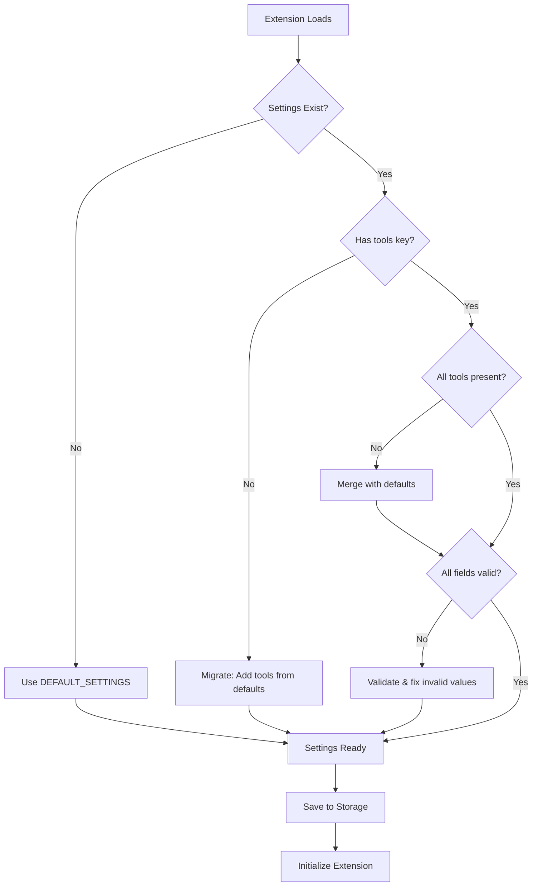

# Deep Dive Tool - Settings Store Design

## 📋 Overview

Chi tiết thiết kế settings structure cho Deep Dive tool, bao gồm:

- Default settings values
- Settings schema và validation
- Migration strategy từ old structure
- Settings update patterns

---

## 🗂️ Settings Structure

### Complete Settings Object

```javascript
// File: src/stores/settingsStore.svelte.js

const DEFAULT_SETTINGS = {
  // ... Existing settings (lines 8-99) ...

  // ============================================
  // TOOLS CONFIGURATION (NEW)
  // ============================================
  tools: {
    // Deep Dive Tool
    deepDive: {
      // Enable/Disable tool
      enabled: true,

      // Provider Configuration
      // 'gemini-basic' = fallback to Gemini 2.5 Flash Lite
      // Or specific provider: 'gemini' | 'openrouter' | 'chatgpt' | 'groq' | 'deepseek' | 'ollama' | 'lmstudio' | 'openaiCompatible'
      provider: 'gemini-basic',

      // Model for the selected provider
      // Default to lite model for performance
      model: 'gemini-2.5-flash-lite',

      // Number of questions to generate (1-5)
      numQuestions: 3,

      // Auto-generate questions after summary completes
      autoGenerate: false,

      // Default chat provider for "Start Chat" action
      // 'gemini' | 'chatgpt' | 'perplexity' | 'grok'
      defaultChatProvider: 'gemini',
    },

    // Future tools will be added here
    // Example:
    // translator: {
    //   enabled: true,
    //   provider: 'gemini-basic',
    //   targetLanguages: ['vi', 'en', 'ja'],
    //   autoDetectSource: true,
    // },
  },
}
```

---

## 🔄 Migration Strategy

### Scenario 1: Fresh Install

- No migration needed
- DEFAULT_SETTINGS will be used as-is
- Tools section initialized with defaults

### Scenario 2: Existing Users (Update from old version)

- Old settings structure exists without `tools` key
- Need to add `tools` object to settings
- Preserve all existing settings

### Scenario 3: Future Tool Updates

- New tools added to DEFAULT_SETTINGS
- Existing tool configs preserved
- Missing tool configs use defaults

### Migration Code

```javascript
// File: src/stores/settingsStore.svelte.js
// Update in loadSettings() function (around line 134-231)

export async function loadSettings() {
  if (_isInitializedPromise) {
    return _isInitializedPromise
  }

  _isInitializedPromise = (async () => {
    try {
      const storedSettings = await settingsStorage.getValue()
      if (storedSettings && Object.keys(storedSettings).length > 0) {
        // ... Existing migration logic ...

        // ============================================
        // TOOLS MIGRATION (NEW)
        // ============================================

        // If tools object doesn't exist, initialize it
        if (!storedSettings.tools) {
          console.log('[settingsStore] Migration: Adding tools configuration')
          storedSettings.tools = DEFAULT_SETTINGS.tools
        } else {
          // If tools exists but is missing some tools, merge with defaults
          storedSettings.tools = {
            ...DEFAULT_SETTINGS.tools,
            ...storedSettings.tools,
          }

          // Ensure each tool has all required fields
          Object.keys(DEFAULT_SETTINGS.tools).forEach((toolName) => {
            if (!storedSettings.tools[toolName]) {
              console.log(
                `[settingsStore] Migration: Adding ${toolName} tool config`
              )
              storedSettings.tools[toolName] = DEFAULT_SETTINGS.tools[toolName]
            } else {
              // Merge tool settings with defaults to ensure all fields exist
              storedSettings.tools[toolName] = {
                ...DEFAULT_SETTINGS.tools[toolName],
                ...storedSettings.tools[toolName],
              }
            }
          })
        }

        // Merge settings with defaults
        const mergedSettings = {
          ...DEFAULT_SETTINGS,
          ...storedSettings,
        }
        Object.assign(settings, mergedSettings)

        // Save cleaned settings back to storage
        await settingsStorage.setValue(
          JSON.parse(JSON.stringify(mergedSettings))
        )
      } else {
        // No settings in storage, initialize with defaults
        await settingsStorage.setValue(DEFAULT_SETTINGS)
        Object.assign(settings, DEFAULT_SETTINGS)
      }
    } catch (error) {
      console.error('[settingsStore] Error loading settings:', error)
      Object.assign(settings, DEFAULT_SETTINGS)
    }
  })()

  return _isInitializedPromise
}
```

---

## 🛡️ Settings Schema & Validation

### Tools Schema

```javascript
// File: src/lib/config/settingsSchema.js (if exists, otherwise add to settingsStore)

/**
 * Validates Deep Dive tool settings
 * @param {Object} toolSettings - Deep Dive settings object
 * @returns {Object} Validated and sanitized settings
 */
export function validateDeepDiveSettings(toolSettings) {
  const defaults = {
    enabled: true,
    provider: 'gemini-basic',
    model: 'gemini-2.5-flash-lite',
    numQuestions: 3,
    autoGenerate: false,
    temperature: 0.7,
    topP: 0.9,
    defaultChatProvider: 'gemini',
  }

  return {
    enabled:
      typeof toolSettings.enabled === 'boolean'
        ? toolSettings.enabled
        : defaults.enabled,

    provider: validateProvider(toolSettings.provider, defaults.provider),

    model:
      typeof toolSettings.model === 'string' && toolSettings.model.trim() !== ''
        ? toolSettings.model
        : defaults.model,

    numQuestions: validateNumQuestions(
      toolSettings.numQuestions,
      defaults.numQuestions
    ),

    autoGenerate:
      typeof toolSettings.autoGenerate === 'boolean'
        ? toolSettings.autoGenerate
        : defaults.autoGenerate,

    temperature: validateTemperature(
      toolSettings.temperature,
      defaults.temperature
    ),

    topP: validateTopP(toolSettings.topP, defaults.topP),

    defaultChatProvider: validateChatProvider(
      toolSettings.defaultChatProvider,
      defaults.defaultChatProvider
    ),
  }
}

/**
 * Validates provider ID
 */
function validateProvider(provider, defaultValue) {
  const validProviders = [
    'gemini-basic',
    'gemini',
    'openrouter',
    'chatgpt',
    'openai',
    'groq',
    'deepseek',
    'ollama',
    'lmstudio',
    'openaiCompatible',
  ]

  return validProviders.includes(provider) ? provider : defaultValue
}

/**
 * Validates number of questions (1-5)
 */
function validateNumQuestions(num, defaultValue) {
  const parsed = parseInt(num, 10)
  if (isNaN(parsed) || parsed < 1 || parsed > 5) {
    return defaultValue
  }
  return parsed
}

/**
 * Validates temperature (0-1)
 */
function validateTemperature(temp, defaultValue) {
  const parsed = parseFloat(temp)
  if (isNaN(parsed) || parsed < 0 || parsed > 1) {
    return defaultValue
  }
  return parsed
}

/**
 * Validates topP (0-1)
 */
function validateTopP(topP, defaultValue) {
  const parsed = parseFloat(topP)
  if (isNaN(parsed) || parsed < 0 || parsed > 1) {
    return defaultValue
  }
  return parsed
}

/**
 * Validates chat provider
 */
function validateChatProvider(provider, defaultValue) {
  const validChatProviders = ['gemini', 'chatgpt', 'perplexity', 'grok']
  return validChatProviders.includes(provider) ? provider : defaultValue
}

/**
 * Validates entire tools configuration
 */
export function validateToolsSettings(toolsSettings) {
  const validated = {}

  // Deep Dive
  if (toolsSettings.deepDive) {
    validated.deepDive = validateDeepDiveSettings(toolsSettings.deepDive)
  }

  // Add validators for future tools here

  return validated
}
```

---

## 📝 Settings Update Patterns

### Pattern 1: Update Single Tool Setting

```javascript
// From a component
import { settings, updateSettings } from '@/stores/settingsStore.svelte.js'

function updateDeepDiveSetting(key, value) {
  updateSettings({
    tools: {
      ...settings.tools,
      deepDive: {
        ...settings.tools.deepDive,
        [key]: value,
      },
    },
  })
}

// Usage
updateDeepDiveSetting('numQuestions', 5)
updateDeepDiveSetting('autoGenerate', true)
```

### Pattern 2: Update Multiple Tool Settings

```javascript
function updateDeepDiveSettings(updates) {
  updateSettings({
    tools: {
      ...settings.tools,
      deepDive: {
        ...settings.tools.deepDive,
        ...updates,
      },
    },
  })
}

// Usage
updateDeepDiveSettings({
  provider: 'gemini',
  model: 'gemini-2.5-flash',
  temperature: 0.8,
})
```

### Pattern 3: Toggle Tool Enabled

```javascript
function toggleToolEnabled(toolName, enabled) {
  updateSettings({
    tools: {
      ...settings.tools,
      [toolName]: {
        ...settings.tools[toolName],
        enabled,
      },
    },
  })
}

// Usage
toggleToolEnabled('deepDive', false)
```

### Pattern 4: Reset Tool to Defaults

```javascript
function resetToolToDefaults(toolName) {
  const defaults = DEFAULT_SETTINGS.tools[toolName]
  if (!defaults) {
    console.error(`Tool "${toolName}" not found in defaults`)
    return
  }

  updateSettings({
    tools: {
      ...settings.tools,
      [toolName]: { ...defaults },
    },
  })
}

// Usage
resetToolToDefaults('deepDive')
```

---

## 🔍 Settings Access Patterns

### Pattern 1: Reactive Access in Components

```svelte
<script>
  import { settings } from '@/stores/settingsStore.svelte.js'

  // Derived reactive values
  let deepDiveSettings = $derived(settings.tools.deepDive)
  let isEnabled = $derived(deepDiveSettings.enabled)
  let numQuestions = $derived(deepDiveSettings.numQuestions)
</script>

{#if isEnabled}
  <div>Deep Dive is enabled with {numQuestions} questions</div>
{/if}
```

### Pattern 2: Direct Access in Services

```javascript
import { settings } from '@/stores/settingsStore.svelte.js'

export function getDeepDiveConfig() {
  return settings.tools.deepDive
}

export function isDeepDiveEnabled() {
  return settings.tools.deepDive.enabled
}

export function getNumQuestions() {
  return settings.tools.deepDive.numQuestions
}
```

### Pattern 3: Conditional Access

```javascript
export function getToolConfig(toolName) {
  const toolConfig = settings.tools[toolName]

  if (!toolConfig) {
    throw new Error(`Tool "${toolName}" not found in settings`)
  }

  if (!toolConfig.enabled) {
    throw new Error(`Tool "${toolName}" is disabled`)
  }

  return toolConfig
}
```

---

## 🧪 Testing Scenarios

### Test Case 1: Fresh Install

```javascript
// Expected: DEFAULT_SETTINGS.tools is used
{
  tools: {
    deepDive: {
      enabled: true,
      provider: 'gemini-basic',
      model: 'gemini-2.5-flash-lite',
      numQuestions: 3,
      autoGenerate: false,
      temperature: 0.7,
      topP: 0.9,
      defaultChatProvider: 'gemini',
    }
  }
}
```

### Test Case 2: Update from Version Without Tools

```javascript
// Before (old settings)
{
  selectedProvider: 'gemini',
  geminiApiKey: 'abc123',
  // ... other settings, NO tools key
}

// After migration
{
  selectedProvider: 'gemini',
  geminiApiKey: 'abc123',
  tools: {
    deepDive: { /* defaults */ }
  }
}
```

### Test Case 3: Partial Tool Config Exists

```javascript
// Before (incomplete tool config)
{
  tools: {
    deepDive: {
      enabled: false,
      numQuestions: 5,
      // Missing other fields
    }
  }
}

// After migration (merged with defaults)
{
  tools: {
    deepDive: {
      enabled: false,          // Preserved
      numQuestions: 5,         // Preserved
      provider: 'gemini-basic', // Added from defaults
      model: 'gemini-2.5-flash-lite', // Added
      autoGenerate: false,     // Added
      temperature: 0.7,        // Added
      topP: 0.9,              // Added
      defaultChatProvider: 'gemini', // Added
    }
  }
}
```

### Test Case 4: Invalid Values

```javascript
// Before (invalid values)
{
  tools: {
    deepDive: {
      numQuestions: 10,        // Out of range (1-5)
      temperature: 2.5,        // Out of range (0-1)
      provider: 'invalid-provider',
    }
  }
}

// After validation
{
  tools: {
    deepDive: {
      numQuestions: 3,         // Reset to default
      temperature: 0.7,        // Reset to default
      provider: 'gemini-basic', // Reset to default
    }
  }
}
```

---

## 🚀 Implementation Steps

### Step 1: Update DEFAULT_SETTINGS

**File**: [`src/stores/settingsStore.svelte.js`](src/stores/settingsStore.svelte.js:8)

**Location**: After line 99 (after existing settings)

**Code**:

```javascript
// Tools Configuration
tools: {
  deepDive: {
    enabled: true,
    provider: 'gemini-basic',
    model: 'gemini-2.5-flash-lite',
    numQuestions: 3,
    autoGenerate: false,
    temperature: 0.7,
    topP: 0.9,
    defaultChatProvider: 'gemini',
  },
},
```

### Step 2: Add Migration Logic

**File**: [`src/stores/settingsStore.svelte.js`](src/stores/settingsStore.svelte.js:134)

**Location**: Inside `loadSettings()` function, after existing migrations (around line 206)

**Code**: See "Migration Code" section above

### Step 3: Add Validation (Optional but Recommended)

**File**: [`src/lib/config/settingsSchema.js`](src/lib/config/settingsSchema.js) or add to settingsStore

**Code**: See "Settings Schema & Validation" section above

### Step 4: Export Helper Functions

**File**: [`src/stores/settingsStore.svelte.js`](src/stores/settingsStore.svelte.js:404)

**Location**: At end of file (after clearPermissionCache)

**Code**:

```javascript
// --- Tool Settings Helper Functions ---

/**
 * Updates a specific tool's settings
 * @param {string} toolName - Name of the tool
 * @param {Object} updates - Settings to update
 */
export async function updateToolSettings(toolName, updates) {
  if (!_isInitializedPromise) {
    await loadSettings()
  }
  await _isInitializedPromise

  if (!settings.tools[toolName]) {
    console.error(`[settingsStore] Tool "${toolName}" not found`)
    return
  }

  const updatedTools = {
    ...settings.tools,
    [toolName]: {
      ...settings.tools[toolName],
      ...updates,
    },
  }

  await updateSettings({ tools: updatedTools })
}

/**
 * Gets a specific tool's settings
 * @param {string} toolName - Name of the tool
 * @returns {Object|null} Tool settings or null if not found
 */
export function getToolSettings(toolName) {
  return settings.tools?.[toolName] || null
}

/**
 * Checks if a tool is enabled
 * @param {string} toolName - Name of the tool
 * @returns {boolean} True if tool is enabled
 */
export function isToolEnabled(toolName) {
  return settings.tools?.[toolName]?.enabled || false
}
```

---

## 📊 Settings Flow Diagram



---

## 🎯 Key Decisions & Rationale

### 1. Why Nested `tools` Object?

- ✅ Clear separation from main settings
- ✅ Easy to add new tools without conflicts
- ✅ Tools can have similar field names without collision
- ✅ Easy to loop through all tools programmatically

### 2. Why `gemini-basic` as Default Provider?

- ✅ Most users already have Gemini Basic key configured
- ✅ Fast, efficient, cost-effective for question generation
- ✅ Clear distinction from advanced usage
- ✅ Easy fallback mechanism

### 3. Why Separate `defaultChatProvider`?

- ✅ Question generation (API) ≠ Chat interaction (web UI)
- ✅ Users might want different providers for different purposes
- ✅ Chat providers don't need API keys (use web UI)
- ✅ More flexibility for user preferences

### 4. Why Optional temperature/topP in Tool?

- ✅ Most users won't need to override
- ✅ Advanced users can fine-tune per tool
- ✅ Falls back to global settings if not specified
- ✅ Keeps basic config simple

### 5. Why Validation Functions?

- ✅ Prevent invalid values breaking the app
- ✅ Graceful degradation with defaults
- ✅ Better error messages for debugging
- ✅ Type safety without TypeScript complexity

---

## ✅ Completion Checklist

- [x] Design complete settings structure
- [x] Define default values
- [x] Design migration strategy
- [x] Create validation functions
- [x] Define update patterns
- [x] Define access patterns
- [x] Create test scenarios
- [x] Document implementation steps
- [ ] Implement in settingsStore.svelte.js
- [ ] Test migrations with real data
- [ ] Verify validation works
- [ ] Test settings persistence

---

**Status**: ✅ Design complete - Ready for implementation

**Next Step**: Implement in [`src/stores/settingsStore.svelte.js`](src/stores/settingsStore.svelte.js)
