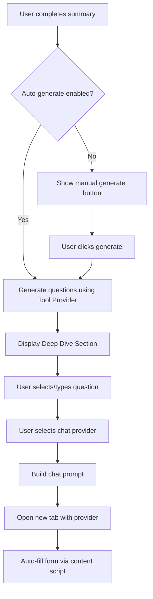
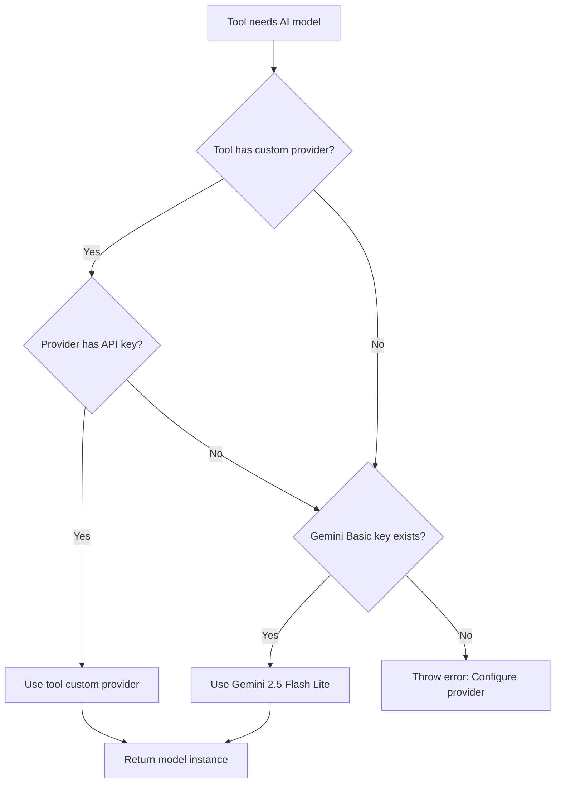

# Deep Dive Tool System - Architecture Plan

## 📋 Tổng Quan

Chuyển Deep Dive từ feature standalone thành một **Tool** trong hệ thống Tools mới, cho phép:

- Mỗi tool có provider và settings riêng độc lập
- Tool có thể fallback về Gemini Basic nếu user chưa config
- Tab "Tools" mới trong Settings để quản lý tất cả tools
- Dễ dàng mở rộng với các tools khác trong tương lai

---

## 🏗️ Kiến Trúc Tool System

### Tool System Architecture

```
┌─────────────────────────────────────────────────────────────┐
│                      Settings Store                          │
│  ┌────────────────┐  ┌────────────────┐  ┌──────────────┐  │
│  │ Summary        │  │ Tools          │  │ General      │  │
│  │ Settings       │  │ Settings       │  │ Settings     │  │
│  │                │  │ ┌────────────┐ │  │              │  │
│  │ • Provider     │  │ │ Deep Dive  │ │  │ • Theme      │  │
│  │ • Model        │  │ │ Tool       │ │  │ • Language   │  │
│  │ • Temp/TopP    │  │ │            │ │  │ • FAB        │  │
│  │                │  │ │ • Provider │ │  │              │  │
│  │                │  │ │ • Model    │ │  │              │  │
│  │                │  │ │ • NumQs    │ │  │              │  │
│  │                │  │ │ • Auto     │ │  │              │  │
│  │                │  │ └────────────┘ │  │              │  │
│  │                │  │                 │  │              │  │
│  │                │  │ [Future Tools]  │  │              │  │
│  └────────────────┘  └────────────────┘  └──────────────┘  │
└─────────────────────────────────────────────────────────────┘
```

### Tool Settings Structure

```javascript
// Trong settingsStore.svelte.js
const DEFAULT_SETTINGS = {
  // ... existing settings ...

  // Tools Configuration
  tools: {
    deepDive: {
      enabled: true,
      provider: 'gemini-basic', // 'gemini-basic' | 'gemini' | 'openai' | etc.
      model: 'gemini-2.5-flash-lite', // Model tương ứng provider
      numQuestions: 3, // 1-5
      autoGenerate: false, // Auto generate sau summary
      temperature: 0.7, // Optional: override global temp
      topP: 0.9, // Optional: override global topP

      // Chat provider settings (mở tab mới)
      defaultChatProvider: 'gemini', // 'gemini' | 'chatgpt' | 'perplexity' | 'grok'
    },
    // Future tools sẽ thêm vào đây
    // translator: { ... },
    // flashcardGenerator: { ... },
  },
}
```

### Provider Resolution Logic

```javascript
/**
 * Resolves the effective provider and model for a tool
 * Priority:
 * 1. Tool's custom provider (if configured and has API key)
 * 2. Gemini Basic (if API key exists)
 * 3. Error: require configuration
 */
function resolveToolProvider(toolName) {
  const toolConfig = settings.tools[toolName]

  // Case 1: Tool has custom provider configured
  if (toolConfig.provider !== 'gemini-basic') {
    const providerKey = getProviderApiKey(toolConfig.provider)
    if (providerKey && providerKey.trim() !== '') {
      return {
        provider: toolConfig.provider,
        model: toolConfig.model,
      }
    }
  }

  // Case 2: Fallback to Gemini Basic
  if (settings.geminiApiKey && settings.geminiApiKey.trim() !== '') {
    return {
      provider: 'gemini',
      model: 'gemini-2.5-flash-lite', // Fixed model for Basic
    }
  }

  // Case 3: No valid provider
  throw new Error('No valid provider configured for this tool')
}
```

---

## 📁 File Structure

### Stores

```
src/stores/
├── settingsStore.svelte.js          # Update để include tools settings
└── toolsStore.svelte.js             # NEW: Shared store cho tools state (optional)
```

### Components - Settings

```
src/components/settings/
├── Setting.svelte                    # Update để add Tools tab
├── ToolsSettings.svelte              # NEW: Main tools settings container
└── tools/
    ├── DeepDiveToolSettings.svelte   # NEW: Deep Dive tool config
    └── [future tool settings]        # Space for future tools
```

### Services

```
src/services/
└── tools/
    ├── deepDiveService.js            # NEW: Deep Dive logic
    ├── toolProviderService.js        # NEW: Shared provider resolution
    └── [future tool services]
```

### Prompts

```
src/lib/prompts/tools/
├── deepDiveQuestionPrompt.js         # NEW: Generate questions
├── deepDiveContentPrompt.js          # NEW: Build chat prompt
└── [future tool prompts]
```

### Components - UI

```
src/components/tools/
└── deepdive/
    ├── DeepDiveSection.svelte        # NEW: Main Deep Dive UI
    ├── QuestionChips.svelte          # NEW: Question selection chips
    ├── ProviderSelector.svelte       # NEW: Chat provider dropdown
    └── CustomQuestionInput.svelte    # NEW: Custom question input
```

---

## 🔧 Implementation Details

### Phase 1: Settings Store Update

**File**: `src/stores/settingsStore.svelte.js`

```javascript
// Add to DEFAULT_SETTINGS (around line 99)
// Tools Configuration
tools: {
  deepDive: {
    enabled: true,
    provider: 'gemini-basic', // 'gemini-basic' | specific provider
    model: 'gemini-2.5-flash-lite',
    numQuestions: 3,
    autoGenerate: false,
    temperature: 0.7,
    topP: 0.9,
    defaultChatProvider: 'gemini',
  },
  // Future tools here
},
```

### Phase 2: Tools Tab UI

**File**: `src/components/settings/Setting.svelte`

Update tab navigation (around line 186-262):

```javascript
// Add after 'about' tab button
<button
  data-tab="tools"
  class="flex flex-col w-16 items-center gap-1 justify-center cursor-pointer rounded-md transition-colors duration-200 {activeTab === 'tools' ? ' text-blackwhite ' : 'text-text-secondary'}"
  onclick={() => switchTab('tools')}
>
  <div class="size-5">
    {#if activeTab === 'tools'}
      <Icon icon="heroicons:wrench-screwdriver-solid" width="20" height="20" />
    {:else}
      <Icon icon="heroicons:wrench-screwdriver" width="20" height="20" />
    {/if}
  </div>
  <span>Tools</span>
</button>
```

Update content area (around line 287-296):

```javascript
{#if activeTab === 'ai-summary'}
  <ModelSummarySettings />
{:else if activeTab === 'general'}
  <GeneralSettings />
{:else if activeTab === 'fab'}
  <FABSettings />
{:else if activeTab === 'tools'}
  <ToolsSettings />
{:else if activeTab === 'about'}
  <AboutSettings />
{/if}
```

### Phase 3: Tools Settings Component

**File**: `src/components/settings/ToolsSettings.svelte`

```svelte
<script>
  import { t } from 'svelte-i18n'
  import { settings, updateSettings } from '@/stores/settingsStore.svelte.js'
  import DeepDiveToolSettings from './tools/DeepDiveToolSettings.svelte'
  import Icon from '@iconify/svelte'

  let expandedTool = $state('deepDive') // Track which tool is expanded

  function toggleTool(toolName) {
    expandedTool = expandedTool === toolName ? null : toolName
  }
</script>

<div class="setting-block flex gap-5 pb-6 pt-5 flex-col">
  <div class="flex items-center h-6 justify-between px-5">
    <label class="block font-bold text-text-primary">Tools</label>
  </div>

  <div class="setting-secsion flex flex-col gap-4 px-5">
    <!-- Deep Dive Tool -->
    <div class="border border-border rounded-md overflow-hidden">
      <button
        class="w-full flex items-center justify-between p-4 hover:bg-surface-2 transition-colors"
        onclick={() => toggleTool('deepDive')}
      >
        <div class="flex items-center gap-3">
          <Icon icon="heroicons:light-bulb" width="24" height="24" class="text-primary" />
          <div class="text-left">
            <div class="font-bold text-text-primary">Deep Dive with AI</div>
            <div class="text-xs text-text-secondary">Generate follow-up questions and chat with AI</div>
          </div>
        </div>
        <Icon
          icon={expandedTool === 'deepDive' ? "heroicons:chevron-up" : "heroicons:chevron-down"}
          width="20"
          height="20"
        />
      </button>

      {#if expandedTool === 'deepDive'}
        <div class="border-t border-border p-4 bg-surface-1">
          <DeepDiveToolSettings />
        </div>
      {/if}
    </div>

    <!-- Future tools will be added here -->
    <div class="text-center text-text-secondary text-xs py-4">
      More tools coming soon...
    </div>
  </div>
</div>
```

### Phase 4: Deep Dive Tool Settings

**File**: `src/components/settings/tools/DeepDiveToolSettings.svelte`

```svelte
<script>
  import { t } from 'svelte-i18n'
  import { settings, updateSettings } from '@/stores/settingsStore.svelte.js'
  import { Switch, Label } from 'bits-ui'
  import Icon from '@iconify/svelte'
  import ProvidersSelect from '@/components/inputs/ProvidersSelect.svelte'
  import ButtonSet from '@/components/buttons/ButtonSet.svelte'

  // Provider configs (reuse existing components)
  import GeminiAdvancedConfig from '@/components/providerConfigs/GeminiAdvancedConfig.svelte'
  import OpenrouterConfig from '@/components/providerConfigs/OpenrouterConfig.svelte'
  import ChatGPTConfig from '@/components/providerConfigs/ChatGPTConfig.svelte'
  // ... other provider configs

  let toolSettings = $derived(settings.tools.deepDive)
  let useCustomProvider = $derived(toolSettings.provider !== 'gemini-basic')

  function updateToolSetting(key, value) {
    updateSettings({
      tools: {
        ...settings.tools,
        deepDive: {
          ...toolSettings,
          [key]: value,
        },
      },
    })
  }

  function toggleProviderMode(useCustom) {
    if (useCustom) {
      updateToolSetting('provider', settings.selectedProvider || 'gemini')
    } else {
      updateToolSetting('provider', 'gemini-basic')
      updateToolSetting('model', 'gemini-2.5-flash-lite')
    }
  }
</script>

<div class="flex flex-col gap-4">
  <!-- Enable Tool Toggle -->
  <div class="flex items-center justify-between">
    <Label.Root for="deepdive-enabled" class="text-text-secondary">
      Enable Deep Dive
    </Label.Root>
    <Switch.Root
      id="deepdive-enabled"
      checked={toolSettings.enabled}
      onCheckedChange={(value) => updateToolSetting('enabled', value)}
      class="focus-visible:ring-primary border border-blackwhite/5 text-text-secondary flex justify-center items-center bg-blackwhite/5 hover:bg-blackwhite/10 transition-colors rounded-full size-7.5"
    >
      <Switch.Thumb
        class="bg-primary rounded-full block size-7.5 transition-all duration-300 data-[state=checked]:scale-100 data-[state=unchecked]:scale-60"
      />
    </Switch.Root>
  </div>

  {#if toolSettings.enabled}
    <!-- Provider Mode Selection -->
    <div class="flex flex-col gap-2">
      <label class="text-text-secondary">Provider Mode</label>
      <div class="grid grid-cols-2 gap-2">
        <ButtonSet
          title="Use Gemini Basic"
          class="setting-btn {!useCustomProvider ? 'active' : ''}"
          onclick={() => toggleProviderMode(false)}
          Description="Auto fallback to Gemini 2.5 Flash Lite"
        >
          <Icon icon="heroicons:sparkles" width="16" height="16" />
        </ButtonSet>
        <ButtonSet
          title="Custom Provider"
          class="setting-btn {useCustomProvider ? 'active' : ''}"
          onclick={() => toggleProviderMode(true)}
          Description="Configure your own provider"
        >
          <Icon icon="heroicons:cog-6-tooth" width="16" height="16" />
        </ButtonSet>
      </div>
    </div>

    {#if useCustomProvider}
      <!-- Custom Provider Configuration -->
      <div class="flex flex-col gap-4 p-4 bg-surface-2 rounded-md">
        <!-- Provider Select -->
        <div class="flex flex-col gap-2">
          <label class="text-text-secondary">Select Provider</label>
          <ProvidersSelect
            bind:value={toolSettings.provider}
            onchange={(event) => updateToolSetting('provider', event.detail)}
          />
        </div>

        <!-- Dynamic Provider Config (reuse existing components) -->
        {#if toolSettings.provider === 'gemini'}
          <GeminiAdvancedConfig
            bind:geminiAdvancedApiKey={settings.geminiAdvancedApiKey}
            bind:selectedGeminiAdvancedModel={toolSettings.model}
          />
        {:else if toolSettings.provider === 'openrouter'}
          <OpenrouterConfig
            bind:openrouterApiKey={settings.openrouterApiKey}
            bind:selectedOpenrouterModel={toolSettings.model}
          />
        {:else if toolSettings.provider === 'chatgpt'}
          <ChatGPTConfig
            bind:chatgptApiKey={settings.chatgptApiKey}
            bind:chatgptBaseUrl={settings.chatgptBaseUrl}
            bind:selectedChatgptModel={toolSettings.model}
          />
        {/if}

        <!-- Temperature & Top P -->
        <div class="grid grid-cols-2 gap-4">
          <div class="flex flex-col gap-2">
            <label class="text-text-secondary flex justify-between">
              <span>Temperature</span>
              <span class="text-text-primary font-bold">{toolSettings.temperature.toFixed(2)}</span>
            </label>
            <input
              type="range"
              min="0"
              max="1"
              step="0.05"
              bind:value={toolSettings.temperature}
              onchange={() => updateToolSetting('temperature', toolSettings.temperature)}
              class="range range-primary"
            />
          </div>
          <div class="flex flex-col gap-2">
            <label class="text-text-secondary flex justify-between">
              <span>Top P</span>
              <span class="text-text-primary font-bold">{toolSettings.topP.toFixed(2)}</span>
            </label>
            <input
              type="range"
              min="0"
              max="1"
              step="0.01"
              bind:value={toolSettings.topP}
              onchange={() => updateToolSetting('topP', toolSettings.topP)}
              class="range range-primary"
            />
          </div>
        </div>
      </div>
    {/if}

    <!-- Number of Questions -->
    <div class="flex flex-col gap-2">
      <label class="text-text-secondary flex justify-between">
        <span>Number of Questions</span>
        <span class="text-text-primary font-bold">{toolSettings.numQuestions}</span>
      </label>
      <input
        type="range"
        min="1"
        max="5"
        step="1"
        bind:value={toolSettings.numQuestions}
        onchange={() => updateToolSetting('numQuestions', toolSettings.numQuestions)}
        class="range range-primary"
      />
      <div class="flex justify-between text-xs text-text-secondary px-1">
        {#each [1, 2, 3, 4, 5] as num}
          <span>{num}</span>
        {/each}
      </div>
    </div>

    <!-- Auto Generate Toggle -->
    <div class="flex items-center justify-between">
      <div class="flex flex-col">
        <Label.Root for="auto-generate" class="text-text-secondary">
          Auto Generate Questions
        </Label.Root>
        <span class="text-xs text-text-secondary/70">
          Automatically generate after summary completes
        </span>
      </div>
      <Switch.Root
        id="auto-generate"
        checked={toolSettings.autoGenerate}
        onCheckedChange={(value) => updateToolSetting('autoGenerate', value)}
        class="focus-visible:ring-primary border border-blackwhite/5 text-text-secondary flex justify-center items-center bg-blackwhite/5 hover:bg-blackwhite/10 transition-colors rounded-full size-7.5"
      >
        <Switch.Thumb
          class="bg-primary rounded-full block size-7.5 transition-all duration-300 data-[state=checked]:scale-100 data-[state=unchecked]:scale-60"
        />
      </Switch.Root>
    </div>

    <!-- Default Chat Provider -->
    <div class="flex flex-col gap-2">
      <label class="text-text-secondary">Default Chat Provider</label>
      <div class="grid grid-cols-2 gap-2">
        <ButtonSet
          title="Gemini"
          class="setting-btn {toolSettings.defaultChatProvider === 'gemini' ? 'active' : ''}"
          onclick={() => updateToolSetting('defaultChatProvider', 'gemini')}
        />
        <ButtonSet
          title="ChatGPT"
          class="setting-btn {toolSettings.defaultChatProvider === 'chatgpt' ? 'active' : ''}"
          onclick={() => updateToolSetting('defaultChatProvider', 'chatgpt')}
        />
        <ButtonSet
          title="Perplexity"
          class="setting-btn {toolSettings.defaultChatProvider === 'perplexity' ? 'active' : ''}"
          onclick={() => updateToolSetting('defaultChatProvider', 'perplexity')}
        />
        <ButtonSet
          title="Grok"
          class="setting-btn {toolSettings.defaultChatProvider === 'grok' ? 'active' : ''}"
          onclick={() => updateToolSetting('defaultChatProvider', 'grok')}
        />
      </div>
    </div>
  {/if}
</div>
```

### Phase 5: Tool Provider Service

**File**: `src/services/tools/toolProviderService.js`

```javascript
// @ts-nocheck
import { settings } from '@/stores/settingsStore.svelte.js'
import { getAISDKModel, mapGenerationConfig } from '@/lib/api/aiSdkAdapter.js'

/**
 * Resolves the effective provider configuration for a tool
 * @param {string} toolName - Name of the tool (e.g., 'deepDive')
 * @returns {Object} Resolved provider config
 * @throws {Error} If no valid provider is configured
 */
export function resolveToolProvider(toolName) {
  const toolConfig = settings.tools[toolName]

  if (!toolConfig) {
    throw new Error(`Tool "${toolName}" not found in settings`)
  }

  // Case 1: Custom provider configured
  if (toolConfig.provider !== 'gemini-basic') {
    const providerKey = getProviderApiKey(toolConfig.provider)
    if (providerKey && providerKey.trim() !== '') {
      return {
        provider: toolConfig.provider,
        model: toolConfig.model,
        temperature: toolConfig.temperature,
        topP: toolConfig.topP,
      }
    }
  }

  // Case 2: Fallback to Gemini Basic
  if (settings.geminiApiKey && settings.geminiApiKey.trim() !== '') {
    return {
      provider: 'gemini',
      model: 'gemini-2.5-flash-lite',
      temperature: 0.7,
      topP: 0.9,
    }
  }

  // Case 3: No valid provider
  throw new Error(
    `No valid provider configured for tool "${toolName}". Please configure a provider in Tools settings.`
  )
}

/**
 * Gets API key for a specific provider
 */
function getProviderApiKey(providerId) {
  const keyMap = {
    gemini: settings.geminiAdvancedApiKey || settings.geminiApiKey,
    openrouter: settings.openrouterApiKey,
    chatgpt: settings.chatgptApiKey,
    openai: settings.chatgptApiKey,
    groq: settings.groqApiKey,
    deepseek: settings.deepseekApiKey,
    ollama: 'local', // Ollama doesn't require API key
    lmstudio: 'local',
    openaiCompatible: settings.openaiCompatibleApiKey,
  }

  return keyMap[providerId] || null
}

/**
 * Creates an AI SDK model instance for a tool
 * @param {string} toolName - Name of the tool
 * @returns {Object} AI SDK model instance
 */
export function getToolAIModel(toolName) {
  const providerConfig = resolveToolProvider(toolName)

  // Create temporary settings object for aiSdkAdapter
  const tempSettings = {
    ...settings,
    selectedProvider: providerConfig.provider,
    temperature: providerConfig.temperature,
    topP: providerConfig.topP,
  }

  // Set appropriate model key based on provider
  switch (providerConfig.provider) {
    case 'gemini':
      tempSettings.selectedGeminiModel = providerConfig.model
      break
    case 'openrouter':
      tempSettings.selectedOpenrouterModel = providerConfig.model
      break
    case 'chatgpt':
    case 'openai':
      tempSettings.selectedChatgptModel = providerConfig.model
      break
    // Add other providers as needed
  }

  return getAISDKModel(providerConfig.provider, tempSettings)
}

/**
 * Checks if a tool has a valid provider configured
 * @param {string} toolName - Name of the tool
 * @returns {boolean} True if valid provider exists
 */
export function hasValidToolProvider(toolName) {
  try {
    resolveToolProvider(toolName)
    return true
  } catch {
    return false
  }
}
```

---

## 📊 Data Flow Diagram

### Deep Dive Tool Flow



### Provider Resolution Flow



---

## 🎯 Key Design Decisions

### 1. Tool Independence

- Mỗi tool có settings object riêng trong `settings.tools[toolName]`
- Tools không share settings với Summary (trừ fallback case)
- Dễ dàng add/remove tools mà không ảnh hưởng nhau

### 2. Provider Fallback Strategy

- Priority: Custom provider → Gemini Basic → Error
- Gemini Basic (`gemini-2.5-flash-lite`) là fallback tốt vì:
  - Nhanh, nhẹ, hiệu quả cho generate câu hỏi
  - Đa số users đã có Gemini Basic key
  - Không cần advanced settings

### 3. Chat Provider Separation

- Generate questions: Dùng Tool Provider (API)
- Chat với AI: Dùng chat providers (mở tab mới)
- 2 concerns khác nhau → tách biệt

### 4. UI/UX

- Tools tab riêng trong Settings
- Mỗi tool là expandable card
- Reuse existing provider config components
- Consistent với design hiện tại

### 5. Extensibility

- Tool interface rõ ràng
- Dễ thêm tools mới
- Shared services (toolProviderService)
- Modular component structure

---

## 🚀 Migration Strategy

### From Original Plan to Tool System

**Original Plan Changes:**

1. ❌ **Old**: `autoGenerateDeepDiveQuestions` trong root settings
   ✅ **New**: `settings.tools.deepDive.autoGenerate`

2. ❌ **Old**: `defaultDeepDiveProvider` cho cả generate và chat
   ✅ **New**:

   - `settings.tools.deepDive.provider` cho generate questions
   - `settings.tools.deepDive.defaultChatProvider` cho chat

3. ❌ **Old**: Deep Dive settings trong Summary Settings hoặc General
   ✅ **New**: Riêng tab Tools với UI expandable

4. ✅ **Keep**: Background script handlers, content scripts, prompt templates
5. ✅ **Keep**: DeepDiveSection component structure
6. ✅ **Keep**: Message types và flow

---

## ✅ Implementation Checklist

### Phase 1: Foundation

- [x] Design tool system architecture
- [ ] Update [`settingsStore.svelte.js`](src/stores/settingsStore.svelte.js:8) with tools structure
- [ ] Create [`toolProviderService.js`](src/services/tools/toolProviderService.js)
- [ ] Add settings migration logic for existing configs

### Phase 2: Settings UI

- [ ] Update [`Setting.svelte`](src/components/settings/Setting.svelte:28) to add Tools tab
- [ ] Create [`ToolsSettings.svelte`](src/components/settings/ToolsSettings.svelte)
- [ ] Create [`DeepDiveToolSettings.svelte`](src/components/settings/tools/DeepDiveToolSettings.svelte)
- [ ] Add iconify icons for tools tab

### Phase 3: Service Layer

- [ ] Create [`deepDiveService.js`](src/services/tools/deepDiveService.js) with:
  - `generateFollowUpQuestions()` function
  - `openDeepDiveChat()` function
  - Integration with [`toolProviderService.js`](src/services/tools/toolProviderService.js)

### Phase 4: Prompt Templates

- [ ] Create [`deepDiveQuestionPrompt.js`](src/lib/prompts/tools/deepDiveQuestionPrompt.js)
- [ ] Create [`deepDiveContentPrompt.js`](src/lib/prompts/tools/deepDiveContentPrompt.js)

### Phase 5: UI Components

- [ ] Create [`DeepDiveSection.svelte`](src/components/tools/deepdive/DeepDiveSection.svelte)
- [ ] Create sub-components (QuestionChips, ProviderSelector, etc.)

### Phase 6: Integration

- [ ] Update [`background.js`](src/entrypoints/background.js:747) with Deep Dive handlers
- [ ] Update [`FoooterDisplay.svelte`](src/components/displays/ui/FoooterDisplay.svelte:40) to include DeepDiveSection
- [ ] Pass necessary props through display components

### Phase 7: Testing & Polish

- [ ] Test provider resolution logic
- [ ] Test auto-generate flow
- [ ] Test manual generate flow
- [ ] Test all 4 chat providers
- [ ] Test settings persistence
- [ ] Test error handling
- [ ] Add i18n translations
- [ ] Documentation

---

## 📝 Notes

- **Performance**: Tool provider resolution cache có thể implement sau
- **i18n**: Hardcode English text trước, add translations sau
- **Validation**: Provider API key validation có thể reuse từ existing components
- **Error UI**: Hiển thị error messages rõ ràng trong Deep Dive section
- **Analytics**: Có thể track tool usage metrics sau

---

## 🔮 Future Extensions

### Future Tools Ideas

1. **Translator Tool**

   ```javascript
   tools: {
     translator: {
       enabled: true,
       provider: 'gemini-basic',
       targetLanguages: ['vi', 'en', 'ja'],
       autoDetectSource: true,
     }
   }
   ```

2. **Flashcard Generator Tool**

   ```javascript
   tools: {
     flashcards: {
       enabled: true,
       provider: 'gemini-basic',
       numCards: 10,
       difficulty: 'medium',
       exportFormat: 'anki',
     }
   }
   ```

3. **Quiz Generator Tool**
   ```javascript
   tools: {
     quiz: {
       enabled: true,
       provider: 'gemini-basic',
       numQuestions: 5,
       questionTypes: ['multiple-choice', 'true-false'],
     }
   }
   ```

---

## 📚 References

- Original Plan: [`deep-dive-feature-implementation-plan.md`](deep-dive-feature-implementation-plan.md)
- Settings Store: [`src/stores/settingsStore.svelte.js`](src/stores/settingsStore.svelte.js)
- AI Config: [`src/lib/config/aiConfig.js`](src/lib/config/aiConfig.js)
- AI SDK Adapter: [`src/lib/api/aiSdkAdapter.js`](src/lib/api/aiSdkAdapter.js)

---

**Status**: ✅ Architecture design complete - Ready for implementation

**Next Step**: Switch to Code mode để implement Phase 1 & 2
