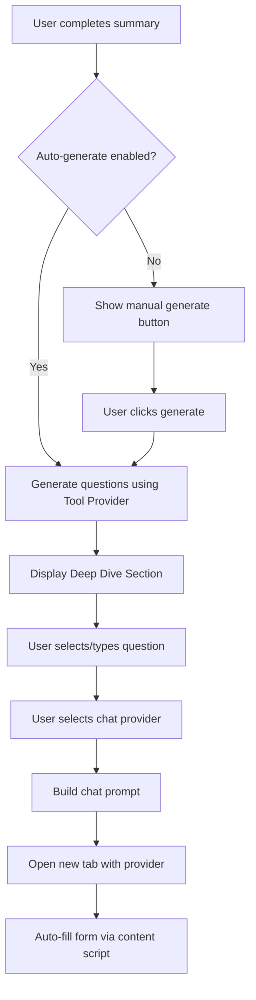
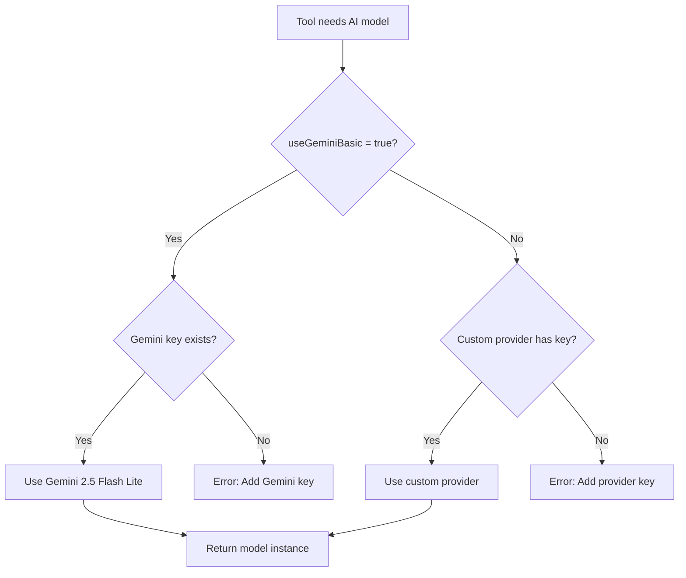

# Deep Dive Tool System - Architecture Plan

## 📋 Tổng Quan

Chuyển Deep Dive từ feature standalone thành một **Tool** trong hệ thống Tools mới, cho phép:

- Mỗi tool có provider và settings riêng độc lập
- Tool có thể fallback về Gemini Basic nếu user chưa config
- Tab "Tools" mới trong Settings để quản lý tất cả tools
- Dễ dàng mở rộng với các tools khác trong tương lai

---

## 🏗️ Kiến Trúc Tool System

### Tool System Architecture

```
┌─────────────────────────────────────────────────────────────┐
│                      Settings Store                          │
│  ┌────────────────┐  ┌────────────────┐  ┌──────────────┐  │
│  │ Summary        │  │ Tools          │  │ General      │  │
│  │ Settings       │  │ Settings       │  │ Settings     │  │
│  │                │  │ ┌────────────┐ │  │              │  │
│  │ • Provider     │  │ │ Deep Dive  │ │  │ • Theme      │  │
│  │ • Model        │  │ │ Tool       │ │  │ • Language   │  │
│  │ • Temp/TopP    │  │ │            │ │  │ • FAB        │  │
│  │                │  │ │ • Provider │ │  │              │  │
│  │                │  │ │ • Model    │ │  │              │  │
│  │                │  │ │ • NumQs    │ │  │              │  │
│  │                │  │ │ • Auto     │ │  │              │  │
│  │                │  │ └────────────┘ │  │              │  │
│  │                │  │                 │  │              │  │
│  │                │  │ [Future Tools]  │  │              │  │
│  └────────────────┘  └────────────────┘  └──────────────┘  │
└─────────────────────────────────────────────────────────────┘
```

### Tool Settings Structure

```javascript
// Trong settingsStore.svelte.js
const DEFAULT_SETTINGS = {
  // ... existing settings ...

  // Tools Configuration
  tools: {
    deepDive: {
      enabled: true,
      useGeminiBasic: true, // true = Gemini Basic, false = custom provider
      customProvider: 'gemini', // Chỉ dùng khi useGeminiBasic = false
      customModel: 'gemini-2.5-flash-lite',
      autoGenerate: false, // Auto generate sau summary

      // Chat provider settings (mở tab mới)
      defaultChatProvider: 'gemini', // 'gemini' | 'chatgpt' | 'perplexity' | 'grok'
    },
    // Future tools sẽ thêm vào đây
    // translator: { ... },
    // flashcardGenerator: { ... },
  },
}
```

### Provider Resolution Logic

```javascript
/**
 * Resolves the effective provider and model for a tool
 * Priority:
 * 1. If useGeminiBasic = true: Use Gemini Basic with API key
 * 2. If useGeminiBasic = false: Use custom provider (if has API key)
 * 3. Error: require configuration
 */
function resolveToolProvider(toolName) {
  const toolConfig = settings.tools[toolName]

  // Case 1: Use Gemini Basic
  if (toolConfig.useGeminiBasic) {
    if (settings.geminiApiKey && settings.geminiApiKey.trim() !== '') {
      return {
        provider: 'gemini',
        model: 'gemini-2.5-flash-lite',
        temperature: 0.7,
        topP: 0.9,
      }
    }
    throw new Error(
      'Gemini API key is required. Please configure it in Settings.'
    )
  }

  // Case 2: Use custom provider
  const providerKey = getProviderApiKey(toolConfig.customProvider)
  if (providerKey && providerKey.trim() !== '') {
    return {
      provider: toolConfig.customProvider,
      model: toolConfig.customModel,
      temperature: 0.7,
      topP: 0.9,
    }
  }

  // Case 3: No valid provider
  throw new Error(
    `Custom provider "${toolConfig.customProvider}" is not configured. Please add API key in Settings.`
  )
}
```

---

## 📁 File Structure

### Stores

```
src/stores/
├── settingsStore.svelte.js          # Update để include tools settings
└── toolsStore.svelte.js             # NEW: Shared store cho tools state (optional)
```

### Components - Settings

```
src/components/settings/
├── Setting.svelte                    # Update để add Tools tab
├── ToolsSettings.svelte              # NEW: Main tools settings container
└── tools/
    ├── DeepDiveToolSettings.svelte   # NEW: Deep Dive tool config
    └── [future tool settings]        # Space for future tools
```

### Services

```
src/services/
└── tools/
    ├── deepDiveService.js            # NEW: Deep Dive logic
    ├── toolProviderService.js        # NEW: Shared provider resolution
    └── [future tool services]
```

### Prompts

```
src/lib/prompts/tools/
├── deepDiveQuestionPrompt.js         # NEW: Generate questions
├── deepDiveContentPrompt.js          # NEW: Build chat prompt
└── [future tool prompts]
```

### Components - UI

```
src/components/tools/
└── deepdive/
    ├── DeepDiveSection.svelte        # NEW: Main Deep Dive UI
    ├── QuestionChips.svelte          # NEW: Question selection chips
    ├── ProviderSelector.svelte       # NEW: Chat provider dropdown
    └── CustomQuestionInput.svelte    # NEW: Custom question input
```

---

## 🔧 Implementation Details

### Phase 1: Settings Store Update

**File**: `src/stores/settingsStore.svelte.js`

```javascript
// Add to DEFAULT_SETTINGS (around line 99)
// Tools Configuration
tools: {
  deepDive: {
    enabled: true,
    useGeminiBasic: true,
    customProvider: 'gemini',
    customModel: 'gemini-2.5-flash-lite',
    autoGenerate: false,
    defaultChatProvider: 'gemini',
  },
  // Future tools here
},
```

### Phase 2: Tools Tab UI

**File**: `src/components/settings/Setting.svelte`

Update tab navigation (around line 186-262):

```javascript
// Add after 'about' tab button
<button
  data-tab="tools"
  class="flex flex-col w-16 items-center gap-1 justify-center cursor-pointer rounded-md transition-colors duration-200 {activeTab === 'tools' ? ' text-blackwhite ' : 'text-text-secondary'}"
  onclick={() => switchTab('tools')}
>
  <div class="size-5">
    {#if activeTab === 'tools'}
      <Icon icon="heroicons:wrench-screwdriver-solid" width="20" height="20" />
    {:else}
      <Icon icon="heroicons:wrench-screwdriver" width="20" height="20" />
    {/if}
  </div>
  <span>Tools</span>
</button>
```

Update content area (around line 287-296):

```javascript
{#if activeTab === 'ai-summary'}
  <ModelSummarySettings />
{:else if activeTab === 'general'}
  <GeneralSettings />
{:else if activeTab === 'fab'}
  <FABSettings />
{:else if activeTab === 'tools'}
  <ToolsSettings />
{:else if activeTab === 'about'}
  <AboutSettings />
{/if}
```

### Phase 3: Tools Settings Component

**File**: `src/components/settings/ToolsSettings.svelte`

```svelte
<script>
  import { t } from 'svelte-i18n'
  import { settings, updateSettings } from '@/stores/settingsStore.svelte.js'
  import DeepDiveToolSettings from './tools/DeepDiveToolSettings.svelte'
  import Icon from '@iconify/svelte'

  // ✅ ĐÚNG - Persist expansion state với sessionStorage
  let expandedTool = $state(
    (typeof sessionStorage !== 'undefined' && sessionStorage.getItem('tools-expanded-tool')) || null
  )

  /**
   * ✅ Toggle tool expansion với persistence
   */
  function toggleTool(toolName) {
    expandedTool = expandedTool === toolName ? null : toolName

    // Persist state
    if (typeof sessionStorage !== 'undefined') {
      if (expandedTool) {
        sessionStorage.setItem('tools-expanded-tool', expandedTool)
      } else {
        sessionStorage.removeItem('tools-expanded-tool')
      }
    }
  }
</script>

<div class="setting-block flex gap-5 pb-6 pt-5 flex-col">
  <div class="flex items-center h-6 justify-between px-5">
    <label class="block font-bold text-text-primary">Tools</label>
  </div>

  <div class="setting-secsion flex flex-col gap-4 px-5">
    <!-- Deep Dive Tool -->
    <div class="border border-border rounded-md overflow-hidden">
      <button
        class="w-full flex items-center justify-between p-4 hover:bg-surface-2 transition-colors"
        onclick={() => toggleTool('deepDive')}
      >
        <div class="flex items-center gap-3">
          <Icon icon="heroicons:light-bulb" width="24" height="24" class="text-primary" />
          <div class="text-left">
            <div class="font-bold text-text-primary">Deep Dive with AI</div>
            <div class="text-xs text-text-secondary">Generate follow-up questions and chat with AI</div>
          </div>
        </div>
        <Icon
          icon={expandedTool === 'deepDive' ? "heroicons:chevron-up" : "heroicons:chevron-down"}
          width="20"
          height="20"
        />
      </button>

      {#if expandedTool === 'deepDive'}
        <div class="border-t border-border p-4 bg-surface-1">
          <DeepDiveToolSettings />
        </div>
      {/if}
    </div>

    <!-- Future tools will be added here -->
    <div class="text-center text-text-secondary text-xs py-4">
      More tools coming soon...
    </div>
  </div>
</div>
```

### Phase 4: Deep Dive Tool Settings

**File**: `src/components/settings/tools/DeepDiveToolSettings.svelte`

```svelte
<script>
  import { t } from 'svelte-i18n'
  import { settings, updateSettings } from '@/stores/settingsStore.svelte.js'
  import { Switch, Label } from 'bits-ui'
  import Icon from '@iconify/svelte'
  import ProvidersSelect from '@/components/inputs/ProvidersSelect.svelte'
  import ButtonSet from '@/components/buttons/ButtonSet.svelte'

  // Provider configs (reuse existing components)
  import GeminiAdvancedConfig from '@/components/providerConfigs/GeminiAdvancedConfig.svelte'
  import OpenrouterConfig from '@/components/providerConfigs/OpenrouterConfig.svelte'
  import ChatGPTConfig from '@/components/providerConfigs/ChatGPTConfig.svelte'
  // ... other provider configs

  // ✅ ĐÚNG - Sử dụng $derived.by() cho computed value
  let toolSettings = $derived.by(() => settings.tools?.deepDive ?? {})

  /**
   * ✅ Helper function để update tool setting
   */
  function updateToolSetting(key, value) {
    updateSettings({
      tools: {
        ...settings.tools,
        deepDive: {
          ...settings.tools.deepDive,
          [key]: value,
        },
      },
    })
  }

  /**
   * ✅ Toggle provider mode với proper initialization
   */
  function toggleProviderMode(useBasic) {
    const updates = { useGeminiBasic: useBasic }

    // Initialize custom provider if switching to custom mode
    if (!useBasic && !settings.tools.deepDive.customProvider) {
      updates.customProvider = settings.selectedProvider || 'gemini'
      updates.customModel = 'gemini-2.0-flash'
    }

    updateSettings({
      tools: {
        ...settings.tools,
        deepDive: {
          ...settings.tools.deepDive,
          ...updates,
        },
      },
    })
  }
</script>

<div class="flex flex-col gap-4">
  <!-- Enable Tool Toggle -->
  <div class="flex items-center justify-between">
    <Label.Root for="deepdive-enabled" class="text-text-secondary">
      Enable Deep Dive
    </Label.Root>
    <Switch.Root
      id="deepdive-enabled"
      checked={toolSettings.enabled}
      onCheckedChange={(value) => updateToolSetting('enabled', value)}
      class="focus-visible:ring-primary border border-blackwhite/5 text-text-secondary flex justify-center items-center bg-blackwhite/5 hover:bg-blackwhite/10 transition-colors rounded-full size-7.5"
    >
      <Switch.Thumb
        class="bg-primary rounded-full block size-7.5 transition-all duration-300 data-[state=checked]:scale-100 data-[state=unchecked]:scale-60"
      />
    </Switch.Root>
  </div>

  {#if toolSettings.enabled}
    <!-- Provider Mode Selection -->
    <div class="flex flex-col gap-2">
      <label class="text-text-secondary">Provider Mode</label>
      <div class="grid grid-cols-2 gap-2">
        <ButtonSet
          title="Use Gemini Basic"
          class="setting-btn {toolSettings.useGeminiBasic ? 'active' : ''}"
          onclick={() => toggleProviderMode(true)}
          Description="Fast and efficient for question generation"
        >
          <Icon icon="heroicons:sparkles" width="16" height="16" />
        </ButtonSet>
        <ButtonSet
          title="Custom Provider"
          class="setting-btn {!toolSettings.useGeminiBasic ? 'active' : ''}"
          onclick={() => toggleProviderMode(false)}
          Description="Use your configured AI provider"
        >
          <Icon icon="heroicons:cog-6-tooth" width="16" height="16" />
        </ButtonSet>
      </div>
    </div>

    {#if !toolSettings.useGeminiBasic}
      <!-- Custom Provider Configuration -->
      <div class="flex flex-col gap-4 p-4 bg-surface-2 rounded-md">
        <!-- Provider Select -->
        <div class="flex flex-col gap-2">
          <label class="text-text-secondary">Select Provider</label>
          <!-- ✅ ĐÚNG - Controlled component không dùng bind -->
          <ProvidersSelect
            value={settings.tools.deepDive.customProvider}
            onchange={(event) => updateToolSetting('customProvider', event.detail)}
          />
        </div>

        <!-- ⚠️ NOTE: Provider configs cần refactor để không dùng bind -->
        <!-- Tạm thời giữ bind cho global settings, chỉ model là tool-specific -->

        <!-- Dynamic Provider Config (reuse existing components) -->
        {#if toolSettings.customProvider === 'gemini'}
          <!-- ✅ API key từ global settings, model từ tool settings -->
          <GeminiAdvancedConfig
            bind:geminiAdvancedApiKey={settings.geminiAdvancedApiKey}
            selectedGeminiAdvancedModel={toolSettings.customModel}
            onModelChange={(model) => updateToolSetting('customModel', model)}
          />
        {:else if toolSettings.customProvider === 'openrouter'}
          <OpenrouterConfig
            bind:openrouterApiKey={settings.openrouterApiKey}
            selectedOpenrouterModel={toolSettings.customModel}
            onModelChange={(model) => updateToolSetting('customModel', model)}
          />
        {:else if toolSettings.customProvider === 'chatgpt'}
          <ChatGPTConfig
            bind:chatgptApiKey={settings.chatgptApiKey}
            bind:chatgptBaseUrl={settings.chatgptBaseUrl}
            selectedChatgptModel={toolSettings.customModel}
            onModelChange={(model) => updateToolSetting('customModel', model)}
          />
        {/if}
      </div>
    {/if}

    <!-- Auto Generate Toggle -->
    <div class="flex items-center justify-between">
      <div class="flex flex-col">
        <Label.Root for="auto-generate" class="text-text-secondary">
          Auto Generate Questions
        </Label.Root>
        <span class="text-xs text-text-secondary/70">
          Automatically generate after summary completes
        </span>
      </div>
      <Switch.Root
        id="auto-generate"
        checked={toolSettings.autoGenerate}
        onCheckedChange={(value) => updateToolSetting('autoGenerate', value)}
        class="focus-visible:ring-primary border border-blackwhite/5 text-text-secondary flex justify-center items-center bg-blackwhite/5 hover:bg-blackwhite/10 transition-colors rounded-full size-7.5"
      >
        <Switch.Thumb
          class="bg-primary rounded-full block size-7.5 transition-all duration-300 data-[state=checked]:scale-100 data-[state=unchecked]:scale-60"
        />
      </Switch.Root>
    </div>

    <!-- Default Chat Provider -->
    <div class="flex flex-col gap-2">
      <label class="text-text-secondary">Default Chat Provider</label>
      <div class="grid grid-cols-2 gap-2">
        <ButtonSet
          title="Gemini"
          class="setting-btn {toolSettings.defaultChatProvider === 'gemini' ? 'active' : ''}"
          onclick={() => updateToolSetting('defaultChatProvider', 'gemini')}
        />
        <ButtonSet
          title="ChatGPT"
          class="setting-btn {toolSettings.defaultChatProvider === 'chatgpt' ? 'active' : ''}"
          onclick={() => updateToolSetting('defaultChatProvider', 'chatgpt')}
        />
        <ButtonSet
          title="Perplexity"
          class="setting-btn {toolSettings.defaultChatProvider === 'perplexity' ? 'active' : ''}"
          onclick={() => updateToolSetting('defaultChatProvider', 'perplexity')}
        />
        <ButtonSet
          title="Grok"
          class="setting-btn {toolSettings.defaultChatProvider === 'grok' ? 'active' : ''}"
          onclick={() => updateToolSetting('defaultChatProvider', 'grok')}
        />
      </div>
    </div>
  {/if}
</div>
```

### Phase 5: Tool Provider Service

**File**: `src/services/tools/toolProviderService.js`

```javascript
// @ts-nocheck
import { settings } from '@/stores/settingsStore.svelte.js'
import { getAISDKModel, mapGenerationConfig } from '@/lib/api/aiSdkAdapter.js'

/**
 * Resolves the effective provider configuration for a tool
 * @param {string} toolName - Name of the tool (e.g., 'deepDive')
 * @returns {Object} Resolved provider config
 * @throws {Error} If no valid provider is configured
 */
/**
 * ✅ Improved with better validation and error messages
 */
export function resolveToolProvider(toolName) {
  // Validate tool exists
  const toolConfig = settings.tools?.[toolName]

  if (!toolConfig) {
    throw new Error(`Tool "${toolName}" not found in settings`)
  }

  // Check if tool is enabled
  if (!toolConfig.enabled) {
    throw new Error(
      `Tool "${toolName}" is disabled. Please enable it in Settings > Tools.`
    )
  }

  // Case 1: Use Gemini Basic
  if (toolConfig.useGeminiBasic) {
    const apiKey = settings.geminiApiKey?.trim()
    if (!apiKey) {
      throw new Error(
        'Gemini API key is required. Please configure it in Settings > Summary > Gemini Basic.'
      )
    }

    return {
      provider: 'gemini',
      model: 'gemini-2.0-flash', // Use current default model
      temperature: 0.7,
      topP: 0.9,
    }
  }

  // Case 2: Use custom provider
  const { customProvider, customModel } = toolConfig

  // Validate provider
  if (!customProvider || typeof customProvider !== 'string') {
    throw new Error('Custom provider is not configured')
  }

  // Get and validate API key
  const providerKey = getProviderApiKey(customProvider)
  if (
    !providerKey ||
    (typeof providerKey === 'string' && !providerKey.trim())
  ) {
    throw new Error(
      `API key for "${customProvider}" is missing. Please add it in Settings > Summary.`
    )
  }

  // Validate model name
  if (!customModel || typeof customModel !== 'string' || !customModel.trim()) {
    throw new Error(`Model name for "${customProvider}" is invalid or missing`)
  }

  return {
    provider: customProvider,
    model: customModel.trim(),
    temperature: 0.7,
    topP: 0.9,
  }
}

/**
 * Gets API key for a specific provider
 */
function getProviderApiKey(providerId) {
  const keyMap = {
    gemini: settings.geminiAdvancedApiKey || settings.geminiApiKey,
    openrouter: settings.openrouterApiKey,
    chatgpt: settings.chatgptApiKey,
    openai: settings.chatgptApiKey,
    groq: settings.groqApiKey,
    deepseek: settings.deepseekApiKey,
    ollama: 'local', // Ollama doesn't require API key
    lmstudio: 'local',
    openaiCompatible: settings.openaiCompatibleApiKey,
  }

  return keyMap[providerId] || null
}

/**
 * Creates an AI SDK model instance for a tool
 * @param {string} toolName - Name of the tool
 * @returns {Object} AI SDK model instance
 */
/**
 * ✅ Optimized - Không spread toàn bộ settings object
 */
export function getToolAIModel(toolName) {
  const providerConfig = resolveToolProvider(toolName)

  // Build clean settings object chỉ với những gì cần thiết
  const modelSettings = buildModelSettings(providerConfig, settings)

  return getAISDKModel(providerConfig.provider, modelSettings)
}

/**
 * ✅ Helper function để build model-specific settings
 * Tránh spread toàn bộ settings object (performance issue với Svelte Proxy)
 */
function buildModelSettings(providerConfig, globalSettings) {
  const { provider, model, temperature, topP } = providerConfig

  // Base settings cho tất cả providers
  const base = {
    temperature,
    topP,
    selectedProvider: provider,
  }

  // Provider-specific model key mapping
  const modelKeyMap = {
    gemini: 'selectedGeminiModel',
    openrouter: 'selectedOpenrouterModel',
    chatgpt: 'selectedChatgptModel',
    openai: 'selectedChatgptModel',
    groq: 'selectedGroqModel',
    deepseek: 'selectedDeepseekModel',
    ollama: 'selectedOllamaModel',
    lmstudio: 'selectedLmStudioModel',
    openaiCompatible: 'selectedOpenAICompatibleModel',
  }

  const modelKey = modelKeyMap[provider]
  if (modelKey) {
    base[modelKey] = model
  }

  // Add provider-specific API keys and endpoints
  switch (provider) {
    case 'gemini':
      base.geminiApiKey =
        globalSettings.geminiAdvancedApiKey || globalSettings.geminiApiKey
      base.isAdvancedMode = false
      break
    case 'openrouter':
      base.openrouterApiKey = globalSettings.openrouterApiKey
      break
    case 'chatgpt':
    case 'openai':
      base.chatgptApiKey = globalSettings.chatgptApiKey
      base.chatgptBaseUrl = globalSettings.chatgptBaseUrl
      break
    case 'groq':
      base.groqApiKey = globalSettings.groqApiKey
      break
    case 'deepseek':
      base.deepseekApiKey = globalSettings.deepseekApiKey
      base.deepseekBaseUrl = globalSettings.deepseekBaseUrl
      break
    case 'ollama':
      base.ollamaEndpoint = globalSettings.ollamaEndpoint
      break
    case 'lmstudio':
      base.lmStudioEndpoint = globalSettings.lmStudioEndpoint
      break
    case 'openaiCompatible':
      base.openaiCompatibleApiKey = globalSettings.openaiCompatibleApiKey
      base.openaiCompatibleBaseUrl = globalSettings.openaiCompatibleBaseUrl
      break
  }

  return base
}

/**
 * Checks if a tool has a valid provider configured
 * @param {string} toolName - Name of the tool
 * @returns {boolean} True if valid provider exists
 */
export function hasValidToolProvider(toolName) {
  try {
    resolveToolProvider(toolName)
    return true
  } catch {
    return false
  }
}
```

---

## 📊 Data Flow Diagram

### Deep Dive Tool Flow



### Provider Resolution Flow



---

## 🎯 Key Design Decisions

### 1. Tool Independence

- Mỗi tool có settings object riêng trong `settings.tools[toolName]`
- Tools không share settings với Summary (trừ fallback case)
- Dễ dàng add/remove tools mà không ảnh hưởng nhau

### 2. Provider Configuration Strategy

- Simple boolean flag: `useGeminiBasic` (true/false)
- When true: Sử dụng Gemini Basic với fixed settings
- When false: Cho phép config custom provider và model
- Rõ ràng, dễ hiểu, không có ambiguity

### 3. Chat Provider Separation

- Generate questions: Dùng Tool Provider (API)
- Chat với AI: Dùng chat providers (mở tab mới)
- 2 concerns khác nhau → tách biệt

### 4. UI/UX

- Tools tab riêng trong Settings
- Mỗi tool là expandable card
- Reuse existing provider config components
- Consistent với design hiện tại

### 5. Extensibility

- Tool interface rõ ràng
- Dễ thêm tools mới
- Shared services (toolProviderService)
- Modular component structure

---

## 🚀 Migration Strategy

### From Original Plan to Tool System

**Original Plan Changes:**

1. ❌ **Old**: Phức tạp với `provider` có nhiều giá trị
   ✅ **New**: Simple với `useGeminiBasic` boolean

2. ❌ **Old**: `provider`, `model`, `temperature`, `topP` trong tool settings
   ✅ **New**: `useGeminiBasic`, `customProvider`, `customModel` (simplified)
   ℹ️ **Note**: temperature/topP vẫn có nhưng hard-coded trong service (0.7/0.9)

3. ❌ **Old**: Deep Dive settings trong Summary Settings hoặc General
   ✅ **New**: Riêng tab Tools với UI expandable

4. ✅ **Keep**: `autoGenerate` và `defaultChatProvider` giữ nguyên

5. ✅ **Keep**: Background script handlers, content scripts, prompt templates
6. ✅ **Keep**: DeepDiveSection component structure
7. ✅ **Keep**: Message types và flow

---

## ✅ Implementation Checklist

### Phase 1: Foundation

- [x] Design tool system architecture
- [ ] Update [`settingsStore.svelte.js`](src/stores/settingsStore.svelte.js:8) with tools structure
- [ ] Create [`toolProviderService.js`](src/services/tools/toolProviderService.js)
- [ ] Add settings migration logic for existing configs

### Phase 2: Settings UI

- [ ] Update [`Setting.svelte`](src/components/settings/Setting.svelte:28) to add Tools tab
- [ ] Create [`ToolsSettings.svelte`](src/components/settings/ToolsSettings.svelte)
- [ ] Create [`DeepDiveToolSettings.svelte`](src/components/settings/tools/DeepDiveToolSettings.svelte)
- [ ] Add iconify icons for tools tab

### Phase 3: Service Layer

- [ ] Create [`deepDiveService.js`](src/services/tools/deepDiveService.js) with:
  - `generateFollowUpQuestions()` function
  - `openDeepDiveChat()` function
  - Integration with [`toolProviderService.js`](src/services/tools/toolProviderService.js)

### Phase 4: Prompt Templates

- [ ] Create [`deepDiveQuestionPrompt.js`](src/lib/prompts/tools/deepDiveQuestionPrompt.js)
- [ ] Create [`deepDiveContentPrompt.js`](src/lib/prompts/tools/deepDiveContentPrompt.js)

### Phase 5: UI Components

- [ ] Create [`DeepDiveSection.svelte`](src/components/tools/deepdive/DeepDiveSection.svelte)
- [ ] Create sub-components (QuestionChips, ProviderSelector, etc.)

### Phase 6: Integration

- [ ] Update [`background.js`](src/entrypoints/background.js:747) with Deep Dive handlers
- [ ] Update [`FoooterDisplay.svelte`](src/components/displays/ui/FoooterDisplay.svelte:40) to include DeepDiveSection
- [ ] Pass necessary props through display components

### Phase 7: Testing & Polish

- [ ] Test provider resolution logic với different scenarios
- [ ] Test auto-generate flow after summary completes
- [ ] Test manual generate button
- [ ] Test all 4 chat providers (Gemini, ChatGPT, Perplexity, Grok)
- [ ] Test settings persistence across browser restart
- [ ] Test error handling và user feedback
- [ ] Test migration from old settings structure
- [ ] Add i18n translations cho all UI text
- [ ] Update documentation với examples

---

## 📝 Notes

- **Performance**: Tool provider resolution cache có thể implement sau
- **i18n**: Hardcode English text trước, add translations sau
- **Validation**: Provider API key validation có thể reuse từ existing components
- **Error UI**: Hiển thị error messages rõ ràng trong Deep Dive section
- **Analytics**: Có thể track tool usage metrics sau

---

## 🔮 Future Extensions

### Future Tools Ideas

1. **Translator Tool**

   ```javascript
   tools: {
     translator: {
       enabled: true,
       provider: 'gemini-basic',
       targetLanguages: ['vi', 'en', 'ja'],
       autoDetectSource: true,
     }
   }
   ```

2. **Flashcard Generator Tool**

   ```javascript
   tools: {
     flashcards: {
       enabled: true,
       provider: 'gemini-basic',
       numCards: 10,
       difficulty: 'medium',
       exportFormat: 'anki',
     }
   }
   ```

3. **Quiz Generator Tool**
   ```javascript
   tools: {
     quiz: {
       enabled: true,
       provider: 'gemini-basic',
       numQuestions: 5,
       questionTypes: ['multiple-choice', 'true-false'],
     }
   }
   ```

---

## 📚 References

- Original Plan: [`deep-dive-feature-implementation-plan.md`](deep-dive-feature-implementation-plan.md)
- Settings Store: [`src/stores/settingsStore.svelte.js`](src/stores/settingsStore.svelte.js)
- AI Config: [`src/lib/config/aiConfig.js`](src/lib/config/aiConfig.js)
- AI SDK Adapter: [`src/lib/api/aiSdkAdapter.js`](src/lib/api/aiSdkAdapter.js)

---

**Status**: ✅ Architecture design complete - Ready for implementation

**Next Step**: Switch to Code mode để implement Phase 1 & 2
