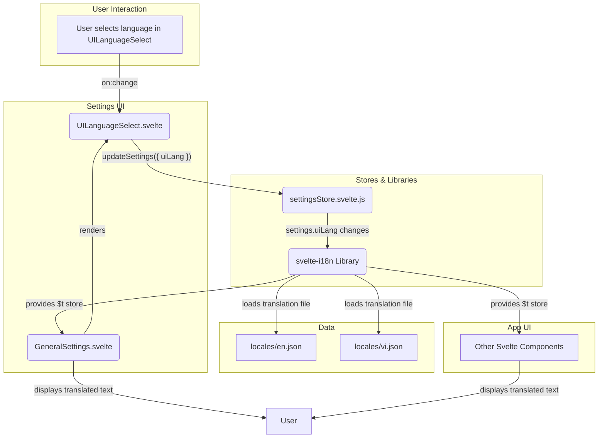

# Kế hoạch Tích hợp Đa ngôn ngữ với svelte-i18n

## 1. Mục tiêu

Tích hợp chức năng đa ngôn ngữ cho giao diện người dùng (UI) của extension bằng cách sử dụng thư viện `svelte-i18n` để có một giải pháp mạnh mẽ và dễ mở rộng.

## 2. Kế hoạch chi tiết

### Bước 1: Cài đặt và Cấu hình `svelte-i18n`

- **Cài đặt thư viện:** Thêm `svelte-i18n` vào dependencies của dự án.
- **Tạo Tệp Ngôn ngữ:** Tạo các tệp JSON chứa các chuỗi dịch.
  - `src/lib/locales/en.json` (Tiếng Anh)
  - `src/lib/locales/vi.json` (Tiếng Việt)
- **Tạo File Cấu hình:** Tạo một file mới tại `src/lib/i18n.js`.
  - Sử dụng hàm `register`, `init` từ `svelte-i18n`.
  - Đăng ký các loader cho từng ngôn ngữ để trỏ đến các tệp JSON tương ứng.
  - Khởi tạo với ngôn ngữ mặc định và một ngôn ngữ dự phòng (`fallbackLocale`).
  - File này sẽ export các store cần thiết như `$t`, `$locale`.

### Bước 2: Cập nhật `settingsStore`

- Mở file `src/stores/settingsStore.svelte.js`.
- Thêm một thuộc tính mới là `uiLang` vào đối tượng `DEFAULT_SETTINGS` với giá trị mặc định là `'en'`.
- Chúng ta sẽ tạo một cơ chế để `svelte-i18n` lắng nghe sự thay đổi của `settings.uiLang` và tự động cập nhật ngôn ngữ.

### Bước 3: Tạo Component `UILanguageSelect.svelte`

- Tạo một file component Svelte mới tại `src/components/inputs/UILanguageSelect.svelte`.
- Component này sẽ là một dropdown cho phép người dùng chọn giữa 'English' và 'Tiếng Việt'.
- Khi người dùng chọn một ngôn ngữ, component sẽ gọi hàm `updateSettings({ uiLang: newLang })`.

### Bước 4: Tích hợp vào `GeneralSettings.svelte`

- Mở file `src/components/settings/GeneralSettings.svelte`.
- Import và sử dụng component `UILanguageSelect.svelte` vừa tạo.
- Đặt nó ở một vị trí hợp lý trong phần "General Settings".

### Bước 5: Áp dụng Bản dịch vào Components

- Trong các file Svelte cần dịch (ví dụ `GeneralSettings.svelte`):
  - Import store `$t` từ `svelte-i18n`.
  - Thay thế các chuỗi văn bản tĩnh bằng cách gọi `$t('key.path')`.
  - Ví dụ: Thay thế `<label>General Settings</label>` bằng `<label>{$t('settings.general.title')}</label>`.
- Cập nhật các tệp `en.json` và `vi.json` với các cặp key-value tương ứng.

## 3. Cấu trúc Thư mục Mới

```
.
└── src/
    ├── components/
    │   └── inputs/
    │       └── UILanguageSelect.svelte
    ├── lib/
    │   ├── i18n.js
    │   └── locales/
    │       ├── en.json
    │       └── vi.json
    └── stores/
        └── settingsStore.svelte.js (updated)
```

## 4. Sơ đồ Kiến trúc Luồng Dữ liệu


